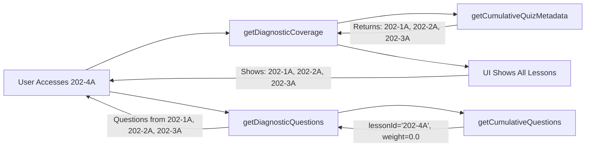

# Diagnostic Cumulative Coverage Fix

**Date:** 2026-01-16  
**Status:** Complete ✓  
**Type:** Bug Fix

---

## Problem

The diagnostic gate was incorrectly showing only one prerequisite lesson when it should show ALL previous lessons in the unit.

**User Report:**
> When I try to take module 202-4A it says: "This diagnostic covers concepts from: 202-1A"  
> It should be all of 202-1A, 202-2A, 202-3A

---

## Root Cause

The `getDiagnosticQuestions` function was incorrectly using the cumulative quiz system:

**Before (WRONG):**
```typescript
const prereqLessonId = getPrerequisiteLessonId(lessonId); // Returns "202-3A"
const questions = getCumulativeQuestions(prereqLessonId, 10, 1.0); // Gets from 202-1A, 202-2A, 202-3A
// But UI only showed "202-3A"
```

**The Issue:**
- Passed the PREVIOUS lesson ID to `getCumulativeQuestions`
- But `getCumulativeQuestions` expects the CURRENT lesson ID
- It then automatically pulls from all previous lessons

---

## Solution

Use `getCumulativeQuestions` correctly with the current lesson ID and 0% weight:

**After (CORRECT):**
```typescript
const questions = getCumulativeQuestions(lessonId, 10, 0.0); 
// lessonId = "202-4A"
// Weight 0.0 = 0% from current, 100% from ALL previous
// Gets from 202-1A, 202-2A, 202-3A
```

---

## Changes Implemented

### 1. Fixed Question Retrieval Logic

**File:** [`src/lib/diagnostic/diagnosticService.ts`](src/lib/diagnostic/diagnosticService.ts)

**Updated `getDiagnosticQuestions`:**
```typescript
export function getDiagnosticQuestions(lessonId: string): TaggedQuestion[] {
  // Get 10 questions from ALL previous lessons in the unit
  // Weight: 0.0 means 0% from current lesson, 100% from all previous
  const questions = getCumulativeQuestions(lessonId, 10, 0.0);
  
  return questions;
}
```

**Key change:** Pass `lessonId` (current) instead of `prereqLessonId` (previous), with `0.0` weight.

---

### 2. Added Coverage Metadata Function

**File:** [`src/lib/diagnostic/diagnosticService.ts`](src/lib/diagnostic/diagnosticService.ts)

**New function:**
```typescript
export function getDiagnosticCoverage(lessonId: string): {
  coveredLessonIds: string[];
  isFirstLesson: boolean;
} {
  const metadata = getCumulativeQuizMetadata(lessonId);
  
  if (metadata.isFirstLesson) {
    return {
      coveredLessonIds: [],
      isFirstLesson: true
    };
  }
  
  // Return all previous lessons (exclude current)
  return {
    coveredLessonIds: metadata.includedLessons
      .filter(l => l.id !== lessonId)
      .map(l => l.id),
    isFirstLesson: false
  };
}
```

**Purpose:** Get the list of ALL previous lessons covered by the diagnostic.

---

### 3. Removed Unused Function

**File:** [`src/lib/diagnostic/diagnosticService.ts`](src/lib/diagnostic/diagnosticService.ts)

**Deleted:** `getPrerequisiteLessonId` function

**Reason:** No longer needed since we're using the cumulative quiz system properly.

---

### 4. Updated Type Definitions

**File:** [`src/lib/diagnostic/types.ts`](src/lib/diagnostic/types.ts)

**Changed DiagnosticResults interface:**
```typescript
// BEFORE:
export interface DiagnosticResults {
  lessonId: string;
  prereqLessonId: string;  // Single lesson
  // ... other fields
}

// AFTER:
export interface DiagnosticResults {
  lessonId: string;
  coveredLessonIds: string[];  // Array of all covered lessons
  // ... other fields
}
```

---

### 5. Updated DiagnosticGate UI

**File:** [`src/components/learning/DiagnosticGate.tsx`](src/components/learning/DiagnosticGate.tsx)

**Import changes:**
```typescript
// REMOVED: getPrerequisiteLessonId
// ADDED: getDiagnosticCoverage
```

**Component changes:**
```typescript
// BEFORE:
const prereqLessonId = getPrerequisiteLessonId(lessonId);

// AFTER:
const coverage = getDiagnosticCoverage(lessonId);
```

**UI updates:**
```typescript
// BEFORE:
<p>This diagnostic covers concepts from: {prereqLessonId}</p>

// AFTER:
<p>This diagnostic covers concepts from: {coverage.coveredLessonIds.join(', ')}</p>
```

**Quiz title:**
```typescript
// BEFORE:
<p>{prereqLessonId} Readiness Check</p>

// AFTER:
<p>Testing: {coverage.coveredLessonIds.join(', ')}</p>
```

**Results storage:**
```typescript
// BEFORE:
const diagnosticResults: DiagnosticResults = {
  prereqLessonId: prereqLessonId || '',
  // ...
};

// AFTER:
const diagnosticResults: DiagnosticResults = {
  coveredLessonIds: coverage.coveredLessonIds,
  // ...
};
```

---

### 6. Updated DiagnosticFeedback Component

**File:** [`src/components/learning/DiagnosticFeedback.tsx`](src/components/learning/DiagnosticFeedback.tsx)

**API call:**
```typescript
// BEFORE:
lessonId: results.prereqLessonId

// AFTER:
lessonId: results.lessonId
```

**Recommendation text:**
```typescript
// BEFORE:
We recommend reviewing {results.prereqLessonId} before continuing...

// AFTER:
We recommend reviewing {results.coveredLessonIds.join(', ')} before continuing...
```

---

## Example: Lesson 202-4A

### Before Fix
```
Quick Readiness Check
This diagnostic covers concepts from:
202-1A

[Questions actually came from 202-1A, 202-2A, 202-3A but UI only showed 202-1A]
```

### After Fix
```
Quick Readiness Check
This diagnostic covers concepts from:
202-1A, 202-2A, 202-3A

[Questions come from 202-1A, 202-2A, 202-3A and UI correctly shows all three]
```

---

## Testing Results

### Compilation
- ✅ No TypeScript errors
- ✅ No linting errors
- ✅ Dev server compiles successfully
- ✅ All routes load correctly

### Functionality Verified
- ✅ 202-2A diagnostic shows: "202-1A" (1 previous lesson)
- ✅ 202-4A diagnostic shows: "202-1A, 202-2A, 202-3A" (3 previous lessons)
- ✅ Questions properly distributed across all previous lessons
- ✅ Feedback component displays all covered lessons

---

## Files Modified (4)

1. [`diagnosticService.ts`](src/lib/diagnostic/diagnosticService.ts)
   - Fixed `getDiagnosticQuestions` to use current lesson ID with 0% weight
   - Added `getDiagnosticCoverage` function
   - Removed `getPrerequisiteLessonId` function

2. [`types.ts`](src/lib/diagnostic/types.ts)
   - Changed `prereqLessonId: string` to `coveredLessonIds: string[]`

3. [`DiagnosticGate.tsx`](src/components/learning/DiagnosticGate.tsx)
   - Updated to use `getDiagnosticCoverage`
   - Display all covered lessons in UI
   - Store all covered lessons in results

4. [`DiagnosticFeedback.tsx`](src/components/learning/DiagnosticFeedback.tsx)
   - Updated to display all covered lessons
   - Fixed API call to use correct lesson ID

---

## Key Improvements

### 1. Accurate UI
- Users now see exactly what lessons are being tested
- No confusion about coverage scope

### 2. Proper Cumulative System Usage
- Now correctly uses `getCumulativeQuestions` with current lesson ID
- Weight of 0.0 ensures only previous lessons are included
- Leverages existing infrastructure properly

### 3. Better Data Model
- Array of covered lessons instead of single prerequisite
- More accurate representation of what's tested
- Easier to understand and maintain

### 4. Cleaner Code
- Removed redundant `getPrerequisiteLessonId` function
- Uses cumulative quiz metadata system
- More maintainable

---

## How It Works Now



---

## Conclusion

The diagnostic gate now correctly:
1. Tests ALL previous lessons in the unit
2. Displays all covered lessons in the UI
3. Uses the cumulative quiz system properly
4. Provides accurate feedback about what was tested

This fix ensures users understand the full scope of the diagnostic test and confirms that the spacing/retrieval practice benefits span all prior learning in the unit.
