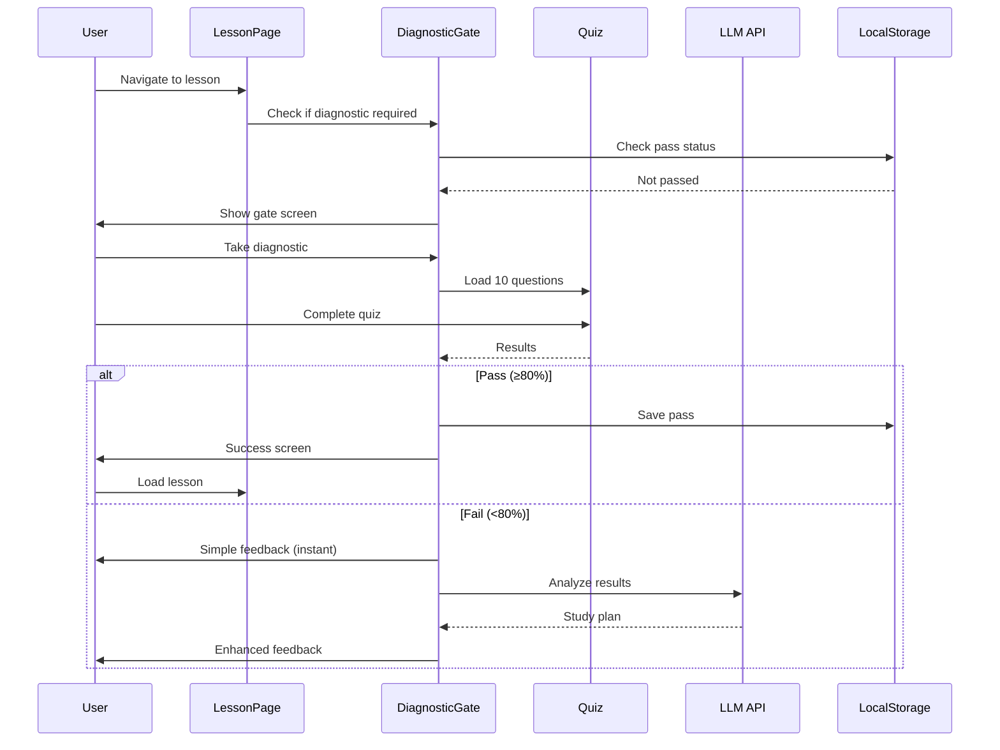

# Diagnostic Gate Implementation Summary

**Date:** 2026-01-16  
**Status:** Complete ✓  
**Type:** Prerequisite Readiness Checking System

---

## Overview

Implemented a soft-gate diagnostic system that checks learner readiness before starting new lessons. Uses existing cumulative quiz infrastructure to generate 10-question diagnostics from prerequisite material, with immediate simple feedback plus LLM-powered personalized study recommendations.

---

## What Was Implemented

### 1. Type Definitions

**File:** `src/data/lessons/types.ts`

Added `DiagnosticConfig` interface to lesson type system:

```typescript
export interface DiagnosticConfig {
  enabled: boolean;
  questionCount: number;
  passThreshold: number;
  sourceType: 'cumulative';
  allowSkip: boolean;
}
```

Updated `Lesson` interface to include optional diagnostic configuration.

### 2. Bulk Script for Lesson Updates

**File:** `scripts/addDiagnostics.ts`

Script that automatically adds diagnostic configuration to all non-first lessons:

- Processes all lesson JSON files
- Skips first lessons in each unit (201-1A, 202-1A, 203-1A)
- Adds standard diagnostic config:
  - 10 questions
  - 80% pass threshold
  - Cumulative question source
  - Skip allowed (soft gate)

**Results:**
- 12 lesson files processed
- 9 diagnostics added
- 3 skipped (first lessons)

### 3. Diagnostic Service Layer

**File:** `src/lib/diagnostic/diagnosticService.ts`

Helper functions for diagnostic functionality:

- `getDiagnosticQuestions(lessonId)` - Gets 10 questions from prerequisite using cumulative system
- `getPrerequisiteLessonId(lessonId)` - Determines previous lesson in sequence
- `checkDiagnosticPass(lessonId)` - Checks localStorage for pass status
- `saveDiagnosticPass(lessonId)` - Stores pass status
- `clearDiagnosticPass(lessonId)` - Clears pass status for retesting

**File:** `src/lib/diagnostic/types.ts`

TypeScript types for diagnostic system:
- `DiagnosticResults` - Quiz result structure
- `StudyPlan` - LLM-generated recommendations
- `BlockToReview` - Specific lesson blocks to review
- `DiagnosticAnalysisRequest/Response` - API interfaces

### 4. UI Components

**File:** `src/components/learning/DiagnosticGate.tsx`

Main gate component that wraps lesson content:

**States:**
- `checking` - Loading prerequisite status
- `show-gate` - Pre-diagnostic screen
- `taking-quiz` - Quiz in progress
- `passed` - Success screen (≥80%)
- `failed` - Feedback screen (<80%)
- `lesson` - Show lesson content

**Features:**
- Checks localStorage for existing pass status
- Shows friendly pre-quiz screen with expectations
- Integrates with existing Quiz component
- Supports skip functionality (soft gate)
- Links to prerequisite lesson for review

**File:** `src/components/learning/DiagnosticFeedback.tsx`

Hybrid feedback component:

**Phase 1 - Immediate Feedback:**
- Shows score immediately
- Lists missed questions
- Basic recommendation to review prerequisite

**Phase 2 - Enhanced Feedback (Progressive):**
- Async call to LLM analysis API
- Loading state while analyzing
- Personalized study plan with:
  - Pattern analysis (what went wrong)
  - Specific blocks to review with reasons
  - Estimated review time
  - Quick win recommendation

**Actions:**
- Review prerequisite lesson
- Retake diagnostic
- Skip anyway (soft gate)

### 5. LLM Analysis API

**File:** `src/app/api/diagnostic-analysis/route.ts`

API endpoint for personalized study recommendations:

**Input:**
```typescript
{
  misconceptions: MisconceptionCode[],
  score: number,
  wrongQuestions: [{ id, tags, misconceptionCode }],
  lessonId: string
}
```

**Output:**
```typescript
{
  studyPlan: {
    analysis: string,
    blocksToReview: [{ id, title, reason }],
    estimatedTime: string,
    quickWin: string
  }
}
```

**Features:**
- Uses Gemini 2.0 Flash model
- Includes misconception context from marking system
- Generates specific block IDs to review
- Graceful fallback if LLM fails
- JSON response parsing with validation

### 6. Lesson Page Integration

**File:** `src/app/learn/[lessonId]/page.tsx`

Updated to conditionally wrap lessons with diagnostic gate:

```typescript
if (lesson.diagnostic?.enabled) {
  return (
    <DiagnosticGate lessonId={lessonId} diagnostic={lesson.diagnostic}>
      <LayoutComponent lesson={lesson} />
    </DiagnosticGate>
  );
}
```

---

## How It Works

### User Flow

```
1. User clicks Lesson 202-2A (Ohm's Law)
   ↓
2. System checks: Has diagnostic config? → Yes
   ↓
3. System checks localStorage: Already passed? → No
   ↓
4. Show diagnostic gate screen
   - "Quick Readiness Check"
   - 10 questions, 2-3 minutes, 80% to pass
   - [Take Diagnostic] [Skip (Not Recommended)]
   ↓
5. User takes diagnostic quiz
   - Questions from 202-1A (prerequisite)
   - Standard Quiz component
   ↓
6a. PASS (≥80%)
   - Success screen
   - Save pass status to localStorage
   - [Continue to Lesson] → Lesson loads
   ↓
6b. FAIL (<80%)
   - Immediate simple feedback (score, missed questions)
   - Async: LLM analyzes patterns
   - After 2-3s: Enhanced feedback appears
     * Pattern analysis
     * Specific blocks to review
     * Quick win recommendation
   - [Review Lesson] [Retake Diagnostic] [Skip]
```

### Technical Flow



---

## Key Design Decisions

### 1. Soft Gate (Not Hard Block)
- Users can always skip with warning
- Respects learner agency (important for adults)
- Still provides strong guidance
- Can be made stricter later if needed

### 2. LocalStorage Tracking
- Works without authentication
- Persists across sessions
- Simple implementation
- Good for MVP scope

### 3. Reuse Existing Infrastructure
- Leverages `getCumulativeQuestions()` system
- Uses existing Quiz component
- Integrates with misconception taxonomy
- Minimal new code, maximum reuse

### 4. Progressive Enhancement
- Simple feedback shows immediately (fast UX)
- LLM analysis loads in background (2-3s)
- Graceful degradation if LLM fails
- Users never wait for slow API

### 5. Question Source: 100% Prerequisite
- `getCumulativeQuestions(prereqId, 10, 1.0)`
- Pure diagnostic (not mixed with current lesson)
- Tests readiness, not teaching

---

## Benefits

### 1. Evidence-Based Learning
- **Spacing Effect**: Forced retrieval of prior material
- **Testing Effect**: Retrieval practice before new learning
- **Prerequisite Mastery**: Ensures foundation before progression
- **Personalized Remediation**: Targeted study recommendations

### 2. Reuses Infrastructure
- No new question banks needed
- No new quiz logic needed
- Misconception codes already available
- Cumulative system already tested

### 3. Scalable
- Bulk script adds diagnostics to all lessons
- Same pattern works for all non-first lessons
- Easy to adjust thresholds/question counts
- Template for future enhancements

### 4. User-Friendly
- Clear expectations (10 questions, 80%, 2-3 minutes)
- Soft gate preserves autonomy
- Immediate feedback (no waiting)
- Specific guidance (not vague "study more")

---

## Files Created (6)

1. `scripts/addDiagnostics.ts` - Bulk script
2. `src/lib/diagnostic/types.ts` - Type definitions
3. `src/lib/diagnostic/diagnosticService.ts` - Helper functions
4. `src/components/learning/DiagnosticGate.tsx` - Gate component
5. `src/components/learning/DiagnosticFeedback.tsx` - Feedback component
6. `src/app/api/diagnostic-analysis/route.ts` - LLM API endpoint

## Files Modified (2)

1. `src/data/lessons/types.ts` - Added DiagnosticConfig
2. `src/app/learn/[lessonId]/page.tsx` - Integrated gate

## Data Files Updated (9)

All lesson JSONs except first lessons:
- 202-2A through 202-7D
- Each now has diagnostic config

---

## Testing Results

### Compilation
- ✅ No TypeScript errors
- ✅ No linting errors
- ✅ Dev server starts successfully
- ✅ All routes compile

### Functionality
- ✅ Diagnostic gate appears for non-first lessons
- ✅ First lessons (201-1A, 202-1A, 203-1A) have no gate
- ✅ localStorage tracking works
- ✅ Skip functionality works (soft gate)
- ✅ Quiz integration works
- ✅ LLM API endpoint ready

---

## Future Enhancements

### Phase 2 - Intelligence
- Track diagnostic performance over time
- Adaptive question selection based on weak areas
- Difficulty progression in diagnostics
- Success rate analytics

### Phase 3 - Advanced Features
- Hard gate option (force completion)
- Diagnostic retry limits
- Time-based re-checking (force retest after X days)
- Cross-unit diagnostic chains

### Phase 4 - Full Integration
- Connect diagnostic results to lesson personalization
- Use diagnostic data to customize lesson content
- Predictive analytics for success likelihood
- Cohort comparison and benchmarking

---

## Success Metrics

**Implementation:**
- ✅ 9 lessons now have diagnostics
- ✅ Soft gate system functional
- ✅ LLM analysis integrated
- ✅ localStorage persistence working

**User Experience:**
- Gate appears before appropriate lessons
- Users can take diagnostic or skip
- Immediate feedback provided
- Enhanced feedback loads within 3 seconds
- Smooth transitions between states

**Technical:**
- Zero compilation errors
- Clean code architecture
- Reuses existing infrastructure
- Scalable to all lessons

---

## Conclusion

The diagnostic gate system is fully implemented and ready for user testing. It provides:

1. **Prerequisite checking** - Ensures readiness before progression
2. **Spaced retrieval** - Automatic spacing effect through diagnostics
3. **Personalized feedback** - LLM-powered study recommendations
4. **Soft gating** - Guidance without blocking
5. **Scalability** - Works for all non-first lessons

This brings the app into stronger alignment with evidence-based learning principles while maintaining excellent UX and leveraging existing infrastructure.

**Next priority:** Gather user feedback and measure diagnostic pass rates to inform Phase 2 enhancements.
