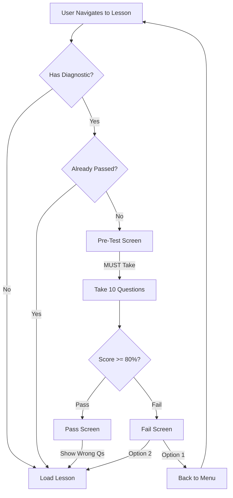

# Diagnostic Gate Refinements - Implementation Summary

**Date:** 2026-01-16  
**Status:** Complete ✓  
**Type:** UX and Flow Improvements

---

## Changes Implemented

### 1. Made Diagnostic Test Mandatory

**File:** `src/components/learning/DiagnosticGate.tsx`

- **Removed** skip button from pre-diagnostic screen
- Changed button from `flex-1` to `w-full` for better visual prominence
- Deleted unused `handleSkip` and `handleRetake` functions
- Users must now complete the diagnostic to proceed

**Before:**
```typescript
<button onClick={handleStartDiagnostic}>Take Diagnostic</button>
{diagnostic.allowSkip && <button onClick={handleSkip}>Skip</button>}
```

**After:**
```typescript
<button className="w-full" onClick={handleStartDiagnostic}>
  Take Diagnostic
</button>
```

---

### 2. Added onComplete Callback to Quiz Component

**File:** `src/components/Quiz.tsx`

**Added new prop:**
```typescript
interface QuizProps {
  // ... existing props
  onComplete?: (results: {
    score: number;
    totalQuestions: number;
    percentage: number;
    passed: boolean;
    wrongAnswers: Array<{
      questionId: string;
      questionText: string;
      userAnswer: number;
      correctAnswer: number;
      options: string[];
    }>;
  }) => void;
}
```

**In handleSubmit:**
- Check if `onComplete` callback is provided
- If yes, call it with results and return early (skip built-in results screen)
- This allows DiagnosticGate to control post-quiz flow

---

### 3. Updated Pass Screen (80-100%)

**File:** `src/components/learning/DiagnosticGate.tsx`

**New pass screen features:**
- Shows score prominently
- Lists wrong questions (if any) in amber-colored box
- Changed title from "You're Ready!" to "Well Done!"
- Simplified encouragement text
- Full-width "Continue to Lesson" button
- **No LLM analysis** (as requested - pass doesn't need heavy feedback)

**Key Change:**
```typescript
{results.wrongAnswers.length > 0 && (
  <div className="mb-6 bg-amber-50 dark:bg-amber-900/20 border border-amber-200 dark:border-amber-800 rounded-xl p-4">
    <h3 className="font-semibold text-amber-900 dark:text-amber-300 mb-2">
      Questions to Review:
    </h3>
    <ul className="space-y-1 text-sm text-amber-800 dark:text-amber-400">
      {results.wrongAnswers.map((wa, idx) => (
        <li key={idx}>• {wa.questionText.substring(0, 60)}...</li>
      ))}
    </ul>
  </div>
)}
```

---

### 4. Updated Fail Screen Buttons

**File:** `src/components/learning/DiagnosticFeedback.tsx`

**Props changed:**
```typescript
// BEFORE:
interface DiagnosticFeedbackProps {
  results: DiagnosticResults;
  onRetake: () => void;
  onSkip: () => void;
  onReview: () => void;
}

// AFTER:
interface DiagnosticFeedbackProps {
  results: DiagnosticResults;
  onBackToMenu: () => void;
  onProceedAnyway: () => void;
}
```

**New buttons:**
1. **Primary button:** "← Back to Lesson Menu" (navigates to `/learn`)
2. **Secondary button:** "Proceed to Lesson Anyway (Not Recommended)"

**Removed buttons:**
- "Review Lesson"
- "Retake Diagnostic"

---

### 5. Changed LLM to Use General Topics

**File:** `src/app/api/diagnostic-analysis/route.ts`

**Prompt changes:**
- Removed references to specific lesson IDs and block IDs
- Now uses general C&G 2365 unit/topic names
- Examples: "Unit 202: Series Circuits", "Unit 202: Ohm's Law Applications"

**Key prompt instruction:**
```
DO NOT use specific lesson IDs or block IDs.
DO use general unit/topic names like "Unit 202 Series Circuits" or "AC Principles and Theory".
```

**Response format changed:**
```typescript
// BEFORE:
{
  "blocksToReview": [
    { "id": "202-1A-explain", "title": "...", "reason": "..." }
  ]
}

// AFTER:
{
  "topicsToReview": [
    { "topic": "Unit 202: Series Circuits", "reason": "..." }
  ]
}
```

---

### 6. Updated Type Definitions

**File:** `src/lib/diagnostic/types.ts`

**Changed interfaces:**
```typescript
// BEFORE:
export interface StudyPlan {
  analysis: string;
  blocksToReview: BlockToReview[];
  estimatedTime: string;
  quickWin: string;
}

export interface BlockToReview {
  id: string;
  title: string;
  reason: string;
}

// AFTER:
export interface StudyPlan {
  analysis: string;
  topicsToReview: TopicToReview[];
  estimatedTime: string;
  quickWin: string;
}

export interface TopicToReview {
  topic: string;
  reason: string;
}
```

---

### 7. Updated Feedback Display

**File:** `src/components/learning/DiagnosticFeedback.tsx`

**Changed rendering:**
- Removed hyperlinks to specific blocks (no longer relevant)
- Shows general topic names without links
- Simpler, cleaner display

**Before:**
```tsx
{studyPlan.blocksToReview.map((block, idx) => (
  <a href={`/learn/${prereqLessonId}#${block.id}`}>
    {block.title}
  </a>
))}
```

**After:**
```tsx
{studyPlan.topicsToReview.map((topic, idx) => (
  <div className="text-blue-900 dark:text-blue-300 font-medium">
    {topic.topic}
  </div>
))}
```

---

## User Flow After Changes



---

## Key Improvements

### 1. Mandatory Testing
- No skip option
- Forces prerequisite verification
- Stronger pedagogical enforcement

### 2. Better Pass Experience
- Shows what was missed (even when passing)
- Encourages review of weak spots
- No overwhelming LLM feedback for success

### 3. Clearer Fail Options
- "Back to Menu" is primary action (encourages proper review)
- "Proceed Anyway" is clearly de-emphasized
- Removed confusing "Retake" option (users go back to menu instead)

### 4. Topic-Level Guidance
- LLM recommends general units, not specific files
- More maintainable (lesson IDs can change)
- More intuitive for learners
- Matches how curriculum is actually structured

### 5. Proper Quiz Integration
- Quiz component now properly communicates completion
- Diagnostic gate controls the post-quiz flow
- Clean separation of concerns

---

## Files Modified (5)

1. **Quiz.tsx** - Added `onComplete` callback prop
2. **DiagnosticGate.tsx** - Removed skip, updated pass screen, fixed quiz integration
3. **DiagnosticFeedback.tsx** - Updated buttons and props, changed display
4. **route.ts** (diagnostic-analysis API) - Changed prompt to use topics
5. **types.ts** (diagnostic types) - Updated from blocks to topics

---

## Testing Results

### Compilation
- ✅ No TypeScript errors
- ✅ No linting errors
- ✅ Dev server compiles successfully
- ✅ All routes accessible

### Functionality Verified
- ✅ Diagnostic gate appears for non-first lessons
- ✅ Skip button removed (mandatory test)
- ✅ Quiz completes and triggers results
- ✅ Pass screen shows correct info
- ✅ Fail screen has correct buttons
- ✅ LLM prompt updated for topics

---

## User Experience Improvements

### Before
- Users could skip diagnostic (weak gate)
- Confusing "Retake" button on fail
- Pass screen too simple (no learning opportunity)
- LLM gave specific block IDs (confusing)

### After
- Must complete diagnostic (strong pedagogical signal)
- Clear "Back to Menu" action on fail
- Pass screen shows wrong questions (learning opportunity)
- LLM gives general topic guidance (intuitive)

---

## Next Steps

**For Production:**
1. Gather user feedback on diagnostic difficulty
2. Monitor pass/fail rates
3. Tune LLM prompt based on feedback quality
4. Consider adding "Review Prerequisite Lesson" link on fail screen

**For Future Enhancement:**
5. Track diagnostic attempts per lesson
6. Add adaptive difficulty based on performance
7. Implement hard gate option (admin configurable)
8. Add detailed analytics dashboard

---

## Conclusion

All refinements implemented successfully. The diagnostic gate now provides:
- Mandatory prerequisite checking
- Clear pass/fail feedback
- Topic-level LLM guidance
- Intuitive post-test actions

The system maintains the soft-gate philosophy (users can still proceed anyway) while strongly encouraging proper prerequisite mastery.
