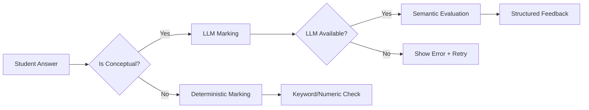

# LLM Marking System - Quick Start Guide

**Status:** ✅ Implementation Complete  
**Date:** 2026-01-20

---

## 🚀 Getting Started (3 Steps)

### Step 1: Configure API Key

Create or update `.env.local` in the `quiz-app` directory:

```bash
# Required
GEMINI_API_KEY=your_gemini_api_key_here

# Optional (has sensible defaults)
GEMINI_MODEL=gemini-2.0-flash-exp
```

**Get your API key:**
1. Go to [Google AI Studio](https://makersuite.google.com/app/apikey)
2. Create a new API key
3. Copy and paste into `.env.local`

### Step 2: Start the Development Server

```bash
cd quiz-app
npm run dev
```

### Step 3: Test a Conceptual Question

1. Navigate to: http://localhost:3000/learn/202-3A
2. Scroll to "Check Your Understanding: The 3 Series Rules"
3. Answer the first question (try different phrasings!)
4. Click "Submit Answer"
5. See the LLM-generated feedback 🎉

---

## ✅ What to Test

### Test 1: Semantic Correctness

**Question:** "How does the fact that there is only one path in a series circuit relate to how current behaves in that circuit?"

**Try these answers:**

✅ Should PASS:
- "Because there's only one loop, the current has nowhere else to go"
- "With just one path and no branches, current must be the same everywhere"
- "Single path means charge can't split, so current stays constant"

❌ Should FAIL:
- "single path no branches" (keyword stuffing, no coherent explanation)
- "current is same" (too vague)
- "electrons move fast" (wrong concept)

### Test 2: Error Handling

**Simulate service unavailable:**
1. Remove or invalidate `GEMINI_API_KEY` in `.env.local`
2. Try to submit an answer
3. Should see yellow error box with:
   - Clear error message
   - Error code
   - "Try Again" button
4. Restore valid API key
5. Click "Try Again"
6. Should work now ✓

### Test 3: Different Cognitive Levels

The system tests three cognitive levels:

**Level 2 - Connection:** Linking two concepts
- Question 1 in each "Check Your Understanding" section

**Level 3 - Synthesis:** Combining multiple ideas  
- Question 2 in each "Check Your Understanding" section

**Level 4 - Hypothesis:** Predicting or justifying
- Question 3 in each "Check Your Understanding" section

Try answering all three in one section to see how feedback differs!

---

## 📊 How It Works



**Key Features:**
- ✅ Semantic understanding (not just keywords)
- ✅ Specific, helpful feedback
- ✅ Fair marking of different phrasings
- ✅ Rejects keyword stuffing
- ✅ Graceful error handling with retry

---

## 🔍 Monitoring Your Usage

### Check Marking Logs

The console will show marking activity:
```
✓ LLM marking: 202-3A-C1-L2 → correct (score: 0.85)
⚠️ LLM marking failed: NETWORK_ERROR-1737394826-A3F2
```

### Monitor API Costs

Check your Google AI Studio dashboard:
- ~$0.000045 per question marked
- 100 questions = ~$0.0045
- 1000 questions = ~$0.045

Very affordable for educational use!

---

## 🐛 Troubleshooting

### Issue: "Service Temporarily Unavailable"

**Check 1:** Is `GEMINI_API_KEY` set?
```bash
# In quiz-app directory
cat .env.local | grep GEMINI_API_KEY
```

**Check 2:** Is the API key valid?
- Go to [API Keys Dashboard](https://makersuite.google.com/app/apikey)
- Check if key exists and is enabled

**Check 3:** Quota exceeded?
- Check [Google Cloud Console](https://console.cloud.google.com/apis/api/generativelanguage.googleapis.com/quotas)
- Free tier: 60 requests/minute (plenty for testing)

**Check 4:** Network issues?
- Can you access https://generativelanguage.googleapis.com/ ?
- Check firewall/proxy settings

### Issue: LLM Always Marks Wrong

**Solution 1:** Check the model answer
- Is it comprehensive and clear?
- Does it cover the key concepts?
- Is it technically accurate?

**Solution 2:** Check student answer
- Is it a coherent explanation?
- Does it demonstrate understanding?
- Or is it just keywords without explanation?

### Issue: Inconsistent Marking

**This should NOT happen** (temperature=0 ensures consistency)

If you see it:
1. Try the exact same answer twice
2. If scores differ by >0.1, report it
3. Check `llmMarkingService.ts` has `temperature: 0`

---

## 📝 For Content Authors

### Writing Good Model Answers

**Good model answer (2-3 sentences, comprehensive):**
```json
"expectedAnswer": "In Alternating Current (AC), the current alternates direction periodically, reversing back and forth in a continuous cycle. In Direct Current (DC), the current flows continuously in one direction only without reversing."
```

**Poor model answer (too brief):**
```json
"expectedAnswer": "AC alternates, DC doesn't"
```

### Question Structure

```json
{
  "questionText": "Clear question asking for understanding?",
  "answerType": "short-text",
  "cognitiveLevel": "connection",  // or "synthesis" or "hypothesis"
  "expectedAnswer": "Comprehensive 2-3 sentence model answer with technical accuracy",
  "hint": "Optional hint if students get stuck",
  "id": "unique-question-id"
}
```

**No keywords needed!** The LLM handles semantic matching.

---

## 🎯 Quick Command Reference

```bash
# Start dev server
cd quiz-app && npm run dev

# Run migration script (already done, but if you add new lessons)
cd quiz-app && npx tsx scripts/removeLessonKeywords.ts

# Check for linter errors
cd quiz-app && npm run lint

# Build for production
cd quiz-app && npm run build
```

---

## 📚 Lessons with Conceptual Questions

All of these now use LLM marking:

1. ✅ 201-1A: Health & Safety Legislation (17 questions)
2. ✅ 202-1A: Electrical Quantities & Units (11 questions)
3. ✅ 202-2A: Ohm's Law (8 questions)
4. ✅ 202-3A: Series Circuits (6 questions)
5. ✅ 202-4A: Series Circuits Extended (9 questions)
6. ✅ 202-5A: Power & Energy (11 questions)
7. ✅ 202-6A: Magnetism & Electromagnetism (14 questions)
8. ✅ 202-7A: AC Principles (14 questions)
9. ✅ 202-7B: How AC is Generated (11 questions)
10. ✅ 202-7C: Sine Wave Vocabulary (14 questions)
11. ✅ 202-7D: Transformers (14 questions)
12. ✅ 203-1A: Types of Cables (11 questions)

**Total: 140 conceptual questions** ready for semantic marking!

---

## 🎉 You're Ready!

The system is fully implemented and ready to use. Just:

1. ✅ Set your `GEMINI_API_KEY`
2. ✅ Start the dev server
3. ✅ Test a conceptual question
4. ✅ Enjoy semantic marking!

**Questions?** Check `LLM_MARKING_IMPLEMENTATION_SUMMARY.md` for full details.

**Issues?** See troubleshooting section above or check the browser console.

---

**Happy Teaching! 🎓**
