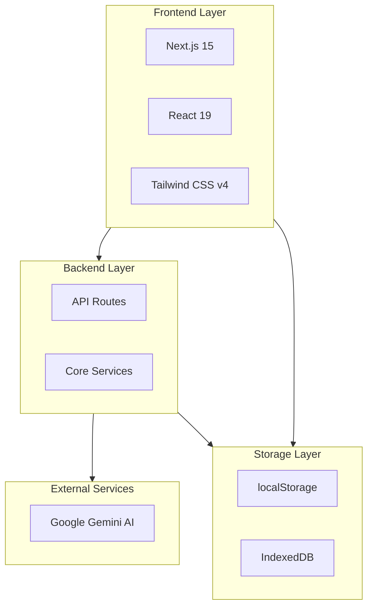
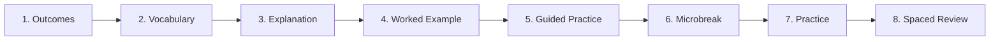
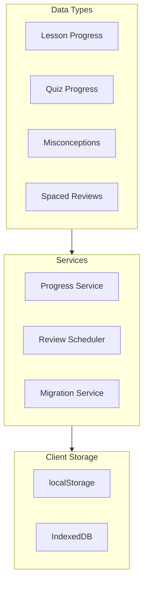
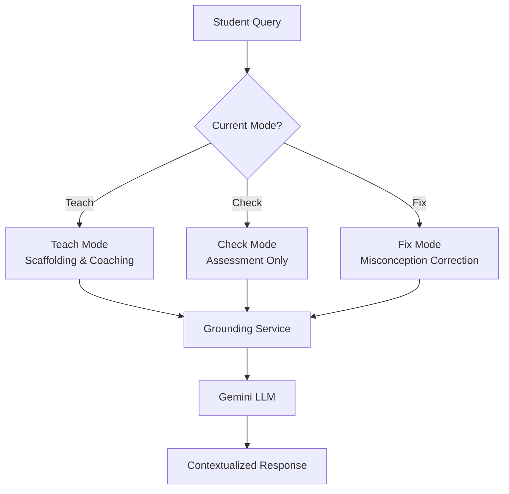
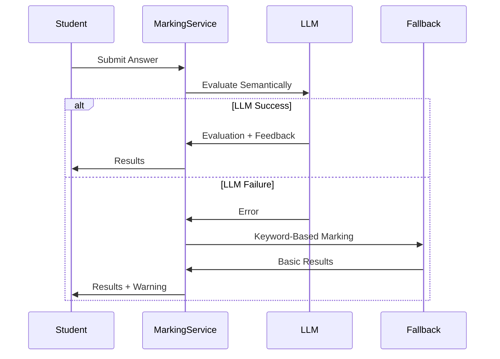
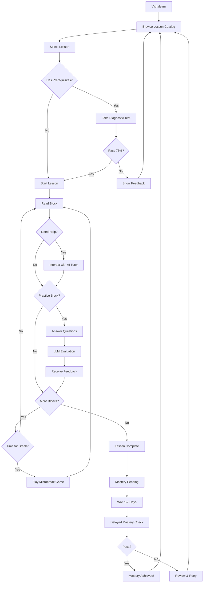
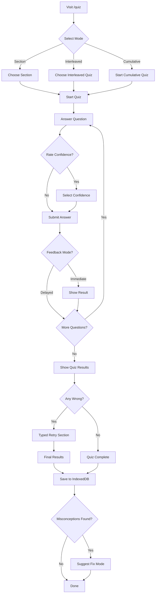
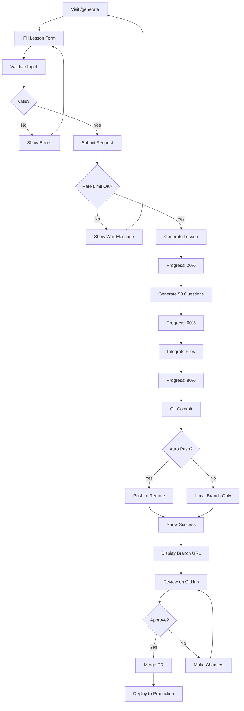
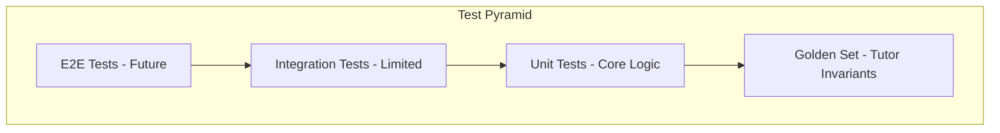

# C&G 2365 Electrical Quiz App - Comprehensive Documentation

**Version**: 1.0.0  
**Last Updated**: February 2, 2026  
**Status**: Production

---

## Table of Contents

1. [Executive Summary](#executive-summary)
2. [Architecture Overview](#architecture-overview)
3. [Core Features](#core-features)
4. [Data Architecture](#data-architecture)
5. [AI Integration](#ai-integration)
6. [User Journeys](#user-journeys)
7. [Technical Implementation](#technical-implementation)
8. [Key Services](#key-services)
9. [Development Workflow](#development-workflow)
10. [File Organization](#file-organization)
11. [Configuration](#configuration)
12. [Quality Assurance](#quality-assurance)
13. [Future Enhancements](#future-enhancements)
14. [Quick Reference](#quick-reference)

---

## Executive Summary

### Purpose

The C&G 2365 Electrical Quiz App is a Next.js-based learning platform designed specifically for City & Guilds 2365 Electrical Installation students. It provides interactive learning experiences, quizzes, and real-time circuit simulations to help students master electrical concepts for their assessments.

### Target Users

- Level 2 Electrical Installation students
- Apprentices studying C&G 2365 qualification
- Instructors teaching electrical installation
- Self-learners preparing for electrical assessments

### Core Value Proposition

1. **Evidence-Based Learning**: Structured lessons following cognitive science principles
2. **AI-Powered Tutoring**: Context-aware tutor with three distinct teaching modes
3. **Misconception Tracking**: Identifies and addresses common student errors
4. **Spaced Repetition**: Optimizes long-term retention through scheduled reviews
5. **Interactive Simulations**: Visual demonstrations of electrical concepts
6. **Automated Content Generation**: AI-powered lesson and quiz creation

### Key Features Overview

- **26+ Structured Lessons** covering Units 201-204
- **50-question quizzes** per lesson with misconception tracking
- **AI Tutor** with Teach, Check, and Fix modes
- **5 Microbreak Games** for engagement and knowledge reinforcement
- **Circuit Simulator** for visual learning
- **Progress Tracking** with mastery gates and delayed confirmation
- **Automated Lesson Generator** for rapid content creation

---

## Architecture Overview

### Technology Stack



**Core Technologies**:
- **Frontend**: Next.js 15 (App Router), React 19, TypeScript 5
- **Styling**: Tailwind CSS v4, dark mode support
- **AI/LLM**: Google Generative AI (Gemini 2.5 Flash)
- **State Management**: React hooks, localStorage, IndexedDB
- **Testing**: Vitest, Golden Set testing
- **Build Tools**: Next.js build system, npm scripts

### Project Structure

```
quiz-app/
├── src/
│   ├── app/                    # Next.js App Router pages
│   │   ├── api/               # API route handlers
│   │   ├── learn/             # Learning module pages
│   │   ├── quiz/              # Quiz module pages
│   │   ├── generate/          # Lesson generator UI
│   │   ├── admin/             # Admin interfaces
│   │   └── electron-simulation/ # Circuit simulator
│   ├── components/            # React components
│   │   ├── learning/          # Lesson blocks, layouts, tutor
│   │   ├── quiz/              # Quiz UI components
│   │   ├── admin/             # Admin components
│   │   └── chat/              # Chat/tutor UI
│   ├── data/                  # Content and data
│   │   ├── lessons/           # Lesson JSON files
│   │   └── questions/         # Question bank TypeScript files
│   ├── lib/                   # Core services and utilities
│   │   ├── diagnostic/        # Prerequisite checking
│   │   ├── generation/        # AI content generation
│   │   ├── llm/               # LLM client
│   │   ├── marking/           # Answer evaluation
│   │   ├── microbreaks/       # Microbreak games
│   │   ├── progress/          # Progress tracking
│   │   ├── questions/         # Question services
│   │   ├── storage/           # Storage services
│   │   └── tutor/             # AI tutor system
│   └── tests/                 # Test suites
├── public/                    # Static assets
│   └── sounds/                # Sound effects
├── reports/                   # Documentation
└── scripts/                   # Build and generation scripts
```

### Key Architectural Decisions

1. **Block-Based Lesson Structure**: Lessons composed of reusable, typed blocks for flexibility
2. **Client-Side Storage**: localStorage + IndexedDB for offline-first experience
3. **LLM Integration**: Gemini AI for semantic evaluation, tutoring, and content generation
4. **Stable IDs**: Block and lesson IDs remain constant for progress tracking across versions
5. **Progressive Enhancement**: Core features work without JavaScript, enhanced with React
6. **Type Safety**: Full TypeScript coverage for reliability
7. **Evidence-Based Design**: Learning structure follows cognitive science research

---

## Core Features

### 1. Learning Module (`/learn`)

The learning module provides structured, evidence-based lessons with AI tutor support.

#### Lesson Structure

Each lesson consists of 8-10 blocks in a specific order:



**Block Types**:

1. **Outcomes Block**: Learning objectives aligned with Bloom's taxonomy
2. **Vocabulary Block**: Key terms and definitions
3. **Explanation Block**: Rich text content with markdown support
4. **Worked Example Block**: Step-by-step problem solutions
5. **Guided Practice Block**: Scaffolded practice with hints
6. **Practice Block**: Independent practice with LLM evaluation
7. **Spaced Review Block**: Review questions from prerequisites
8. **Diagram Block**: Visual content (images, videos, future SVG)
9. **Microbreak Block**: Engagement games or rest periods

#### Layout Templates

Three layout options optimize different learning scenarios:

**Layout A - Split Visualization** (`split-vis`):
- Side-by-side content and visuals
- Best for: Circuits, diagrams, formula-heavy content
- Features: Persistent diagram panel, synchronized highlights

**Layout B - Linear Flow** (`linear-flow`):
- Traditional top-to-bottom progression
- Best for: Conceptual topics, regulations, procedures
- Features: Clean reading experience, minimal distractions

**Layout C - Focus Mode** (`focus-mode`):
- Full-screen immersive experience
- Best for: Complex topics requiring deep focus
- Features: Distraction-free, one block at a time

#### AI Tutor Integration

The AI tutor is embedded in every lesson with three modes:

**Teach Mode**:
- Provides scaffolding and coaching
- Offers hints and step-by-step guidance
- Encourages learner attempts before revealing answers
- Links responses to lesson content blocks

**Check Mode**:
- Assessment integrity mode
- Only clarifies question wording
- No hints or method guidance during tests
- Maintains neutral tone

**Fix Mode**:
- Targets specific misconceptions
- Provides targeted corrections
- Suggests relevant blocks to review
- Offers variant questions for practice

#### Progress Tracking

**Mastery System**:
1. Complete all lesson blocks
2. Pass practice questions (LLM-evaluated)
3. Achieve "mastery pending" status
4. Return after delay (1-7 days)
5. Pass delayed confirmation check
6. Achieve true mastery

**Features**:
- Block completion tracking
- Practice attempt history
- Time spent per lesson
- Mastery gates preventing premature progression
- Prerequisite enforcement with diagnostic gates

#### Microbreaks

Strategic breaks inserted every 15-20 minutes to maintain engagement:

**5 Game Types**:

1. **Matching Game**: Pair terms with definitions (60-120s)
2. **Sorting Game**: Categorize items into two buckets (60-120s)
3. **Spot the Error Game**: Identify mistakes in scenarios (60-90s)
4. **Tap to Label Game**: Label diagram elements (90-120s)
5. **Quick Win Sprint Game**: Rapid-fire recall questions (30-60s)

**Rest Microbreaks**: 20-40 second breathing exercises

**Celebration Effects**:
- Sound effects (success/failure)
- Confetti animations (canvas-confetti)
- User preference controls
- Telemetry tracking for analytics

#### Diagnostic Gates

Prerequisites enforced through diagnostic checks based on **lesson order within the same unit**:

1. Student accesses lesson with `diagnostic.enabled: true` configuration
2. System automatically determines which lessons to test: all lessons in the SAME UNIT with lower `order` value in `lessonIndex.ts`
   - Example: Lesson 203-2C (order: 6) tests lessons 203-1A through 203-2B (orders 1-5)
3. System generates 10 questions from the cumulative prior lessons
4. Student must achieve 80% pass rate (8/10 correct)
5. Pass unlocks lesson; fail shows feedback with option to proceed anyway
6. Pass status stored in localStorage

**IMPORTANT**: Diagnostic gates use lesson ORDER from `lessonIndex.ts`, NOT the `prerequisites` array in lesson JSON files.

### 2. Quiz Module (`/quiz`)

Standalone quiz system for practice and assessment.

#### Question Types

- **Multiple Choice Questions (MCQ)**: Primary format with 4 options
- **Misconception Mapping**: Wrong answers mapped to specific error codes
- **Tagged Questions**: Organized by topic, difficulty, learning outcomes
- **Question Variants**: Parametric templates for infinite variations

#### Quiz Modes

**Section Quizzes**:
- Filter by Health & Safety, Communication, Science
- 10-50 questions per attempt
- Randomized question and option order

**Interleaved Quizzes**:
- Mix questions from multiple topics
- Forces discrimination between similar concepts
- Improves long-term retention vs. blocked practice
- Example: Series + Parallel circuits interleaved

**Cumulative Quizzes**:
- Draws from all completed lessons
- Spaced repetition scheduling
- Reinforces prior learning

#### Features

**Confidence Rating**:
- Optional self-assessment: "not sure", "somewhat sure", "very sure"
- Tracks calibration over time
- Identifies overconfidence patterns

**Feedback Modes**:
- **Immediate Feedback**: See results after each question
- **Delayed Feedback**: See results after quiz completion
- **Typed Retries**: Re-answer missed questions with text input

**Misconception Tracking**:
- Detects patterns across questions
- Provides targeted fix-mode interventions
- Tracks improvement over time
- Generates misconception reports

**Progress Analytics**:
- Best scores and percentages
- Attempt history
- Time spent per quiz
- Strengths and weaknesses identification

#### LLM-Based Evaluation

For open-ended practice questions:

1. Student submits text answer
2. LLM compares to model answer
3. Semantic evaluation (not just keyword matching)
4. Generates personalized feedback
5. Identifies misconceptions
6. Fallback to keyword marking on service failure

### 3. Generator Module (`/generate`)

Automated lesson and quiz generation using Gemini AI.

#### Capabilities

**Lesson Generation**:
- Creates complete 8-10 block lesson JSON
- Follows lesson factory templates
- Generates 3-4 learning outcomes (Bloom's taxonomy)
- Creates 4-6 vocabulary terms
- Writes 400-600 word explanations
- Produces worked examples and practice questions

**Quiz Generation**:
- Generates 50 questions per lesson
- Distribution: 15 easy, 25 medium, 10 hard
- Maps misconceptions to wrong answers
- Includes tags and learning outcome IDs
- Batch generation (10 questions at a time)

**Auto-Integration**:
Updates 7 codebase files automatically:
1. `src/data/questions/index.ts` - Import/export
2. `src/data/questions.ts` - Add to main array
3. `src/data/lessons/lessonIndex.ts` - Register lesson
4. `src/app/learn/[lessonId]/page.tsx` - Import
5. `src/app/learn/page.tsx` - Add to list
6. `src/data/questions/types.ts` - New tags (if any)
7. `src/lib/marking/misconceptionCodes.ts` - New codes

**Git Automation**:
- Creates feature branch: `feat/lesson-{unit}-{id}-{timestamp}`
- Commits changes with descriptive message
- Pushes to remote (optional)
- Returns branch URL for review

#### Usage

1. Navigate to `/generate`
2. Fill form:
   - Unit number (201, 202, 203, 204)
   - Lesson ID (e.g., "7E")
   - Topic (e.g., "Capacitors in AC Circuits")
   - Section (e.g., "Science 2365 Level 2")
   - Layout (auto, split-vis, linear-flow)
   - Prerequisites (optional, comma-separated)
3. Click "Generate Lesson"
4. Wait 2-5 minutes
5. Review git branch before merging

#### Quality Controls

**Validation**:
- JSON structure correctness
- Required blocks present
- Question IDs unique
- Misconception codes valid
- Tags from approved list
- Difficulty distribution (30/50/20 split)

**Rate Limiting**:
- 5 generations per hour per IP
- Prevents API abuse
- Cost management

**Error Handling**:
- Deletes generated files on error
- Warns about manual integration review
- Rolls back git branch
- Returns detailed error messages

### 4. Simulator Module (`/electron-simulation`)

Real-time circuit simulation for visual learning.

#### Features

- **Interactive Controls**: Adjust voltage, current, resistance
- **Real-Time Visualization**: See electrons flowing through circuits
- **Ohm's Law Demonstration**: Visual representation of V=IR
- **Demo Mode**: Pre-built demonstrations
- **Real Mode**: Custom circuit building

#### Technical Implementation

- HTML5 Canvas rendering
- React state management
- Physics calculations in real-time
- Responsive design for mobile/desktop

---

## Data Architecture

### Lesson Structure

#### Block System

All content organized as typed blocks:

```typescript
interface Block {
  id: string;           // Format: "lessonId#blockType"
  type: BlockType;      // One of 9 block types
  content: BlockContent; // Type-specific content
  order: number;        // Display order
}
```

**Block ID Format**: `{lessonId}#{blockType}` (e.g., `202-4A#outcomes`)

**Stability**: Block IDs remain constant across lesson updates for progress tracking.

#### Lesson Schema

```typescript
interface Lesson {
  id: string;                    // e.g., "202-4A"
  title: string;
  description: string;
  layout: 'split-vis' | 'linear-flow' | 'focus-mode';
  unit: string;                  // e.g., "Unit 202"
  topic: string;                 // e.g., "Series Circuits"
  learningOutcomes: string[];
  prerequisites?: string[];       // Prerequisite lesson IDs
  blocks: Block[];
  metadata: {
    created: string;
    updated: string;
    version: string;
    contentVersion?: number;      // For breaking changes
  };
  blockIdAliases?: BlockIdAliasMap; // Handle renamed blocks
  diagnostic?: DiagnosticConfig;    // Prerequisite gate config
}
```

#### Content Versioning

**Migration Support**:
- `contentVersion` tracks breaking changes
- `blockIdAliases` maps old IDs to new IDs
- Progress service handles migrations automatically
- Students don't lose progress during updates

### Progress Tracking

#### Storage Architecture



#### Progress Storage Schema

```typescript
interface ProgressStorage {
  version: string;                           // Schema version
  progressVersion: number;                   // Numeric version
  learningPaths: LearningPathProgress[];
  spacedReviews: SpacedReviewItem[];
  misconceptions: MisconceptionTracking[];
  lastSynced?: Date;
  lessonContentVersions?: Record<string, number>;
}
```

#### Lesson Progress

```typescript
interface LessonProgress {
  lessonId: string;
  lessonTitle: string;
  status: 'not-started' | 'in-progress' | 'completed' | 'reviewed';
  completedAt?: Date;
  lastAccessedAt: Date;
  blocksCompleted: string[];        // Block IDs
  practiceAttempts: PracticeAttempt[];
  timeSpent: number;                // seconds
  masteryPending: boolean;          // Awaiting delayed check
  masteryAchieved: boolean;         // True mastery confirmed
  nextReviewAt?: Date;
}
```

#### Spaced Repetition

Uses **SM-2 Algorithm** for optimal review scheduling:

```typescript
interface SpacedReviewItem {
  itemId: string;
  itemType: 'question' | 'concept' | 'block';
  lessonId: string;
  lastReviewed: Date;
  nextReviewDate: Date;
  reviewCount: number;
  successCount: number;
  interval: number;     // days
  easeFactor: number;   // SM-2 ease factor
}
```

**Review Schedule**:
- First review: 1 day
- Second review: 3 days
- Third review: 7 days
- Subsequent: Based on performance

#### Misconception Tracking

```typescript
interface MisconceptionTracking {
  misconceptionCode: string;
  occurrences: Occurrence[];
  firstOccurred: Date;
  lastOccurred: Date;
  totalOccurrences: number;
  fixedCount: number;
  status: 'active' | 'improving' | 'fixed';
  relatedLessons: string[];
}
```

**Status Determination**:
- **Active**: Recent occurrences, not improving
- **Improving**: Decreasing frequency
- **Fixed**: No occurrences in last 3 attempts

### Question Bank

#### Tagged Question Schema

```typescript
interface TaggedQuestion {
  id: string;
  question: string;
  options: string[];
  correctAnswer: number;
  section: string;
  category: string;
  difficulty: number;                    // 1-5
  tags: QuestionTag[];                   // Topic tags
  learningOutcomeId: string;             // "lessonId-LO#"
  misconceptionCodes?: {
    [answerIndex: number]: MisconceptionCode;
  };
  answerType?: AnswerType;
  explanation?: string;
  variantIds?: string[];                 // Related variants
  estimatedTime?: number;                // seconds
}
```

#### Misconception Codes

119 unique misconception codes tracking common errors:

**Examples**:
- `USED_PARALLEL_RULE` - Applied parallel formula in series
- `CONFUSED_I_V_R` - Mixed up I, V, R positions
- `VOLTAGE_EQUAL_SPLIT_ERROR` - Assumed equal voltage split
- `CONFUSED_AC_DC` - Mixed up AC/DC concepts
- `UNITS_MISSING` - Answer missing units

**Severity Levels**:
- **Minor**: Small errors, easy to fix
- **Moderate**: Conceptual gaps requiring review
- **Critical**: Fundamental misunderstandings

#### Question Tags

60+ tags for organization and filtering:

**Circuit Tags**: series, parallel, mixed-circuit, topology
**Concept Tags**: ohms-law, voltage-rule, current-rule
**Skill Tags**: calculation, discrimination, application
**Topic Tags**: ac-dc, frequency, transformers, magnetism

---

## AI Integration

### Tutor System

#### Three-Mode Architecture



#### Mode Specifications

**Teach Mode**:
- **Purpose**: Supportive learning coach
- **Allowed Actions**: Hints, scaffolds, worked examples, formula reminders
- **Temperature**: 0.7 (creative but controlled)
- **Guardrails**: 
  - Must encourage attempt before revealing answer
  - Links to specific lesson blocks
  - Socratic questioning preferred
  - No direct answers on first attempt

**Check Mode**:
- **Purpose**: Assessment integrity
- **Allowed Actions**: Question clarification only
- **Temperature**: 0.3 (deterministic)
- **Guardrails**:
  - NO hints or method guidance
  - NO scaffolding
  - Can only clarify question wording
  - Neutral tone (not supportive)
  - Remind student of assessment mode

**Fix Mode**:
- **Purpose**: Targeted misconception correction
- **Allowed Actions**: Direct correction, block recommendations, variant questions
- **Temperature**: 0.5 (balanced)
- **Guardrails**:
  - Focus on specific misconception
  - Short, direct explanations
  - Provide retest question
  - Link to relevant blocks

#### Grounding System

Ensures tutor responses stay within lesson content:

**Lesson Context Injection**:
```typescript
interface LessonContext {
  lessonId: string;
  lessonTitle: string;
  blocks: {
    id: string;
    type: string;
    content: string;  // Formatted for LLM
  }[];
  learningOutcomes: string[];
}
```

**Context Budget Management**:
- Include only relevant blocks
- Summarize long explanations
- Reference block IDs for lookups
- Token limit: ~8000 tokens per request

**Block Citations**:
- Tutor must cite specific block IDs
- Links rendered in UI for navigation
- Verifiable responses grounded in content

#### Prompt Engineering

**System Prompts** (mode-specific):
- Define role and constraints
- Specify allowed/forbidden actions
- Include lesson context
- Set tone and style

**History Management**:
- Last 10 messages for context
- Strips initial assistant messages (Gemini requirement)
- Includes mode transitions

**Security & Safety**:
- Input sanitization
- Output validation
- No personal data in prompts
- Rate limiting per session

### LLM Marking

Semantic evaluation for open-ended answers.

#### Marking Flow



#### Evaluation Criteria

**For Practice Questions**:
- Compare to model answer
- Check conceptual understanding
- Identify misconceptions
- Generate personalized feedback
- Award partial credit when appropriate

**Prompt Structure**:
```
You are evaluating a student's answer to:
Question: {questionText}
Expected Answer: {modelAnswer}
Student Answer: {userAnswer}

Evaluate if the student demonstrates understanding.
Identify any misconceptions.
Provide constructive feedback.
```

#### Fallback Strategy

When LLM unavailable:
1. Keyword-based marking
2. Check for required keywords
3. Basic correctness determination
4. Generic feedback
5. Flag for manual review

**Error Handling**:
- Service unavailable flag in results
- Error codes and types logged
- Graceful degradation
- User notification

### Lesson Generator

AI-powered content creation following templates.

#### Generation Pipeline

```mermaid
graph LR
    Input[User Input] --> Validate[Validate Input]
    Validate --> GenLesson[Generate Lesson]
    GenLesson --> ValidateLesson[Validate Lesson]
    ValidateLesson --> GenQuiz[Generate 50 Questions]
    GenQuiz --> ValidateQuiz[Validate Quiz]
    ValidateQuiz --> WriteFiles[Write Files]
    WriteFiles --> Integrate[Update 7 Files]
    Integrate --> Git[Git Commit & Push]
    Git --> Complete[Return Branch URL]
```



#### Lesson Generation

**Prompt Template**:
- Lesson factory specifications
- Topic and unit context
- Learning outcome requirements
- Block structure and order
- Content length guidelines
- Example lessons for reference

**Quality Checks**:
- 8-10 blocks in correct order
- 3-4 learning outcomes
- 4-6 vocabulary terms
- 400-600 word explanations
- Practice questions present
- JSON structure valid

#### Quiz Generation

**Batch Approach**:
- Generate 10 questions at a time (5 batches)
- Reduces context window pressure
- Better quality per question
- Progress feedback to user

**Question Requirements**:
- Difficulty distribution: 15/25/10 (easy/medium/hard)
- Misconception codes for wrong answers
- Tags from approved list
- Learning outcome alignment
- Unique IDs

**Validation**:
- 50 questions total
- All IDs unique
- Tags valid
- Misconception codes exist
- Difficulty distribution correct

#### Integration Service

Auto-updates 7 files:

1. **questions/index.ts**: Export new questions
2. **questions.ts**: Import and add to array
3. **lessons/lessonIndex.ts**: Register lesson metadata
4. **learn/[lessonId]/page.tsx**: Import lesson
5. **learn/page.tsx**: Add to catalog
6. **questions/types.ts**: Add new tags (if needed)
7. **marking/misconceptionCodes.ts**: Add new codes (if needed)

**Strategy**:
- Read-modify-write pattern
- Preserve existing imports
- Maintain alphabetical order
- Add comments for tracking

---

## User Journeys

### Learning Journey



### Quiz Journey



### Content Creation Journey (Admin)



---

## Technical Implementation

### Frontend Architecture

#### Next.js App Router

**Pages**:
- `app/page.tsx` - Home page with feature cards
- `app/learn/page.tsx` - Lesson catalog
- `app/learn/[lessonId]/page.tsx` - Lesson viewer
- `app/learn/[lessonId]/quiz/page.tsx` - Lesson quiz
- `app/quiz/page.tsx` - Quiz selection
- `app/quiz/interleaved/[quizId]/page.tsx` - Interleaved quiz
- `app/generate/page.tsx` - Lesson generator UI
- `app/electron-simulation/page.tsx` - Circuit simulator
- `app/admin/generate-games/page.tsx` - Game generator admin

**API Routes**:
- `app/api/tutor/route.ts` - AI tutor endpoint
- `app/api/marking/route.ts` - Answer evaluation
- `app/api/lesson-generator/route.ts` - Lesson generation
- `app/api/diagnostic-analysis/route.ts` - Prerequisite checks
- `app/api/admin/generate-games/route.ts` - Game generation
- `app/api/chat/route.ts` - General chat (deprecated)
- `app/api/questions/variant/route.ts` - Question variants
- `app/api/upload-image/route.ts` - Image upload

#### Component Architecture

**Learning Components**:
- `components/learning/layouts/` - LayoutA, LayoutB, LayoutC
- `components/learning/blocks/` - Block renderers (9 types)
- `components/learning/tutor/` - TutorPanel, TutorMessage, TutorInput
- `components/learning/microbreaks/` - Game components
- `components/learning/DiagnosticGate.tsx` - Prerequisite gating
- `components/learning/MasteryGate.tsx` - Mastery verification
- `components/learning/ReviewDashboard.tsx` - Progress overview

**Quiz Components**:
- `components/Quiz.tsx` - Main quiz component
- `components/quiz/TypedRetrySection.tsx` - Retry interface
- `components/chat/ChatAssistant.tsx` - Chat integration

**Admin Components**:
- `components/admin/GameGeneratorForm.tsx` - Game creation form
- `components/admin/GamePreview.tsx` - Game preview
- `components/admin/LessonSelector.tsx` - Lesson picker

#### Styling System

**Tailwind CSS v4**:
- Custom color palette for electrical theme
- Dark mode support via `dark:` prefix
- Responsive breakpoints (mobile-first)
- Custom gradients and animations
- Utility-first approach

**Theme Colors**:
- Primary: Cyan/Blue gradient (electrical theme)
- Success: Green
- Error: Red
- Warning: Yellow
- Neutral: Slate grays

**Dark Mode**:
- System preference detection
- Manual toggle via `DarkModeToggle.tsx`
- Persisted in localStorage
- Smooth transitions

### Backend Services

#### API Route Handlers

**Tutor Route** (`/api/tutor`):
```typescript
POST /api/tutor
Request: {
  message: string;
  mode: 'teach' | 'check' | 'fix';
  lessonContext: LessonContext;
  history: TutorMessage[];
}
Response: {
  response: string;
  blockReferences?: string[];
  metadata?: { model, tokensUsed, responseTime }
}
```

**Marking Route** (`/api/marking`):
```typescript
POST /api/marking
Request: {
  questionId: string;
  userAnswer: string;
  questionText: string;
  expectedAnswer: string;
  cognitiveLevel?: string;
}
Response: MarkingResult
```

**Lesson Generator Route** (`/api/lesson-generator`):
```typescript
POST /api/lesson-generator
Request: {
  unit: number;
  lessonId: string;
  topic: string;
  section: string;
  layout: LayoutType;
  prerequisites?: string[];
}
Response: {
  success: boolean;
  lessonFile: string;
  quizFile: string;
  branchName: string;
  branchUrl: string;
  warnings: string[];
}
```

#### Service Layer

**Progress Service** (`lib/progress/progressService.ts`):
- `saveQuizAttempt()` - Store quiz results
- `getQuizProgress()` - Retrieve quiz history
- `markLessonMasteryPending()` - Set mastery pending
- `confirmLessonMastery()` - Confirm true mastery
- `resetLessonMastery()` - Clear mastery status

**Diagnostic Service** (`lib/diagnostic/diagnosticService.ts`):
- `getDiagnosticQuestions()` - Select prerequisite questions
- `getDiagnosticCoverage()` - Analyze topic coverage
- `checkDiagnosticPass()` - Check if student passed
- `saveDiagnosticPass()` - Store pass status

**Marking Service** (`lib/marking/llmMarkingService.ts`):
- `markAnswer()` - Evaluate with LLM
- `markAnswerWithFallback()` - LLM with keyword fallback
- `detectMisconception()` - Identify error patterns
- `generateFeedback()` - Create personalized feedback

**Interleaving Service** (`lib/questions/interleavingService.ts`):
- `createInterleavedQuiz()` - Mix question pools
- `selectDiscriminationQuestions()` - Find discrimination Qs
- `applyStrategy()` - Apply interleaving pattern

#### Storage Services

**localStorage** (Primary):
- Progress data (`cg2365-learning-progress`)
- Theme preferences (`theme`)
- Celebration preferences (`celebration-prefs`)
- Diagnostic passes (`diagnostic-pass-{lessonId}`)

**IndexedDB** (Backup/Analytics):
- Quiz attempts (detailed records)
- Needs review items (spaced repetition queue)
- Telemetry data (microbreak performance)

**Migration Service** (`lib/progress/migrationService.ts`):
- Detects schema version
- Migrates data structures
- Handles breaking changes
- Preserves student progress

### LLM Integration

#### Gemini Client

**Configuration** (`lib/llm/client.ts`):
```typescript
import { GoogleGenerativeAI } from '@google/generative-ai';

const apiKey = process.env.GEMINI_API_KEY;
const model = process.env.GEMINI_MODEL || 'gemini-2.5-flash';

export const genAI = new GoogleGenerativeAI(apiKey);
export const getModel = () => genAI.getGenerativeModel({ model });
```

**Safety Settings**:
- Harassment: BLOCK_MEDIUM_AND_ABOVE
- Hate speech: BLOCK_MEDIUM_AND_ABOVE
- Sexually explicit: BLOCK_MEDIUM_AND_ABOVE
- Dangerous content: BLOCK_MEDIUM_AND_ABOVE

**Rate Limiting**:
- Client-side throttling (500ms between requests)
- Server-side rate limiting (IP-based)
- Exponential backoff on failures
- Queue management for batch operations

#### Context Budget Management

**Token Limits**:
- System prompt: ~1000 tokens
- Lesson context: ~4000 tokens
- History: ~2000 tokens
- Response: ~1000 tokens
- Total: ~8000 tokens (well under 32k limit)

**Optimization Strategies**:
- Summarize long blocks
- Include only relevant blocks
- Truncate history to 10 messages
- Remove redundant context

#### Error Handling

**Retry Logic**:
1. First attempt fails
2. Wait 1 second
3. Retry with exponential backoff
4. Max 3 retries
5. Fall back to alternative strategy

**Fallback Strategies**:
- Marking: Keyword-based evaluation
- Tutor: Canned responses based on mode
- Generator: Abort and notify user

---

## Key Services

### Progress Service

**Location**: `src/lib/progress/progressService.ts`

**Responsibilities**:
- Track lesson completion
- Track quiz attempts
- Manage mastery states
- Schedule reviews
- Calculate statistics

**Key Functions**:

```typescript
// Save quiz attempt
saveQuizAttempt(quizId: string, attempt: QuizAttempt): void

// Get quiz progress
getQuizProgress(quizId: string): QuizProgress | null

// Mark lesson mastery pending
markLessonMasteryPending(lessonId: string): void

// Confirm lesson mastery after delay
confirmLessonMastery(lessonId: string): void

// Get all lesson progress
getAllLessonProgress(): LessonProgress[]

// Calculate next review date
calculateNextReviewDate(delayDays: number): Date
```

**Storage Format**:
- Key: `cg2365-learning-progress`
- Format: JSON stringified ProgressStorage
- Migrations: Handled by MigrationService

### Diagnostic Service

**Location**: `src/lib/diagnostic/diagnosticService.ts`

**Responsibilities**:
- Select prerequisite questions
- Verify topic coverage
- Determine pass/fail
- Store results

**Algorithm**:
1. Get all prerequisite lesson IDs
2. Collect questions tagged with those IDs
3. Calculate cumulative coverage
4. Select 8 questions distributed across topics
5. Randomize order
6. Present to student
7. Require 75% (6/8) to pass

**Coverage Analysis**:
- Identifies gaps in prerequisite knowledge
- Ensures broad coverage (not all from one topic)
- Weights questions by difficulty

### Marking Service

**Location**: `src/lib/marking/llmMarkingService.ts`

**Two-Tier Approach**:

**Tier 1 - LLM Semantic Evaluation**:
- Compares conceptual understanding
- Detects misconceptions
- Generates personalized feedback
- Awards partial credit intelligently

**Tier 2 - Keyword Fallback**:
- Checks for required keywords
- Simple presence/absence evaluation
- Generic feedback
- Binary correct/incorrect

**Misconception Detection**:
1. Analyze wrong answer patterns
2. Map to misconception codes
3. Check historical frequency
4. Recommend fix-mode intervention
5. Track improvement over time

**Feedback Generation**:
- **What was wrong**: Specific error identified
- **Why it matters**: Conceptual explanation
- **How to fix**: Actionable steps
- **Related blocks**: Links for review

### Interleaving Service

**Location**: `src/lib/questions/interleavingService.ts`

**Theory**: 
Interleaving (mixing topics) beats blocking (one topic at a time) for:
- Long-term retention
- Transfer to new contexts
- Discrimination between similar concepts

**Implementation**:

```typescript
interface InterleavedQuizConfig {
  pools: {
    tag: QuestionTag;
    count: number;
  }[];
  discriminationCount: number;
  strategy: 'random' | 'alternating' | 'progressive';
  difficultyProgression?: 'easy-to-hard' | 'mixed';
}
```

**Strategies**:

1. **Random**: Complete random mixing
2. **Alternating**: ABABAB pattern
3. **Progressive**: Start blocked, transition to interleaved

**Example**:
```typescript
createInterleavedQuiz(questions, {
  pools: [
    { tag: 'series', count: 10 },
    { tag: 'parallel', count: 10 }
  ],
  discriminationCount: 5,
  strategy: 'alternating'
})
```

### Celebration Effects

**Location**: `src/lib/microbreaks/celebrationEffects.ts`

**Sound System**:
```typescript
playSound(type: 'success' | 'failure', volumeOverride?: number)
```

- Web Audio API for sound generation
- Pre-generated sound files in `public/sounds/`
- User volume control
- Mute option

**Confetti System**:
```typescript
triggerCelebration(type?: CelebrationType)
```

- canvas-confetti library
- Multiple celebration types
- Configurable intensity
- Position-aware (follows element)

**Types**:
- `basic` - Simple burst
- `stars` - Star shapes
- `fireworks` - Multiple bursts
- `cannon` - Side cannons
- `realistic` - Physics-based

**Preferences**:
```typescript
interface CelebrationPreferences {
  soundEnabled: boolean;
  confettiEnabled: boolean;
  volume: number; // 0-1
}
```

Stored in localStorage, respects user settings.

### Telemetry Service

**Location**: `src/lib/microbreaks/telemetryService.ts`

**Purpose**: Track microbreak engagement and effectiveness

**Data Collected**:
```typescript
interface MicrobreakTelemetry {
  sessionId: string;
  lessonId: string;
  gameType: GameType;
  duration: number;
  score: number;
  completed: boolean;
  timestamp: Date;
  performance: {
    correctAnswers?: number;
    totalQuestions?: number;
    timePerQuestion?: number;
  };
}
```

**Analytics**:
- Completion rates by game type
- Average scores
- Time spent
- Engagement patterns
- A/B testing support (future)

**Privacy**: All data stored locally, no server transmission

---

## Development Workflow

### Local Development

**Setup**:
```bash
cd quiz-app
npm install
cp .env.example .env
# Add GEMINI_API_KEY to .env
npm run dev
```

**Development Server**:
- Runs on `http://localhost:3000`
- Hot reload enabled
- Fast Refresh for React components

**Environment Variables**:
```bash
# Required
GEMINI_API_KEY=your_api_key_here

# Optional (with defaults)
GEMINI_MODEL=gemini-2.5-flash
LESSON_GENERATOR_ENABLED=true
LESSON_GENERATOR_AUTO_COMMIT=true
LESSON_GENERATOR_AUTO_PUSH=true
```

### Creating New Lessons

#### Option 1: Automated (Recommended)

1. Navigate to `http://localhost:3000/generate`
2. Fill form:
   - Unit: 201, 202, 203, or 204
   - Lesson ID: e.g., "8F"
   - Topic: e.g., "Three-Phase Systems"
   - Section: e.g., "Science 2365 Level 2"
   - Layout: auto, split-vis, or linear-flow
   - Prerequisites: comma-separated lesson IDs
3. Click "Generate Lesson"
4. Wait 2-5 minutes
5. Review generated branch on GitHub
6. Merge if quality approved

#### Option 2: Manual

1. Create lesson JSON in `src/data/lessons/`
2. Follow schema in `src/data/lessons/types.ts`
3. Create questions file in `src/data/questions/`
4. Update 7 integration files manually
5. Test lesson renders correctly
6. Commit changes

**Manual Integration Checklist**:
- [ ] Add lesson JSON file
- [ ] Add questions TS file
- [ ] Export questions in `questions/index.ts`
- [ ] Import questions in `questions.ts`
- [ ] Register lesson in `lessons/lessonIndex.ts`
- [ ] Import lesson in `learn/[lessonId]/page.tsx`
- [ ] Add to catalog in `learn/page.tsx`
- [ ] Add new tags (if any) to `questions/types.ts`
- [ ] Add new codes (if any) to `marking/misconceptionCodes.ts`

### Creating Microbreak Games

**Admin UI**: `http://localhost:3000/admin/generate-games`

**Steps**:
1. Select existing lesson
2. Choose game types to generate
3. Click "Generate Games"
4. AI analyzes lesson content
5. Generates appropriate games
6. Preview games
7. Accept or regenerate
8. Games added to lesson JSON

**Manual Creation**:
1. Edit lesson JSON
2. Add microbreak block:
```json
{
  "id": "202-4A#microbreak-1",
  "type": "microbreak",
  "order": 6,
  "content": {
    "breakType": "game",
    "gameType": "matching",
    "duration": 90,
    "pairs": [
      { "left": "Series", "right": "Current same everywhere" },
      { "left": "Parallel", "right": "Voltage same everywhere" }
    ]
  }
}
```

### Testing

#### Unit Tests

**Vitest Configuration**:
```bash
npm run test          # Run all tests
npm run test:watch    # Watch mode
npm run test:ui       # UI mode
```

**Test Locations**:
- `src/tests/` - Test files
- `src/tests/golden-set/` - Tutor invariant tests
- `src/tests/interleaving.test.ts` - Interleaving logic tests

#### Golden Set Testing

**Purpose**: Prevent tutor behavior drift

**Run Golden Set**:
```bash
npm run test:golden-set
```

**Scenarios** (10 core):
1. Teach Mode Scaffolding
2. Check Mode No Hints
3. Out-of-Scope Grounding
4. No Answer Before Attempt
5. Fix Mode Targeted Correction
6. Block Citations
7. Confused Learner Support
8. Series vs Parallel Discrimination
9. Check Mode Question Clarification
10. Consistency Check

**Pass Criteria**: 100% (minimum 95%)

#### Manual Testing

**Lesson Testing Checklist**:
- [ ] Lesson appears in catalog
- [ ] All blocks render correctly
- [ ] AI tutor responds appropriately in all modes
- [ ] Practice questions evaluate correctly
- [ ] Microbreaks play without errors
- [ ] Progress saves and loads
- [ ] Dark mode works
- [ ] Mobile responsive

**Quiz Testing Checklist**:
- [ ] Questions display correctly
- [ ] Answer submission works
- [ ] Feedback displays properly
- [ ] Misconception detection works
- [ ] Progress saves to IndexedDB
- [ ] Typed retries function
- [ ] Interleaved quizzes mix properly

### Git Workflow

**Branch Naming**:
- Features: `feat/description`
- Bugs: `fix/description`
- Lessons: `feat/lesson-{unit}-{id}-{timestamp}`
- Docs: `docs/description`

**Commit Messages**:
```
type(scope): description

- Bullet point details
- More details

[optional footer]
```

**Types**: feat, fix, docs, style, refactor, test, chore

**Auto-Generated Commits** (lesson generator):
```
feat(lessons): add lesson 202-8F Three-Phase Systems

Generated with AI lesson generator:
- Lesson JSON: 202-8F-three-phase-systems.json
- Quiz file: threePhaseSystems Questions.ts
- 50 questions (15 easy, 25 medium, 10 hard)
- Integrated into 7 codebase files

Branch: feat/lesson-202-8F-1738454321
```

### Build and Deployment

**Build Process**:
```bash
npm run build
```

**Output**:
- `.next/` directory with optimized bundles
- Static assets in `.next/static/`
- Server components in `.next/server/`

**Deployment (Vercel)**:
1. Connect GitHub repo
2. Set environment variables
3. Auto-deploy on push to main
4. Preview deployments for PRs

**Environment Variables (Production)**:
- `GEMINI_API_KEY` - Required
- `GEMINI_MODEL` - Optional (defaults to gemini-2.5-flash)
- `LESSON_GENERATOR_ENABLED` - Recommended false in production
- `NODE_ENV` - Set to 'production'

**Build Checks**:
- TypeScript compilation
- ESLint validation
- No unused imports
- Type safety across codebase

---

## File Organization

### Directory Structure Deep Dive

#### `src/app/` - Pages and Routes

**Pages**:
- `page.tsx` - Home page
- `layout.tsx` - Root layout with theme provider
- `globals.css` - Global styles

**Learning Routes**:
- `learn/page.tsx` - Lesson catalog
- `learn/[lessonId]/page.tsx` - Lesson viewer with dynamic routing
- `learn/[lessonId]/quiz/page.tsx` - Lesson-specific quiz

**Quiz Routes**:
- `quiz/page.tsx` - Quiz selection
- `quiz/interleaved/[quizId]/page.tsx` - Interleaved quiz

**Admin Routes**:
- `generate/page.tsx` - Lesson generator
- `admin/generate-games/page.tsx` - Game generator
- `generate-quiz/page.tsx` - Standalone quiz generator

**Simulator**:
- `electron-simulation/page.tsx` - Circuit simulator

**API Routes**:
- `api/tutor/route.ts`
- `api/marking/route.ts`
- `api/lesson-generator/route.ts`
- `api/diagnostic-analysis/route.ts`
- `api/admin/generate-games/route.ts`
- `api/chat/route.ts`
- `api/questions/variant/route.ts`
- `api/upload-image/route.ts`
- `api/lessons-status/route.ts`

#### `src/components/` - React Components

**Organization by Feature**:

**Learning** (`learning/`):
- `layouts/` - LayoutA, LayoutB, LayoutC
- `blocks/` - Block renderers (9 types)
- `tutor/` - TutorPanel, TutorMessage, TutorInput, ModeSwitcher
- `microbreaks/` - MicrobreakBlock, GameWrapper, 5 game components
- `diagram/` - DiagramStage (for future SVG diagrams)
- `DiagnosticGate.tsx`, `MasteryGate.tsx`, `PrerequisiteGate.tsx`
- `DiagnosticFeedback.tsx`, `ReviewDashboard.tsx`

**Quiz** (`quiz/`):
- `TypedRetrySection.tsx`

**Admin** (`admin/`):
- `GameGeneratorForm.tsx`
- `GamePreview.tsx`
- `LessonSelector.tsx`

**Chat** (`chat/`):
- `ChatAssistant.tsx`
- `ChatInput.tsx`
- `ChatMessage.tsx`

**Electron Simulation** (`electron/`):
- `ElectronApp.tsx`
- `components/` - DemoMode, RealMode, SimulationCanvas, Slider
- `utils/` - Math utilities
- `constants.ts`, `types.ts`

**Shared**:
- `Quiz.tsx` - Main quiz component
- `DarkModeToggle.tsx`
- `ThemeProvider.tsx`

#### `src/data/` - Content and Questions

**Lessons** (`lessons/`):
- 26 lesson JSON files
- `lessonIndex.ts` - Lesson registry
- `types.ts` - TypeScript schemas

**Questions** (`questions/`):
- 24 question bank TypeScript files
- `index.ts` - Export aggregator
- `types.ts` - Question schemas

**Other**:
- `questions.ts` - Main questions array
- `quizzes/interleavedQuizzes.ts` - Quiz definitions
- `scienceQuestions.ts` - Legacy questions

#### `src/lib/` - Services and Utilities

**Services by Domain**:

**config/** - Configuration
- `geminiConfig.ts`

**diagnostic/** - Prerequisite checking
- `diagnosticService.ts`
- `types.ts`

**generation/** - AI content generation
- `fileGenerator.ts` - Create files
- `fileIntegrator.ts` - Update integration files
- `gameGenerator.ts` - Generate microbreak games
- `lessonPromptBuilder.ts` - Build LLM prompts
- `quizPromptBuilder.ts` - Build quiz prompts
- `lessonDetector.ts` - Scan existing lessons
- `lessonDeleter.ts` - Clean up lessons
- `validationService.ts` - Validate generated content
- `gitService.ts` - Git operations
- `rateLimiter.ts` - API rate limiting
- `errorHandler.ts` - Error handling
- `constants.ts`, `types.ts`, `utils.ts`
- `README.md` - Generator documentation

**llm/** - LLM client
- `client.ts`

**marking/** - Answer evaluation
- `llmMarkingService.ts` - LLM-based marking
- `markingService.ts` - Marking orchestration
- `misconceptionCodes.ts` - Misconception definitions
- `types.ts`

**microbreaks/** - Microbreak system
- `celebrationEffects.ts` - Sound and confetti
- `lessonAnalyzer.ts` - Analyze lesson for games
- `telemetryService.ts` - Track engagement
- `types.ts`

**observability/** - Logging
- `loggingService.ts`

**progress/** - Progress tracking
- `progressService.ts` - Main progress API
- `migrationService.ts` - Schema migrations
- `reviewScheduler.ts` - Spaced repetition
- `types.ts`

**questions/** - Question services
- `cumulativeQuestions.ts` - Cumulative quiz logic
- `interleavingService.ts` - Interleaving logic
- `questionFilter.ts` - Filter and search
- `variantService.ts` - Question variants

**ratelimit/** - Rate limiting
- `clientThrottleService.ts`

**storage/** - Storage services
- `indexedDBService.ts` - IndexedDB operations

**tutor/** - AI tutor
- `prompts.ts` - System prompts
- `groundingService.ts` - Lesson context
- `contextBudgetService.ts` - Token management
- `securityService.ts` - Input/output validation
- `types.ts`

**utils/** - Utilities
- `htmlEntities.ts` - HTML entity handling

#### `src/tests/` - Test Suites

- `golden-set/` - Tutor invariant tests
  - `golden-set.test.ts`
  - `scenarios.ts`
  - `README.md`
- `interleaving.test.ts` - Interleaving logic tests
- `setup.ts` - Test configuration

#### `public/` - Static Assets

- `sounds/` - Sound effect files
  - 20+ generated sound files for celebrations
  - `README.md` - Sound generation docs
- `favicon.ico`
- `images/` (future) - Lesson images

#### `reports/` - Documentation

**Structure**:
- `app_des/` - App descriptions
- `lesson_factory/` - Lesson creation guides
  - `generator/` - Generator documentation
- `lesson_guide/` - Comprehensive lesson guide
- `answers_tech/` - Answer marking documentation
- `bulk_tasks/` - Batch operation guides
- `improvements/` - Improvement tracking
- `learning module/` - Learning module design docs
- `New_LLM_Marking/` - LLM marking implementation

#### `scripts/` - Build Scripts

- `generateGamesForLesson.ts` - CLI game generator
- `generateSoundFiles.js` - Sound file generator
- `generateSounds.html` - Browser-based sound tool

#### Root Configuration Files

- `package.json` - Dependencies and scripts
- `tsconfig.json` - TypeScript configuration
- `next.config.js` - Next.js configuration (if exists)
- `tailwind.config.js` - Tailwind configuration (if exists)
- `.gitignore` - Git ignore rules
- `.env` - Environment variables (not committed)
- `.env.example` - Environment template

---

## Configuration

### Environment Variables

#### Required

```bash
# Gemini API Key (required for all AI features)
GEMINI_API_KEY=your_gemini_api_key_here
```

Get your API key from [Google AI Studio](https://makersuite.google.com/app/apikey)

#### Optional

```bash
# LLM Model Selection
GEMINI_MODEL=gemini-2.5-flash
# Options: gemini-2.5-flash, gemini-2.0-flash, gemini-1.5-pro

# Lesson Generator Settings
LESSON_GENERATOR_ENABLED=true
LESSON_GENERATOR_AUTO_COMMIT=true
LESSON_GENERATOR_AUTO_PUSH=true

# Development
NODE_ENV=development
# Options: development, production, test
```

### Application Configuration

#### Gemini Config (`lib/config/geminiConfig.ts`)

```typescript
export const GEMINI_CONFIG = {
  model: process.env.GEMINI_MODEL || 'gemini-2.5-flash',
  temperature: {
    teach: 0.7,    // Creative but controlled
    check: 0.3,    // Deterministic
    fix: 0.5,      // Balanced
    generate: 0.8  // Creative for content
  },
  maxTokens: {
    tutor: 8000,
    marking: 4000,
    generation: 32000
  },
  safetySettings: [
    {
      category: 'HARM_CATEGORY_HARASSMENT',
      threshold: 'BLOCK_MEDIUM_AND_ABOVE'
    },
    // ... other categories
  ]
};
```

#### Rate Limiting

**Client-Side**:
- 500ms throttle between requests
- Prevents UI spam
- Queue management

**Server-Side**:
- 5 lesson generations per hour per IP
- 100 tutor requests per hour per IP
- 200 marking requests per hour per IP
- Headers: `X-RateLimit-Limit`, `X-RateLimit-Remaining`, `X-RateLimit-Reset`

#### Progress Storage

**Schema Version**: 2
**Storage Key**: `cg2365-learning-progress`
**Migration**: Automatic on version mismatch

**IndexedDB Databases**:
- `quiz-attempts` - Quiz attempt records
- `needs-review` - Spaced repetition queue
- `microbreak-telemetry` - Engagement data

#### Feature Flags

None currently implemented. Future consideration for:
- A/B testing tutor prompts
- Experimental features
- Gradual rollouts

---

## Quality Assurance

### Testing Strategy

#### Test Pyramid



**Current Coverage**:
- **Golden Set**: 10 scenarios (tutor behavior)
- **Unit Tests**: Interleaving logic, utilities
- **Integration Tests**: Minimal (future expansion)
- **E2E Tests**: None (future consideration)

#### Golden Set Testing

**Purpose**: Ensure tutor maintains strict behavioral boundaries

**Test Categories**:
1. **Mode Separation**: Teach/Check/Fix stay distinct
2. **Grounding**: Responses stay within lesson content
3. **Assessment Integrity**: No coaching during tests
4. **Scaffolding**: No answers before attempts
5. **Consistency**: Behavior doesn't degrade over time

**Running Tests**:
```bash
npm run test:golden-set
```

**Failure Threshold**: 95% minimum (100% target)

**Scenarios**:

**GS-001: Teach Mode Scaffolding**
- Tutor provides hints and guidance
- Encourages attempt before revealing answer
- Links to lesson blocks

**GS-002: Check Mode No Hints**
- Tutor refuses method guidance
- Only clarifies question wording
- Maintains neutral tone

**GS-003: Out-of-Scope Grounding**
- Tutor declines off-topic questions
- Redirects to lesson content
- Maintains focus

**GS-004: No Answer Before Attempt**
- Tutor requires student attempt first
- Won't give direct answer immediately
- Scaffolds instead

**GS-005: Fix Mode Targeted Correction**
- Tutor addresses specific misconception
- Provides direct correction
- Offers variant question

**GS-006: Block Citations**
- Tutor cites specific block IDs
- References are accurate
- Links work in UI

**GS-007: Confused Learner Support**
- Tutor provides scaffolding
- Breaks down complex questions
- Checks understanding

**GS-008: Series vs Parallel Discrimination**
- Tutor helps distinguish concepts
- Uses comparison tables
- Provides examples

**GS-009: Check Mode Question Clarification**
- Tutor clarifies wording only
- Doesn't hint at method
- Stays in assessment mode

**GS-010: Consistency Check**
- Same question gets similar response
- Behavior stable across sessions
- No degradation

#### Build Error Prevention

**Pre-Commit Checks**:
- TypeScript compilation
- ESLint validation
- No unused imports
- Type errors

**CI/CD** (future):
- Automated test runs
- Build verification
- Deployment gates

**Common Errors Prevented**:
- Missing imports
- Type mismatches
- Undefined variables
- Circular dependencies

### Monitoring and Observability

#### Logging

**Client-Side**:
- Console errors (development only)
- Progress events
- Telemetry data (local only)

**Server-Side**:
- API request logs
- Error tracking
- Rate limit violations
- LLM response times

#### Telemetry

**Microbreak Analytics**:
- Completion rates by game type
- Average scores
- Time spent
- Engagement patterns

**Quiz Analytics** (IndexedDB):
- Attempt history
- Wrong answer patterns
- Time per question
- Confidence calibration

**Progress Analytics**:
- Lesson completion rates
- Mastery achievement times
- Review schedule adherence
- Misconception frequency

#### Error Tracking

**Error Categories**:
- LLM service failures
- Validation errors
- Storage errors
- Network errors

**Error Handling**:
- Graceful degradation
- Fallback strategies
- User-friendly messages
- Developer logging

### Manual Testing Checklists

#### Lesson Testing

Pre-release checklist for new lessons:

- [ ] Lesson appears in catalog
- [ ] Title and description correct
- [ ] Prerequisite gate functions (if applicable)
- [ ] All blocks render correctly
- [ ] Outcomes display properly
- [ ] Vocabulary terms show
- [ ] Explanation formatting correct
- [ ] Worked examples clear
- [ ] Guided practice steps work
- [ ] Practice questions evaluate correctly
- [ ] Microbreaks play without errors
- [ ] Spaced review questions appear
- [ ] Diagrams/videos load
- [ ] AI tutor responds in all modes
- [ ] Progress saves correctly
- [ ] Mastery gate triggers
- [ ] Dark mode works
- [ ] Mobile responsive
- [ ] No console errors

#### Quiz Testing

Pre-release checklist for new quizzes:

- [ ] 50 questions present
- [ ] Difficulty distribution correct (15/25/10)
- [ ] Questions display properly
- [ ] Options randomize
- [ ] Answer submission works
- [ ] Feedback displays
- [ ] Misconceptions detected
- [ ] Progress saves to IndexedDB
- [ ] Typed retries function
- [ ] Confidence rating works
- [ ] Results page shows
- [ ] Interleaving works (if applicable)
- [ ] No duplicate questions
- [ ] All IDs unique
- [ ] Tags valid
- [ ] Misconception codes exist
- [ ] Dark mode works
- [ ] Mobile responsive

---

## Future Enhancements

### Planned Features

#### 1. SVG Diagram System

**Current**: Placeholder text and videos
**Future**: Interactive SVG diagrams

**Features**:
- Clickable circuit elements
- Animated electron flow
- Highlighting on hover
- Tutor-triggered highlights
- User annotations
- Measurement overlays

**Implementation**:
- React SVG components
- Element ID system (already in types)
- Control interface (already in types)
- Integration with tutor

#### 2. Batch Lesson Generation

**Current**: One lesson at a time
**Future**: Generate multiple lessons in sequence

**Features**:
- CSV/JSON upload with lesson list
- Queue management
- Progress tracking
- Parallel generation (with rate limits)
- Bulk review interface

**Use Case**: Generate all Unit 203 lessons in one go

#### 3. Server-Based Progress Sync

**Current**: localStorage only (per device)
**Future**: Cloud sync across devices

**Features**:
- User accounts (optional)
- Progress synchronization
- Conflict resolution
- Offline-first architecture
- Privacy controls

**Architecture**:
- Next.js API routes + database
- Or third-party BaaS (Firebase, Supabase)
- Encrypted storage
- GDPR compliance

#### 4. Advanced Analytics Dashboard

**Current**: Basic progress tracking
**Future**: Comprehensive learning analytics

**Features**:
- Learning curve visualization
- Misconception heatmaps
- Optimal study time recommendations
- Retention prediction
- Strength/weakness identification
- Comparison to anonymized peers

**Privacy**: All local, opt-in for aggregated data

#### 5. AI Prompt A/B Testing

**Current**: Single prompt per mode
**Future**: Test prompt variations

**Features**:
- Multiple prompt templates
- Random assignment
- Performance tracking
- Statistical analysis
- Gradual rollout of winners

**Metrics**:
- Student satisfaction ratings
- Tutor effectiveness scores
- Pass rates
- Engagement metrics

#### 6. Adaptive Difficulty

**Current**: Fixed difficulty distribution
**Future**: Adapts to student level

**Features**:
- Performance-based question selection
- Dynamic difficulty adjustment
- Mastery estimation (IRT model)
- Personalized quiz generation

**Algorithm**: Item Response Theory (IRT) or Elo-based

#### 7. Collaborative Learning

**Current**: Solo learning
**Future**: Peer interaction (optional)

**Features**:
- Study groups
- Shared progress tracking
- Peer tutoring mode
- Discussion forums
- Collaborative quizzes

**Moderation**: AI-assisted content filtering

#### 8. Voice Interaction

**Current**: Text-only tutor
**Future**: Voice input/output

**Features**:
- Speech-to-text for questions
- Text-to-speech for tutor responses
- Voice commands for navigation
- Accessibility benefits

**Technology**: Web Speech API or cloud TTS/STT

#### 9. Augmented Reality (AR) Circuits

**Current**: 2D simulation
**Future**: AR circuit building

**Features**:
- Phone/tablet camera integration
- Place virtual circuits in real space
- Interactive components
- Real-world scale visualization

**Technology**: WebXR or native AR frameworks

#### 10. Gamification System

**Current**: Microbreak games only
**Future**: Full gamification layer

**Features**:
- Points and badges
- Leaderboards (optional, anonymous)
- Achievements
- Unlockable content
- Streaks and challenges
- Seasonal events

**Balance**: Motivating but not distracting from learning

### Technical Debt

#### Areas for Improvement

1. **Test Coverage**: Expand beyond Golden Set
2. **TypeScript Strictness**: Enable strict mode fully
3. **Bundle Size**: Code splitting and lazy loading
4. **Accessibility**: Full WCAG 2.1 AA compliance
5. **Performance**: Optimize large lesson renders
6. **Error Boundaries**: Better error isolation
7. **Internationalization**: i18n infrastructure
8. **Documentation**: Auto-generate API docs

### Research Opportunities

1. **Optimal Interleaving Ratios**: Find best mix of topics
2. **Mastery Delay Duration**: Ideal delay for retention
3. **Microbreak Timing**: Optimal break frequency
4. **LLM Temperature Tuning**: Best settings per mode
5. **Misconception Taxonomy**: Expand and refine codes

---

## Quick Reference

### Common Commands

```bash
# Development
npm run dev              # Start dev server (localhost:3000)
npm run build            # Production build
npm run start            # Start production server
npm run lint             # Run ESLint

# Testing
npm run test             # Run all tests
npm run test:watch       # Watch mode
npm run test:ui          # Vitest UI
npm run test:golden-set  # Golden Set tests only

# Generation
npm run generate:games   # CLI game generator
npm run generate:sounds  # Generate sound files
```

### Key URLs

#### Public Routes
- `/` - Home page
- `/learn` - Lesson catalog
- `/learn/{lessonId}` - Lesson viewer
- `/learn/{lessonId}/quiz` - Lesson quiz
- `/quiz` - Quiz selection
- `/quiz/interleaved/{quizId}` - Interleaved quiz
- `/electron-simulation` - Circuit simulator

#### Admin Routes
- `/generate` - Lesson generator
- `/admin/generate-games` - Game generator
- `/generate-quiz` - Quiz generator

#### API Endpoints
- `POST /api/tutor` - AI tutor
- `POST /api/marking` - Answer evaluation
- `POST /api/lesson-generator` - Lesson generation
- `POST /api/diagnostic-analysis` - Diagnostic checks
- `POST /api/admin/generate-games` - Game generation
- `GET /api/lessons-status` - Lesson status
- `POST /api/questions/variant` - Question variants

### File Locations

#### Critical Files
- Lesson JSONs: `src/data/lessons/*.json`
- Questions: `src/data/questions/*Questions.ts`
- Tutor prompts: `src/lib/tutor/prompts.ts`
- Misconception codes: `src/lib/marking/misconceptionCodes.ts`
- Progress types: `src/lib/progress/types.ts`
- Lesson types: `src/data/lessons/types.ts`

#### Configuration
- Environment: `.env`
- Package: `package.json`
- TypeScript: `tsconfig.json`
- Tailwind: `tailwind.config.js` (if exists)

### Troubleshooting

#### Common Issues

**Issue**: Lesson doesn't appear in catalog
**Fix**: 
1. Check lesson registered in `lessonIndex.ts`
2. Restart dev server
3. Clear browser cache

**Issue**: AI tutor not responding
**Fix**:
1. Check `GEMINI_API_KEY` in `.env`
2. Verify API key is valid
3. Check rate limits
4. Check console for errors

**Issue**: Progress not saving
**Fix**:
1. Check browser localStorage enabled
2. Clear corrupted data: `localStorage.clear()`
3. Check for quota exceeded errors
4. Try different browser

**Issue**: Quiz questions not loading
**Fix**:
1. Check question file imported in `questions/index.ts`
2. Check file imported in `questions.ts`
3. Restart dev server
4. Check for TypeScript errors

**Issue**: LLM marking fails
**Fix**:
1. Check API key and quotas
2. Verify fallback marking works
3. Check network connectivity
4. Review error logs

**Issue**: Build fails
**Fix**:
1. Run `npm run lint`
2. Fix TypeScript errors
3. Check for missing imports
4. Delete `.next` folder and rebuild

#### Getting Help

**Documentation**:
- This file: `reports/app_des/app_des.md`
- Lesson factory: `reports/lesson_factory/`
- Generator: `src/lib/generation/README.md`
- Golden Set: `src/tests/golden-set/README.md`

**Code Comments**:
- Most services have inline documentation
- TypeScript types are self-documenting
- Complex logic includes explanatory comments

**External Resources**:
- Next.js docs: https://nextjs.org/docs
- Gemini API: https://ai.google.dev/docs
- Tailwind CSS: https://tailwindcss.com/docs
- Vitest: https://vitest.dev/

---

## Appendix

### Acronyms and Terms

- **C&G**: City & Guilds (qualification body)
- **LLM**: Large Language Model
- **MCQ**: Multiple Choice Question
- **SM-2**: SuperMemo 2 (spaced repetition algorithm)
- **IRT**: Item Response Theory
- **RMS**: Root Mean Square (electrical term)
- **AC**: Alternating Current
- **DC**: Direct Current
- **API**: Application Programming Interface
- **UI**: User Interface
- **UX**: User Experience

### Lesson ID Format

Format: `{unit}-{id}[-{topic-slug}]`

Examples:
- `202-4A` - Unit 202, Lesson 4A
- `204-13A-3-plate-ceiling-rose-loop-in-explained-for-a-total-beginner`

### Block ID Format

Format: `{lessonId}#{blockType}`

Examples:
- `202-4A#outcomes`
- `202-4A#vocab`
- `202-4A#microbreak-1`

### Question ID Format

Format: `{topic}-{type}-{number}`

Examples:
- `series-calc-001`
- `ohms-law-conceptual-012`

### Misconception Code Format

Format: `SCREAMING_SNAKE_CASE`

Examples:
- `USED_PARALLEL_RULE`
- `CONFUSED_AC_DC`
- `UNITS_MISSING`

### Version History

**v1.0.0** (2026-02-02)
- Initial comprehensive documentation
- Covers all major systems
- 26 lessons, 4 units
- AI tutor with 3 modes
- 5 microbreak games
- Automated lesson generator

**Future Versions**:
- v1.1.0 - SVG diagram system
- v1.2.0 - Batch generation
- v2.0.0 - Server-based sync

---

## Conclusion

The C&G 2365 Electrical Quiz App is a comprehensive, AI-powered learning platform that combines evidence-based pedagogy with modern web technologies. It provides students with structured lessons, intelligent tutoring, misconception tracking, and engaging practice opportunities—all designed to optimize learning outcomes for electrical installation assessments.

**Key Strengths**:
- Evidence-based learning design
- AI integration for personalization
- Comprehensive progress tracking
- Automated content generation
- Engaging microbreak system
- Offline-first architecture

**Target Outcomes**:
- Improved student pass rates
- Better long-term retention
- Reduced misconceptions
- Increased engagement
- Self-paced learning flexibility

For questions, issues, or contributions, refer to the relevant documentation sections or create an issue in the project repository.

**Last Updated**: February 2, 2026  
**Document Version**: 1.0.0  
**Maintained By**: Development Team

---

*End of Comprehensive Documentation*
