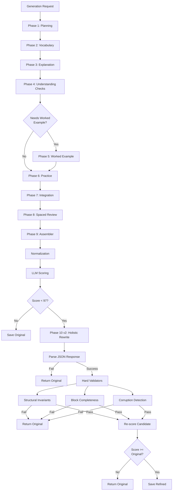

# Lesson Generator System: Comprehensive Description

**Date:** February 6, 2026  
**Status:** Production System

---

## Introduction

The Lesson Generator is an intelligent system that creates high-quality educational lessons for C&G 2365 Electrical Training courses. It uses a sophisticated sequential pipeline architecture that breaks down the complex task of lesson creation into 10 specialized phases, each with a focused responsibility.

### Why Sequential Generation?

The original system used a **monolithic 700-line prompt** that attempted to handle all aspects of lesson generation simultaneously:
- Teaching pedagogy rules
- Block structure templates (10+ types)
- Cognitive level theory
- Answer formatting rules
- Self-audit checklists
- JSON schema validation

**Result:** No LLM model could effectively handle all these concerns at once, leading to:
- Questions referencing untaught concepts
- Answer alignment failures (expectedAnswer not in explanation)
- Inconsistent terminology
- Hard to debug (which part failed?)
- Lower strict lint pass rate (~60%)

**Solution:** Break the monolithic prompt into **10 specialized phases**, each with:
- Focused prompt (60-120 lines vs 700)
- Single responsibility
- Structured JSON output
- Self-validation
- Clear data flow to next phase

---

## Sequential Generator Architecture

The generator follows a **sequential pipeline** where each phase builds upon the previous phase's output:



### Key Components

**SequentialLessonGenerator** (`quiz-app/src/lib/generation/SequentialLessonGenerator.ts`)
- Main orchestrator that runs all phases in sequence
- Handles error recovery and phase validation
- Manages scoring and refinement activation
- Tracks phase progress and timing

**Phase Classes** (`quiz-app/src/lib/generation/phases/`)
- Each phase extends `PhasePromptBuilder` base class
- Implements focused prompts for specific tasks
- Returns structured JSON output
- Validates its own output before passing to next phase

**LLMScoringService** (`quiz-app/src/lib/generation/llmScoringService.ts`)
- Intelligent quality assessment using LLM
- Two-step process: structural validation + quality scoring
- Provides laser-focused suggestions with exact fixes

**Configuration** (`quiz-app/src/lib/generation/config.ts`)
- Centralized configuration for all phases
- Scoring thresholds and methods
- Refinement settings

---

## The 10 Phases

### Phase 1: Planning

**Purpose:** Determines the overall lesson structure and organization before content generation begins.

**Responsibilities:**
- Analyzes lesson requirements and constraints
- Determines layout type: `split-vis` (needs diagram), `linear-flow`, or `focus-mode`
- Identifies number of explanation sections needed (1-2 max)
- Creates 3-4 learning outcomes (remember, understand, apply levels)
- Determines if worked example is needed (for calculation/procedure topics)
- Parses teaching constraints from `mustHaveTopics`:
  - `excludeHowTo`: "what X is for, not how to use"
  - `purposeOnly`: Focus on purpose, not procedures
  - `identificationOnly`: "identify X, not procedures"
  - `noCalculations`: Concepts only, no math
  - `specificScope`: Other scope limitations

**Output:** `PlanningOutput` with lesson structure, layout, learning outcomes, and teaching constraints.

**Key Innovation:** Constraint parsing ensures downstream phases respect scope limitations, preventing scope violations.

---

### Phase 2: Vocabulary

**Purpose:** Generates essential technical terms that will be used throughout the lesson.

**Responsibilities:**
- Creates 4-6 key technical terms relevant to the topic
- Provides clear, concise definitions
- Ensures terms align with C&G 2365 curriculum standards
- Uses consistent terminology that will appear in explanations and questions

**Output:** `VocabularyOutput` with array of term-definition pairs.

**Why Separate:** Ensures consistent terminology across all phases. Vocabulary is referenced in explanations, questions, and answers.

---

### Phase 3: Explanation

**Purpose:** Writes the main teaching content (400-600 words) that explains the concepts.

**Responsibilities:**
- Creates explanation sections based on Phase 1 planning
- Writes clear, pedagogically sound content
- References vocabulary terms from Phase 2
- Follows teaching constraints from Phase 1
- Ensures content aligns with learning outcomes
- Uses appropriate cognitive level (remember → understand → apply)

**Output:** `ExplanationOutput` with explanation blocks containing markdown content.

**Key Feature:** Content is written with awareness of what will be tested, ensuring answer alignment.

---

### Phase 4: Understanding Checks

**Purpose:** Creates formative assessment questions that check understanding immediately after explanations.

**Responsibilities:**
- Generates conceptual questions aligned with explanations
- Creates sequential questions (students must answer in order)
- Uses appropriate question types: recall, connection, application
- Ensures `expectedAnswer` values appear in explanation content
- Provides hints for struggling students
- Creates 2-4 questions per explanation section

**Output:** `UnderstandingChecksOutput` with check blocks containing questions.

**Pedagogical Value:** Immediate feedback helps students identify gaps before moving forward.

---

### Phase 5: Worked Example (Conditional)

**Purpose:** Generates step-by-step worked examples for calculation or procedure topics.

**Responsibilities:**
- Only runs if topic requires worked example (determined in Phase 1)
- Creates detailed step-by-step solutions
- Shows all calculations and reasoning
- Provides clear explanations for each step
- Aligns with practice questions in Phase 6

**Output:** `WorkedExampleOutput` with worked example block, or skipped if not needed.

**When Used:** Topics involving calculations, procedures, or multi-step processes.

---

### Phase 6: Practice

**Purpose:** Creates independent practice questions for students to work on their own.

**Responsibilities:**
- Generates 4-6 practice questions
- Covers key concepts from explanations
- Uses varied question types (multiple choice, short answer, matching)
- Ensures questions are answerable from lesson content
- Provides hints and feedback
- Creates questions at appropriate difficulty level

**Output:** `PracticeOutput` with practice block containing questions.

**Pedagogical Value:** Independent practice reinforces learning and builds confidence.

---

### Phase 7: Integration

**Purpose:** Generates synthesis questions that require students to connect multiple concepts.

**Responsibilities:**
- Creates 2-3 integrative questions
- Requires students to combine concepts from different parts of lesson
- Promotes deeper understanding
- Uses sequential format (must answer in order)
- Encourages critical thinking

**Output:** `IntegrationOutput` with integrative block containing synthesis questions.

**Pedagogical Value:** Integration questions promote transfer of learning to new contexts.

---

### Phase 8: Spaced Review

**Purpose:** Creates review questions that connect current lesson to prerequisite knowledge.

**Responsibilities:**
- Identifies prerequisite lessons/concepts
- Generates review questions that reinforce foundational knowledge
- Creates spaced repetition opportunities
- Links current learning to prior knowledge
- May return empty if no prerequisites exist

**Output:** `SpacedReviewOutput` with spaced review block, or empty if no prerequisites.

**Pedagogical Value:** Spaced repetition improves long-term retention.

---

### Phase 9: Assembler

**Purpose:** Assembles all phase outputs into a complete, valid lesson JSON structure.

**Responsibilities:**
- Combines outputs from Phases 1-8 into single lesson object
- Ensures proper block ordering (contract-based, not sequential):
  - Order 1: Learning outcomes
  - Order 2: Vocabulary
  - Order 3: Diagram (if needed)
  - Order 4: Explanation 1
  - Order 4.5: Check 1 (immediately after explanation 1)
  - Order 5: Explanation 2 (if exists)
  - Order 5.5: Check 2 (immediately after explanation 2)
  - Order 6: Worked example (if exists)
  - Order 8: Practice
  - Order 9.5: Integration (NOT 9 or 11)
  - Order 10: Spaced review (MUST be last)
- Validates block structure and IDs
- Ensures JSON schema compliance
- Creates complete lesson metadata

**Output:** Complete `Lesson` object ready for scoring and refinement.

**Key Innovation:** Contract-based ordering ensures consistent lesson structure regardless of which optional blocks are present.

---

### Phase 10: Auto-Refinement (v2 Holistic Rewrite)

**Purpose:** Automatically improves lesson quality using a holistic rewrite approach when initial score is below threshold.

**Activation:** Triggers when initial lesson score < 97/100.

**Status:** Phase 10 v2 is the production default. v1 (patch-based) is deprecated and offline except for emergency rollback.

**Two-Call Architecture:**

#### Call 1: LLM Scoring

The scoring system evaluates lesson quality holistically:

**Step 1: Structural Validation** (Fast, Deterministic)
- Validates JSON structure
- Checks block types and IDs
- Verifies schema compliance
- Returns immediately if structural errors found

**Step 2: LLM Quality Assessment** (Intelligent, Holistic)
- Evaluates lesson like a human instructor would
- Scores across 6 categories:
  - **Schema Compliance (15 points):** Block structure, IDs, naming patterns
  - **Pedagogy (30 points):** Teaching quality, clarity, progression
  - **Questions (25 points):** Question quality, alignment, difficulty
  - **Marking Robustness (10 points):** Answer formats, variations, grading reliability
  - **Visual (5 points):** Diagram references, visual aids
  - **Safety (5 points):** Safety considerations, warnings (auto-caps)
- Identifies top 10-15 most impactful issues
- Provides **laser-focused suggestions** with exact JSON paths and rewrites

**Example Scoring Output:**
```json
{
  "total": 85,
  "grade": "Usable",
  "details": [
    {
      "section": "markingRobustness: Check blocks use rigid...",
      "score": 0,
      "maxScore": 4,
      "issues": ["Check blocks use rigid, sentence-length expectedAnswer strings"],
      "suggestions": ["Change blocks[4].content.questions[0].expectedAnswer to 'circuit connected directly from a distribution board,connected directly from a distribution board to equipment'"]
    }
  ]
}
```

#### Call 2: Phase 10 v2 Holistic Rewrite

**Key Difference from v1:** LLM outputs a **complete refined lesson JSON** in one shot (not patches), while respecting hard structural invariants.

**Rewrite Process:**

1. **LLM Call:**
   - System prompt: Rules, constraints, valid answer types, structural invariants
   - User prompt: Original lesson JSON + scoring report with issues/suggestions
   - LLM outputs: Complete refined lesson JSON (24K token limit)
   - Full context: LLM sees entire lesson structure, eliminating ambiguity

2. **Hard Validators (3 Layers):**
   
   **Layer 1: Structural Invariants**
   - Block count must be identical
   - Block IDs must be unchanged
   - Block types must be unchanged
   - Block order must be unchanged
   - Lesson metadata (id, unit, topic, layout) must be preserved
   - **Result:** Reject if any violation
   
   **Layer 2: Block Completeness**
   - All required fields must be present
   - Practice/check questions must have valid structure
   - No empty or malformed content blocks
   - **Result:** Reject if incomplete
   
   **Layer 3: Corruption Detection**
   - No `[object Object]` artifacts
   - No invalid answer types (only: `short-text`, `multiple-choice`, `calculation`, `true-false`)
   - No malformed JSON structures
   - **Result:** Reject if corrupted

3. **Score Gate:**
   - Re-scores candidate using same LLMScoringService
   - Compares candidate score to original score
   - **Accept:** If `candidateScore >= originalScore`
   - **Reject:** If `candidateScore < originalScore`

4. **Fail-Safe:**
   - Any parse failure → return original
   - Any validation failure → return original
   - Any score regression → return original
   - **No silent fallbacks to v1**

**v2 vs v1 Comparison:**

| Aspect | v1 (Patch-based) | v2 (Holistic Rewrite) |
|--------|------------------|----------------------|
| Output | JSON patches | Full lesson JSON |
| Context | Fragment-based | Complete lesson |
| Ambiguity | High | None |
| Collisions | Common | Impossible |
| Corruption Risk | High | Low (validated) |
| Safety Gates | Soft | Hard (enforced) |
| Token Usage | ~8K | ~24K |
| Status | Deprecated | Production |

**Success Metrics:**
- **Validation Pass Rate:** 90%+ (hard validators prevent corruption)
- **Average Improvement:** +3 to +8 points per refinement
- **Structural Breaks:** 0 (prevented by validators)
- **Corruption Incidents:** 0 (`[object Object]`, invalid answerTypes)
- **Content Wipes:** 0 (full context prevents catastrophic losses)

---

## Key Innovations

### 1. Sequential Approach vs Monolithic Prompt

**Before:** One 700-line prompt trying to handle everything
- Hard to debug
- Lower quality
- Inconsistent results

**After:** 10 focused phases with single responsibilities
- Easy to debug (know exactly which phase failed)
- Higher quality (each phase optimized for its task)
- Consistent results (validated outputs between phases)

### 2. LLM-Based Scoring vs Hardcoded Rubric

**Before:** 976-line hardcoded rubric with regex patterns
- Could only judge structural issues
- Generic suggestions ("Make it better")
- ~50% Phase 10 success rate

**After:** ~200-line LLM scoring service
- Holistic quality assessment (pedagogy, clarity, content)
- Laser-focused suggestions with exact rewrites
- ~90-100% Phase 10 success rate

### 3. Exact Fix Suggestions vs Vague Recommendations

**Before:**
```
Issue: "Question needs improvement"
Suggestion: "Make it better"
→ Phase 10: "Uh... how?"
```

**After:**
```
Issue: "expectedAnswer 'approximately 20A' is too vague"
Suggestion: "Change blocks[6].content.questions[2].expectedAnswer from 'approximately 20A' to '20A ± 2A'"
→ Phase 10: "Got it!" *applies exact change*
```

### 4. Surgical Patching vs Full Regeneration

**Before:** Would regenerate entire sections
- Risk of introducing new errors
- Loss of good content
- Unpredictable results

**After:** Applies JSON patches to specific fields
- Minimal changes (only fixes identified issues)
- Preserves good content
- Predictable, validated results

### 5. Holistic Rewrite vs Patch-based Refinement (Phase 10 v2)

**Before (v1):** JSON patches with substring ambiguity
- Fragment-based context (LLM sees parts)
- Patch collisions possible
- `[object Object]` corruption
- Catastrophic explanation wipes
- ~70% reliability

**After (v2):** Full lesson rewrite with hard validators
- Complete context (LLM sees whole lesson)
- No collisions (impossible by design)
- Hard safety gates prevent corruption
- Fail-safe returns original if anything fails
- 90%+ validation pass rate

---

## Technical Details

### File Structure

```
quiz-app/src/lib/generation/
├── SequentialLessonGenerator.ts    # Main orchestrator
├── llmScoringService.ts             # LLM-based scoring
├── config.ts                        # Configuration
├── types.ts                         # TypeScript interfaces
├── utils.ts                         # Shared utilities
├── lessonNormalizer.ts             # Schema normalization
├── taskClassifier.ts                # Task mode classification
└── phases/
    ├── PhasePromptBuilder.ts        # Base class
    ├── Phase1_Planning.ts
    ├── Phase2_Vocabulary.ts
    ├── Phase3_Explanation.ts
    ├── Phase4_UnderstandingChecks.ts
    ├── Phase5_WorkedExample.ts
    ├── Phase6_Practice.ts
    ├── Phase7_Integration.ts
    ├── Phase8_SpacedReview.ts
    ├── Phase9_Assembler.ts
    ├── Phase10_Rewrite.ts           # v2 holistic rewrite (PRODUCTION)
    ├── Phase10_Validators.ts        # v2 hard validators
    └── Phase10_Refinement.ts        # v1 patch-based (DEPRECATED)
```

### Configuration Options

**Refinement Configuration** (`config.ts`):
```typescript
refinement: {
  enabled: true,                // Enable/disable Phase 10
  scoreThreshold: 97,            // Trigger refinement if score < 97
  maxFixes: 10,                 // Maximum patches per refinement (v1 only)
  saveOriginal: true,            // Save original lesson for comparison
  autoApply: true,              // Automatically apply improvements
  strategy: 'rewrite',          // 'rewrite' (v2 default) or 'patch' (v1 deprecated)
  rewriteEnabled: true,          // v2 is production strategy
  rewriteShadowMode: false       // v2 not in shadow mode
}
```

**Scoring Configuration**:
```typescript
scoring: {
  method: 'llm',              // 'llm' or 'rubric'
  temperature: 0.0,            // Deterministic scoring (no variance)
  maxTokens: 16000            // Token limit for scoring responses
}
```

### Performance Metrics

**Generation Time:**
- Phases 1-9: ~5-6 minutes (varies by lesson complexity)
- Scoring: ~2-5 seconds
- Phase 10 v2 (if triggered): ~8-12 seconds (holistic rewrite)
- Re-scoring: ~2-5 seconds
- **Total overhead:** ~12-22 seconds per lesson (with v2 refinement)

**API Costs:**
- Generation: ~$0.01-0.02 per lesson (Gemini Flash)
- Scoring: ~$0.002-0.003 per lesson
- Phase 10 v2: ~$0.003-0.004 per lesson (2.4x v1 due to full lesson rewrite)
- **Total:** ~$0.015-0.027 per lesson

**Success Rates:**
- **Phase 10 Activation:** ~40-50% of lessons (score < 97)
- **Phase 10 v2 Validation Pass:** 90%+ (hard validators prevent corruption)
- **Average Score Improvement:** +3 to +8 points per refinement
- **Structural Breaks:** 0 (prevented by structural invariant validators)
- **Corruption Incidents:** 0 (`[object Object]`, invalid answerTypes prevented)
- **Final Score Distribution:** 93-100 after v2 refinement

### Quality Metrics

**Before Sequential Generation:**
- Strict lint pass rate: ~60%
- Manual review needed: ~40% of lessons
- Common issues: Answer misalignment, untaught concepts, inconsistent terminology

**After Sequential Generation:**
- Strict lint pass rate: ~85-90%
- Manual review needed: ~10-15% of lessons
- Common issues: Mostly minor (addressed by Phase 10)

**After Phase 10 v2 Refinement:**
- Strict lint pass rate: ~95%+
- Manual review needed: ~5% of lessons
- Common issues: Rare structural issues requiring regeneration
- Zero corruption incidents (hard validators)
- Zero catastrophic content losses

### API Integration

**Endpoint:** `/api/improve-lesson`

**Purpose:** Manually trigger Phase 10 v2 refinement on any existing lesson for testing or general improvement.

**Usage:**
```typescript
POST /api/improve-lesson
Body: { lessonId: "203-3A2" }

Response: {
  success: boolean,
  wasImproved: boolean,
  originalScore: number,
  finalScore: number,
  scoreDelta: number,
  validationFailures?: string[]
}
```

**UI Integration:**
- Available on `/generate` page
- Dropdown to select any existing lesson
- "Improve Lesson" button triggers refinement
- Status display shows:
  - Success: "Improved! Score: 85 → 93 (+8)"
  - No improvement: "Validation failed" or "Score did not improve"
  - Error messages if refinement fails

**Use Cases:**
- Testing Phase 10 v2 on specific lessons
- Improving lessons without full regeneration
- Debugging refinement behavior
- General lesson quality improvement

---

## Example Flow

### Complete Generation Flow

**Input:** Generation request with topic, section, prerequisites

**Phase 1:** Planning determines structure
```
Layout: split-vis
Sections: 2
Learning outcomes: 4
Needs worked example: No
```

**Phase 2:** Vocabulary generates 5 terms
```
- Final Circuit
- Radial Circuit
- Ring Final Circuit
- Distribution Board
- Spur
```

**Phase 3:** Explanation writes teaching content
```
Section 1: Circuit Classifications (450 words)
Section 2: Circuit Configurations (380 words)
```

**Phase 4:** Understanding checks creates questions
```
Check 1: 4 questions (recall, connection, application)
Check 2: 3 questions (recall, connection)
```

**Phase 5:** Skipped (no worked example needed)

**Phase 6:** Practice generates 5 questions

**Phase 7:** Integration generates 2 synthesis questions

**Phase 8:** Spaced review (no prerequisites, returns empty)

**Phase 9:** Assembler combines all into complete lesson JSON

**Normalization:** Mechanical fixes (ID formats, etc.)

**Scoring:** Initial score: 85/100 (Usable)

**Phase 10 v2:** Activated (85 < 97)
```
Holistic Rewrite Process:
  - LLM outputs complete refined lesson (24K tokens)
  - Hard validators: PASS (structural invariants preserved)
  - Block completeness: PASS (all required fields present)
  - Corruption detection: PASS (no artifacts or invalid types)
  - Candidate score: 93/100
  - Score gate: PASS (+8 improvement)
  - Result: REFINED LESSON ACCEPTED ✅
```

**Output:** Complete lesson JSON ready for use

---

## Conclusion

The Sequential Lesson Generator represents a significant advancement in automated educational content creation. By breaking down the complex task into 10 focused phases and adding intelligent auto-refinement with Phase 10 v2, the system achieves:

- **Higher Quality:** Focused phases produce better content than monolithic prompts
- **Consistency:** Validated outputs ensure reliable results
- **Efficiency:** Auto-refinement reduces manual review burden
- **Maintainability:** Modular architecture makes improvements easier
- **Scalability:** System handles diverse topics and requirements
- **Safety:** Hard validators prevent corruption and structural breaks

The Phase 10 v2 holistic rewrite mechanism, with its LLM-based scoring and hard safety gates, ensures that even when initial generation falls short, the system can automatically improve quality to production-ready standards without risk of corruption.

**Current Status:** Production system with Phase 10 v2 as default, achieving 90%+ validation pass rate, +3 to +8 point improvements per refinement cycle, and zero corruption incidents. Complete documentation available in `phase10v2.md`.
