# Phase 12 Implementation Analysis and Solutions

**Date:** February 9, 2026  
**Status:** Phase 12 Failing - Patch Application Error  
**Priority:** High - Blocks entire Phase 10-13 pipeline

---

## Executive Summary

The Phase 10-13 pedagogical improvement pipeline has been successfully implemented and integrated into the lesson generation system. However, **Phase 12 (Implement) is failing** after applying only the first patch out of multiple patches, preventing lesson improvements from being applied.

**Current Status:**
- ✅ **Phase 10 (Score):** Fully operational - Scores lessons and identifies issues
- ✅ **Phase 11 (Suggest):** Fully operational - Generates fix plans with JSON Pointer patches
- ❌ **Phase 12 (Implement):** Failing - Cannot apply multiple patches to same path
- ⏸️ **Phase 13 (Rescore):** Never reached - Blocked by Phase 12 failure

**Impact:** Lesson improvements cannot be applied, blocking the entire improvement pipeline and preventing lessons from being automatically enhanced based on pedagogical assessment.

---

## Architecture Overview

### Phase 10-13 Pipeline Flow

```mermaid
sequenceDiagram
    participant Gen as SequentialLessonGenerator
    participant P10 as Phase10_Score
    participant P11 as Phase11_Suggest
    participant P12 as Phase12_Implement
    participant P13 as Phase13_Rescore
    participant RAG as SyllabusRAG
    
    Gen->>P10: Original Lesson (Score: Unknown)
    P10->>RAG: Retrieve syllabus context
    RAG-->>P10: Unit 203 LO3 context
    P10->>P10: Assess using pedagogical criteria
    P10-->>Gen: Score: 67/100 + 10 Issues
    
    Gen->>P11: Lesson + Issues
    P11->>P11: Classify issues (fixable vs blocked)
    P11->>P11: Generate JSON Pointer patches
    P11-->>Gen: 10 Fix Plans (0 blocked)
    
    Gen->>P12: Lesson + Fix Plans
    P12->>P12: Apply Patch 1 to /blocks/5/content/content
    Note over P12: ✅ Success
    P12->>P12: Apply Patch 2 to /blocks/5/content/content
    Note over P12: ❌ FAILURE - Path not found
    P12-->>Gen: ERROR: Path invalid after mutation
    
    Note over P13: Never executed due to Phase 12 failure
```



### System Integration

The Phase 10-13 pipeline is integrated into `SequentialLessonGenerator.ts` at lines 964-1039:

```typescript
private async runPhase10(lesson: Lesson, rubricScore: RubricScore, 
                         debugCollector: DebugBundleCollector): Promise<RefinementOutput | null>
```

The pipeline activates when:
- Initial lesson score < threshold (97)
- Configuration `refinement.enabled = true`

---

## What We Have Done: Implementation Details

### Phase 10: Scoring (WORKING ✅)

**File:** [`quiz-app/src/lib/generation/phases/Phase10_Score.ts`](../../../src/lib/generation/phases/Phase10_Score.ts)

**Status:** Fully operational

**Functionality:**
- Scores lessons using LLM-based pedagogical assessment
- Retrieves relevant syllabus context via BM25 search (RAG)
- Identifies specific issues with JSON Pointer locations
- Categorizes issues by type (alignment, clarity, marking, etc.)

**Output Example (Lesson 203-3A12):**
```
Score: 67/100 (Usable)
- Beginner Clarity: 22/30
- Teaching-Before-Testing: 20/25
- Marking Robustness: 12/20
- Alignment to LO: 6/15
- Question Quality: 7/10
- Issues: 10
```

**Key Issues Identified:**
1. Missing Assessment Criterion 3.3 (current-carrying capacity)
2. AC 3.5 not addressed (specialized equipment)
3. AC 3.6 missing (spacing factor calculations)
4. Terminology not defined (luminaires, fused connection units)
5. Acronym 'CPC' used but not taught
6. Question marking issues (INT-2 uses wrong answer type)

**Verbose Logging:**
- Controlled by `DEBUG_PHASE10=true` environment variable
- Shows prompts, responses, score breakdown, and detailed issue analysis

---

### Phase 11: Suggestion (WORKING ✅)

**File:** [`quiz-app/src/lib/generation/phases/Phase11_Suggest.ts`](../../../src/lib/generation/phases/Phase11_Suggest.ts)

**Status:** Fully operational

**Functionality:**
- Analyzes Phase 10 issues for fixability
- Generates concrete JSON Pointer-based patches
- Classifies issues as fixable, blocked, or requiring regeneration
- Respects structural invariants (no block count changes, no answerType changes)

**Output Example:**
```
✅ Generated suggestions:
   - Fixable plans: 10
   - Blocked issues: 0
   - Regeneration needed: false
```

**Patch Operations Supported:**
```typescript
interface PatchOperation {
  op: 'replaceSubstring' | 'append' | 'prepend' | 'replace';
  path: string;  // JSON Pointer (RFC 6901)
  find?: string;  // For replaceSubstring
  from?: string;  // For replace (context)
  value: string;  // New value
}
```

**Example Fix Plan:**
```typescript
{
  issueId: "ISSUE-1",
  targets: ["/blocks/5/content/content"],
  instructions: "Add definition for 'luminaires' to vocabulary",
  patches: [
    {
      op: "append",
      path: "/blocks/5/content/content",
      value: "\n\n**Luminaires**: Light fixtures including the bulb, shade, and housing."
    }
  ]
}
```

**Verbose Logging:**
- Shows issue classification
- Displays patch generation process
- Logs fixability analysis

---

### Phase 12: Implementation (FAILING ❌)

**File:** [`quiz-app/src/lib/generation/phases/Phase12_Implement.ts`](../../../src/lib/generation/phases/Phase12_Implement.ts)

**Status:** Failing after 1st patch

**Functionality:**
- Applies JSON Pointer patches sequentially
- Validates structural invariants after all patches
- Deep clones lesson at start for isolation

**Current Behavior:**
```typescript
// Line 56-58: Single deep clone at start
let candidateLesson: any = JSON.parse(JSON.stringify(originalLesson));

// Line 66-112: Apply patches sequentially
for (const plan of suggestions.fixablePlans) {
  for (const patch of plan.patches) {
    candidateLesson = this.applyPatch(candidateLesson, patch);
    // ❌ No path revalidation after this mutation
  }
}
```

**Problem Code (Lines 194-238):**
```typescript
private applyPatch(lesson: any, patch: PatchOperation): any {
  const path = patch.path;
  const parts = path.split('/').filter(p => p !== '');
  
  // Navigate to parent object
  let current: any = lesson;
  for (let i = 0; i < parts.length - 1; i++) {
    const part = parts[i];
    const key = this.parsePathPart(part);
    
    if (current[key] === undefined) {
      throw new Error(`Path not found: ${path} (missing ${key})`);
      // ❌ Throws immediately, no recovery
    }
    
    current = current[key];
  }
  
  // Apply operation...
}
```

**What Happens:**
1. ✅ Patch 1: `append` to `/blocks/5/content/content` succeeds
2. Lesson structure is mutated
3. ❌ Patch 2: Same path now invalid due to first mutation
4. `applyPatch()` throws error
5. Entire Phase 12 fails

---

### Phase 13: Rescoring (NOT REACHED ⏸️)

**File:** [`quiz-app/src/lib/generation/phases/Phase13_Rescore.ts`](../../../src/lib/generation/phases/Phase13_Rescore.ts)

**Status:** Never executed due to Phase 12 failure

**Intended Functionality:**
- Re-scores the improved lesson
- Compares original vs candidate scores
- Decides whether to accept or reject improvements
- Provides detailed comparison table

**Decision Logic:**
```typescript
if (candidateScore > originalScore) {
  return { accepted: true, reason: "Score improved" };
} else {
  return { accepted: false, reason: "No improvement" };
}
```

---

## The Error: Detailed Analysis

### Terminal Output (Lines 408-412)

```
🔧 Applying fix for issue ISSUE-1...
  ✅ Applied append to /blocks/5/content/content 
🔧 Applying fix for issue ISSUE-2...
  ❌ Failed to apply patch: Path not found: /blocks/5/content/content (missing blocks)
❌ Phase 12 failed: Failed to apply patch to /blocks/5/content/content: Path not found: /blocks/5/content/content (missing blocks)
```

### Root Cause Analysis

#### Primary Issue: Stale JSON Pointers After Mutation

**Location:** `Phase12_Implement.ts` lines 206-215

**Problem Flow:**


**Why the Path Becomes Invalid:**

1. **First patch modifies structure**: The `append` operation changes the content at `/blocks/5/content/content`
2. **No path revalidation**: Phase 12 doesn't check if subsequent paths are still valid
3. **Pre-computed pointers**: All patches use JSON Pointers calculated against the original lesson
4. **Structural assumptions broken**: After mutation, the lesson structure may have changed in ways that invalidate other paths

**Technical Details:**

The `applyPatch()` method navigates the lesson object using the JSON Pointer path:
- Splits path into parts: `["blocks", "5", "content", "content"]`
- Iterates through parts, navigating to each nested level
- **Fails immediately when any part is undefined**
- **No recovery mechanism** - throws error and exits

### Contributing Factors

#### Factor 1: Multiple Patches Targeting Same Path

**Evidence from terminal:**
- Both ISSUE-1 and ISSUE-2 target `/blocks/5/content/content`
- Phase 11 generated multiple fixes for the same block
- No deduplication or conflict detection in Phase 11
- No grouping of compatible patches in Phase 12

**Why This Happens:**
- Multiple pedagogical issues may affect the same content block
- Phase 11 LLM generates independent patches for each issue
- No analysis of inter-patch dependencies

#### Factor 2: No Deep Clone Between Patches

**Current Implementation:**
```typescript
// Line 57: Single clone at start
let candidateLesson: any = JSON.parse(JSON.stringify(originalLesson));

// Lines 66-112: All patches mutate same object
for (const plan of suggestions.fixablePlans) {
  for (const patch of plan.patches) {
    candidateLesson = this.applyPatch(candidateLesson, patch);
    // Same object reference throughout
  }
}
```

**Problem:**
- One clone at the beginning
- All mutations affect the same object
- No snapshot mechanism for rollback
- Cannot undo failed patches

#### Factor 3: Optimistic Path Resolution

**Current Assumptions:**
- All JSON Pointers remain valid throughout execution
- Lesson structure doesn't change in ways that affect paths
- No defensive path checking before operations

**Reality:**
- Paths can become invalid after mutations
- Structure changes unpredictably
- Need defensive programming

---

## Proposed Solutions

### Solution 1: Pre-Validate All Paths (Quick Fix)

**Effort:** Low | **Risk:** Low | **Effectiveness:** Medium

**Approach:**
Before applying any patches, validate that all paths exist in the original lesson structure.

**Implementation:**

```typescript
private validateAllPaths(lesson: Lesson, patches: PatchOperation[]): PatchOperation[] {
  const validPatches: PatchOperation[] = [];
  const skippedPatches: PatchOperation[] = [];
  
  for (const patch of patches) {
    try {
      this.getValueAtPath(lesson, patch.path);
      validPatches.push(patch);
    } catch (error) {
      console.warn(`⚠️ Skipping invalid path: ${patch.path}`);
      console.warn(`   Reason: ${error.message}`);
      skippedPatches.push(patch);
    }
  }
  
  if (skippedPatches.length > 0) {
    console.log(`\n📊 Validation Summary:`);
    console.log(`   Valid patches: ${validPatches.length}`);
    console.log(`   Skipped patches: ${skippedPatches.length}`);
  }
  
  return validPatches;
}

// Usage in implementImprovements():
async implementImprovements(originalLesson: Lesson, suggestions: Phase11Suggestions) {
  // ... existing code ...
  
  // Flatten all patches
  const allPatches = suggestions.fixablePlans.flatMap(plan => plan.patches);
  
  // Pre-validate
  const validPatches = this.validateAllPaths(originalLesson, allPatches);
  
  // Apply only valid patches
  for (const patch of validPatches) {
    candidateLesson = this.applyPatch(candidateLesson, patch);
  }
  
  // ... rest of code ...
}
```

**Pros:**
- ✅ Easy to implement (< 50 lines of code)
- ✅ Prevents crashes completely
- ✅ Maintains partial functionality
- ✅ Clear logging of skipped patches

**Cons:**
- ❌ Doesn't fix the underlying issue (paths becoming stale)
- ❌ May skip important fixes
- ❌ Doesn't handle inter-patch dependencies
- ❌ Validates against original, not current state

**When to Use:**
- Immediate hotfix to unblock pipeline
- Gathering data on failure patterns
- Temporary solution while developing better fix

---

### Solution 2: Revalidate Paths After Each Mutation (Recommended)

**Effort:** Medium | **Risk:** Low | **Effectiveness:** High

**Approach:**
After applying each patch, revalidate all remaining patches against the current (mutated) lesson state.

**Implementation:**

```typescript
async implementImprovements(originalLesson: Lesson, suggestions: Phase11Suggestions) {
  const stopTimer = debugLogger.startTimer('Phase 12: Implement Improvements');
  
  let candidateLesson: any = JSON.parse(JSON.stringify(originalLesson));
  let patchesApplied = 0;
  let patchesSkipped = 0;
  const skippedReasons: string[] = [];
  
  // Collect all patches with metadata
  const allPatches: Array<{ patch: PatchOperation; issueId: string; planIdx: number }> = [];
  suggestions.fixablePlans.forEach((plan, idx) => {
    plan.patches.forEach(patch => {
      allPatches.push({ patch, issueId: plan.issueId, planIdx: idx });
    });
  });
  
  console.log(`\n🔨 Applying ${allPatches.length} patches...`);
  
  for (let i = 0; i < allPatches.length; i++) {
    const { patch, issueId } = allPatches[i];
    
    // Revalidate path against CURRENT lesson state
    const isValid = this.isPathValid(candidateLesson, patch.path);
    
    if (!isValid) {
      patchesSkipped++;
      const reason = `Path ${patch.path} no longer valid after previous mutations`;
      skippedReasons.push(`${issueId}: ${reason}`);
      console.warn(`  ⚠️ Skipping patch ${i + 1}/${allPatches.length}: ${reason}`);
      debugLogger.logWarning(reason);
      continue;
    }
    
    try {
      const beforeValue = debugLogger.isEnabled() ? 
        this.getValueAtPath(candidateLesson, patch.path) : null;
      
      // Apply patch
      candidateLesson = this.applyPatch(candidateLesson, patch);
      patchesApplied++;
      
      console.log(`  ✅ Applied patch ${i + 1}/${allPatches.length}: ${patch.op} to ${patch.path}`);
      
      // Verbose logging
      if (debugLogger.isEnabled() && beforeValue !== null) {
        const afterValue = this.getValueAtPath(candidateLesson, patch.path);
        this.logBeforeAfter(beforeValue, afterValue);
      }
      
    } catch (error: any) {
      patchesSkipped++;
      const reason = `Failed to apply: ${error.message}`;
      skippedReasons.push(`${issueId}: ${reason}`);
      console.error(`  ❌ Patch ${i + 1}/${allPatches.length} failed: ${error.message}`);
      debugLogger.logError(reason);
      // Continue with next patch instead of failing completely
    }
  }
  
  console.log(`\n📊 Patch Application Summary:`);
  console.log(`   Applied: ${patchesApplied}`);
  console.log(`   Skipped: ${patchesSkipped}`);
  
  if (patchesSkipped > 0) {
    console.log(`\n⚠️ Skipped Patches:`);
    skippedReasons.forEach(reason => console.log(`   - ${reason}`));
  }
  
  // Continue with validation even if some patches were skipped
  const validationResult = validateCandidate(originalLesson, candidateLesson);
  
  stopTimer();
  return {
    success: validationResult.passed,
    candidateLesson: validationResult.passed ? candidateLesson as Lesson : undefined,
    validationResult,
    patchesApplied,
    patchesSkipped,
  };
}

// Helper method to check if path is valid
private isPathValid(lesson: any, path: string): boolean {
  try {
    this.getValueAtPath(lesson, path);
    return true;
  } catch {
    return false;
  }
}
```

**Pros:**
- ✅ Prevents crashes
- ✅ Allows pipeline to continue with partial success
- ✅ Validates against current state (after each mutation)
- ✅ Provides detailed metrics on skipped patches
- ✅ Graceful degradation

**Cons:**
- ⚠️ May skip important fixes
- ⚠️ Doesn't prevent path conflicts
- ⚠️ No automatic path recalculation

**Expected Behavior:**
- First few patches apply successfully
- When a path becomes invalid, that patch is skipped with warning
- Remaining valid patches continue to apply
- Phase 12 completes with partial success
- Phase 13 can execute and compare scores

---

### Solution 3: Smart Path Conflict Resolution (Advanced)

**Effort:** High | **Risk:** Medium | **Effectiveness:** Very High

**Approach:**
Analyze patch interdependencies, detect conflicts, merge compatible operations, and apply intelligently.

**Phase 11 Enhancement - Conflict Detection:**

```typescript
// In Phase11_Suggest.ts
interface ConflictReport {
  conflicts: Array<{
    path: string;
    operations: PatchOperation[];
    canMerge: boolean;
    mergeStrategy?: string;
  }>;
}

private analyzeConflicts(patches: PatchOperation[]): ConflictReport {
  const pathMap = new Map<string, PatchOperation[]>();
  
  // Group patches by target path
  patches.forEach(patch => {
    if (!pathMap.has(patch.path)) {
      pathMap.set(patch.path, []);
    }
    pathMap.get(patch.path)!.push(patch);
  });
  
  // Analyze each group
  const conflicts = Array.from(pathMap.entries())
    .filter(([_, ops]) => ops.length > 1)
    .map(([path, operations]) => {
      // Check if operations can be merged
      const canMerge = this.canMergeOperations(operations);
      const mergeStrategy = canMerge ? this.getMergeStrategy(operations) : undefined;
      
      return { path, operations, canMerge, mergeStrategy };
    });
  
  return { conflicts };
}

private canMergeOperations(ops: PatchOperation[]): boolean {
  // Multiple appends can be merged into one
  if (ops.every(op => op.op === 'append')) return true;
  
  // Multiple prepends can be merged into one
  if (ops.every(op => op.op === 'prepend')) return true;
  
  // Multiple replaceSubstring can be chained
  if (ops.every(op => op.op === 'replaceSubstring')) return true;
  
  // Cannot merge conflicting operations
  return false;
}

private getMergeStrategy(ops: PatchOperation[]): string {
  if (ops.every(op => op.op === 'append')) {
    return 'MERGE_APPENDS';
  } else if (ops.every(op => op.op === 'prepend')) {
    return 'MERGE_PREPENDS';
  } else if (ops.every(op => op.op === 'replaceSubstring')) {
    return 'CHAIN_REPLACEMENTS';
  }
  return 'UNKNOWN';
}

// Merge compatible operations
private mergePatches(patches: PatchOperation[]): PatchOperation {
  const first = patches[0];
  
  if (first.op === 'append') {
    // Combine all append values
    const combinedValue = patches.map(p => p.value).join('');
    return { ...first, value: combinedValue };
  } else if (first.op === 'prepend') {
    // Combine all prepend values (reverse order)
    const combinedValue = patches.reverse().map(p => p.value).join('');
    return { ...first, value: combinedValue };
  }
  
  return first;
}
```

**Phase 12 Enhancement - Smart Application:**

```typescript
// In Phase12_Implement.ts
class PathRegistry {
  private pathCache: Map<string, any> = new Map();
  
  constructor(private lesson: any) {
    this.buildCache();
  }
  
  private buildCache() {
    this.pathCache.clear();
    this.traverseObject(this.lesson, '');
  }
  
  private traverseObject(obj: any, currentPath: string) {
    if (obj === null || typeof obj !== 'object') {
      this.pathCache.set(currentPath, obj);
      return;
    }
    
    if (Array.isArray(obj)) {
      obj.forEach((item, idx) => {
        this.traverseObject(item, `${currentPath}/${idx}`);
      });
    } else {
      Object.keys(obj).forEach(key => {
        this.traverseObject(obj[key], `${currentPath}/${key}`);
      });
    }
  }
  
  isValid(path: string): boolean {
    return this.pathCache.has(path);
  }
  
  findSimilarPath(path: string): string | null {
    // Try to find similar content at different path
    // This is heuristic-based and may need tuning
    const parts = path.split('/').filter(p => p);
    
    // Try removing last part and checking parent
    if (parts.length > 1) {
      const parentPath = '/' + parts.slice(0, -1).join('/');
      if (this.isValid(parentPath)) {
        return parentPath;
      }
    }
    
    return null;
  }
  
  update(lesson: any) {
    this.lesson = lesson;
    this.buildCache();
  }
}

// Apply patches with intelligent tracking
private applyPatchesWithTracking(
  lesson: Lesson, 
  patches: PatchOperation[]
): { lesson: Lesson; applied: number; skipped: number } {
  const registry = new PathRegistry(lesson);
  let applied = 0;
  let skipped = 0;
  
  for (const patch of patches) {
    if (!registry.isValid(patch.path)) {
      const similarPath = registry.findSimilarPath(patch.path);
      
      if (similarPath) {
        console.log(`🔄 Path adjusted: ${patch.path} → ${similarPath}`);
        patch.path = similarPath;
      } else {
        console.warn(`⚠️ Skipping: Path no longer valid: ${patch.path}`);
        skipped++;
        continue;
      }
    }
    
    try {
      lesson = this.applyPatch(lesson, patch);
      applied++;
      registry.update(lesson);
    } catch (error) {
      console.error(`❌ Failed to apply patch: ${error.message}`);
      skipped++;
    }
  }
  
  return { lesson, applied, skipped };
}
```

**Pros:**
- ✅ Handles complex scenarios intelligently
- ✅ Merges compatible operations
- ✅ Attempts path recalculation
- ✅ Maximizes successful patch application

**Cons:**
- ❌ Complex implementation
- ❌ Higher risk of bugs
- ❌ Performance overhead
- ❌ May require extensive testing

---

### Solution 4: Transactional Batching (Most Robust)

**Effort:** Very High | **Risk:** High | **Effectiveness:** Very High

**Approach:**
Apply fixes as atomic transactions with rollback capability.

**Implementation Concept:**

```typescript
interface Transaction {
  planId: string;
  patches: PatchOperation[];
  snapshot: Lesson;
}

private applyTransactional(
  lesson: Lesson,
  plans: FixPlan[]
): { lesson: Lesson; successfulPlans: string[]; failedPlans: string[] } {
  
  let currentLesson = lesson;
  const successfulPlans: string[] = [];
  const failedPlans: string[] = [];
  
  for (const plan of plans) {
    // Take snapshot before applying plan
    const snapshot = JSON.parse(JSON.stringify(currentLesson));
    
    try {
      // Apply all patches in this plan
      let tempLesson = currentLesson;
      for (const patch of plan.patches) {
        tempLesson = this.applyPatch(tempLesson, patch);
      }
      
      // Validate after this plan
      const validation = this.validatePlanResult(lesson, tempLesson);
      
      if (validation.passed) {
        // Commit transaction
        currentLesson = tempLesson;
        successfulPlans.push(plan.issueId);
        console.log(`✅ Committed plan: ${plan.issueId}`);
      } else {
        // Rollback transaction
        console.warn(`⚠️ Rolled back plan: ${plan.issueId}`);
        console.warn(`   Reason: ${validation.errors.join(', ')}`);
        failedPlans.push(plan.issueId);
      }
      
    } catch (error) {
      // Rollback on error
      console.error(`❌ Plan failed: ${plan.issueId} - ${error.message}`);
      failedPlans.push(plan.issueId);
      // currentLesson stays as snapshot (implicit rollback)
    }
  }
  
  return { lesson: currentLesson, successfulPlans, failedPlans };
}
```

**Pros:**
- ✅ Guarantees consistency
- ✅ Clear success/failure per fix plan
- ✅ Automatic rollback
- ✅ Best audit trail

**Cons:**
- ❌ Very complex
- ❌ Performance overhead (multiple clones)
- ❌ May waste work on failures
- ❌ Requires careful validation logic

---

## Recommended Approach

### Phase 1: Immediate Fix (This Week)

**Implement Solution 2: Revalidate Paths After Each Mutation**

**Rationale:**
- ✅ Unblocks the pipeline immediately
- ✅ Medium effort, low risk
- ✅ Provides graceful degradation
- ✅ Collects data on failure patterns

**Action Items:**
1. Add `isPathValid()` helper method to Phase 12
2. Modify patch application loop to revalidate before each patch
3. Add skip tracking and detailed logging
4. Update `Phase12Result` interface to include `patchesSkipped`
5. Test with failing lesson (203-3A12)

**Expected Outcome:**
- Phase 12 completes successfully with partial patches
- Phase 13 executes and compares scores
- Pipeline unblocked for continued development

---

### Phase 2: Short-term Enhancement (Next Sprint)

**Enhance Phase 11 Conflict Detection**

**Action Items:**
1. Add conflict analysis to Phase 11 LLM prompt
2. Request LLM to merge compatible patches
3. Add warning logs when multiple patches target same path
4. Generate metrics on conflict frequency

**Expected Outcome:**
- Fewer path conflicts generated
- Better patch quality from Phase 11
- Reduced skip rate in Phase 12

---

### Phase 3: Long-term Optimization (Future)

**Implement Solution 3: Smart Path Conflict Resolution**

**Action Items:**
1. Build PathRegistry class
2. Add automatic path recalculation
3. Implement patch merging logic
4. Add comprehensive test suite

**Expected Outcome:**
- Maximum patch application success rate
- Intelligent handling of complex scenarios
- Robust and maintainable solution

---

## Testing Strategy

### Unit Tests

**File:** `quiz-app/src/lib/generation/phases/__tests__/phase12-implement.test.ts`

```typescript
describe('Phase12_Implement', () => {
  describe('Path Validation', () => {
    it('should apply sequential patches to different paths', () => {
      // Test patches targeting different blocks
    });
    
    it('should skip patches with invalid paths', () => {
      // Test path that becomes invalid
    });
    
    it('should apply multiple patches to same path if valid', () => {
      // Test compatible operations on same path
    });
  });
  
  describe('Error Handling', () => {
    it('should continue after patch failure', () => {
      // Test graceful degradation
    });
    
    it('should provide detailed skip reasons', () => {
      // Test logging and metrics
    });
  });
  
  describe('Structural Validation', () => {
    it('should maintain block count', () => {
      // Test invariant: block count unchanged
    });
    
    it('should preserve block IDs', () => {
      // Test invariant: IDs preserved
    });
  });
});
```

---

### Integration Tests

**Scenario 1: Full Pipeline with Conflicting Patches**
```typescript
describe('Phase 10-13 Pipeline Integration', () => {
  it('should handle lesson with multiple issues per block', async () => {
    const lesson = loadLesson('203-3A12');
    const result = await runFullPipeline(lesson);
    
    expect(result.phase10Score).toBeLessThan(97);
    expect(result.phase11Plans.length).toBeGreaterThan(0);
    expect(result.phase12.success).toBe(true);
    expect(result.phase12.patchesApplied).toBeGreaterThan(0);
    expect(result.phase13.accepted).toBe(true);
  });
});
```

**Scenario 2: Graceful Degradation**
```typescript
it('should complete pipeline even with some patch failures', async () => {
  const lesson = loadLesson('203-3A12');
  const result = await runFullPipeline(lesson);
  
  expect(result.phase12.patchesSkipped).toBeGreaterThan(0);
  expect(result.phase12.patchesApplied).toBeGreaterThan(0);
  expect(result.phase13).toBeDefined(); // Phase 13 ran
});
```

---

### Regression Tests

**Test Suite:** Existing lessons should continue to improve
```typescript
describe('Regression: Lesson Improvement', () => {
  const testLessons = ['202-7B', '203-3A1', '203-3A12'];
  
  testLessons.forEach(lessonId => {
    it(`should improve lesson ${lessonId}`, async () => {
      const result = await generateAndImprove(lessonId);
      
      expect(result.finalScore).toBeGreaterThanOrEqual(result.initialScore);
      expect(result.phase12.success).toBe(true);
    });
  });
});
```

---

## Implementation Checklist

### Phase 1 Tasks (Immediate)

- [ ] Add `isPathValid()` method to `Phase12_Implement.ts`
- [ ] Modify patch application loop to revalidate before each patch
- [ ] Add `patchesSkipped` field to `Phase12Result` interface
- [ ] Implement detailed skip reason logging
- [ ] Add metrics tracking (applied/skipped/failed counts)
- [ ] Test with lesson 203-3A12
- [ ] Verify Phase 13 now executes
- [ ] Update verbose logging to show skip reasons
- [ ] Add configuration flag for strict vs lenient mode
- [ ] Document new behavior in code comments

### Phase 2 Tasks (Short-term)

- [ ] Enhance Phase 11 LLM prompt to detect conflicts
- [ ] Add conflict warning logs in Phase 11
- [ ] Generate conflict frequency metrics
- [ ] Update Phase 11 to suggest patch merging

### Phase 3 Tasks (Long-term)

- [ ] Design PathRegistry class
- [ ] Implement automatic path recalculation
- [ ] Add patch merging logic
- [ ] Create comprehensive test suite
- [ ] Performance benchmarking

---

## References

### Key Files

**Phase 12 Implementation:**
- [`Phase12_Implement.ts`](../../../src/lib/generation/phases/Phase12_Implement.ts)
  - Lines 194-238: Patch application logic (needs modification)
  - Lines 66-112: Main patch loop (needs revalidation)
  - Lines 176-189: Path navigation helper

**Phase 11 Suggestions:**
- [`Phase11_Suggest.ts`](../../../src/lib/generation/phases/Phase11_Suggest.ts)
  - Lines 15-28: Patch operation definitions
  - Lines 54-150: Fix plan generation

**Sequential Generator:**
- [`SequentialLessonGenerator.ts`](../../../src/lib/generation/SequentialLessonGenerator.ts)
  - Lines 964-1039: Phase 10-13 pipeline orchestration

### Related Standards

- **JSON Pointer:** RFC 6901 - JavaScript Object Notation (JSON) Pointer
- **JSON Patch:** RFC 6902 - JavaScript Object Notation (JSON) Patch (for future reference)

### Debug Configuration

Environment variables for verbose logging:
```bash
DEBUG_PHASE10=true
DEBUG_PHASE10_PROMPTS=true
DEBUG_PHASE10_TIMING=true
```

---

## Discussion Points

### Open Questions

1. **Should Phase 11 detect and prevent conflicting patches?**
   - Pro: Fewer conflicts in Phase 12
   - Con: More complex Phase 11 logic, LLM token overhead
   - Recommendation: Start with Phase 12 handling, add Phase 11 detection in Phase 2

2. **Should Phase 12 fail-fast or continue-on-error?**
   - Fail-fast: More predictable, easier to debug
   - Continue-on-error: Better resilience, partial success possible
   - Recommendation: Continue-on-error (Solution 2) for robustness

3. **What metrics should we track for patch success rates?**
   - Applied count
   - Skipped count (with reasons)
   - Failed count (with errors)
   - Time per patch
   - Success rate per issue category
   - Recommendation: Track all for data-driven optimization

4. **Should we implement rollback mechanisms?**
   - Now: No (Phase 1)
   - Short-term: Per-plan rollback (Phase 3)
   - Long-term: Full transactional system (Phase 4)

---

## Conclusion

The Phase 10-13 pipeline is architecturally sound and Phases 10-11 are working perfectly. The Phase 12 patch application failure is a **well-understood technical issue** with multiple viable solutions.

**Immediate Action:** Implement Solution 2 (Revalidate After Each Mutation) to unblock the pipeline and collect production data on patch conflicts.

**Long-term Goal:** Evolve toward Solution 3 (Smart Path Resolution) for maximum robustness and patch application success rate.

The fix is straightforward, low-risk, and will enable the complete Phase 10-13 pipeline to function, allowing automatic lesson improvements based on pedagogical assessment criteria.

---

**Last Updated:** February 9, 2026  
**Next Review:** After Phase 1 implementation
