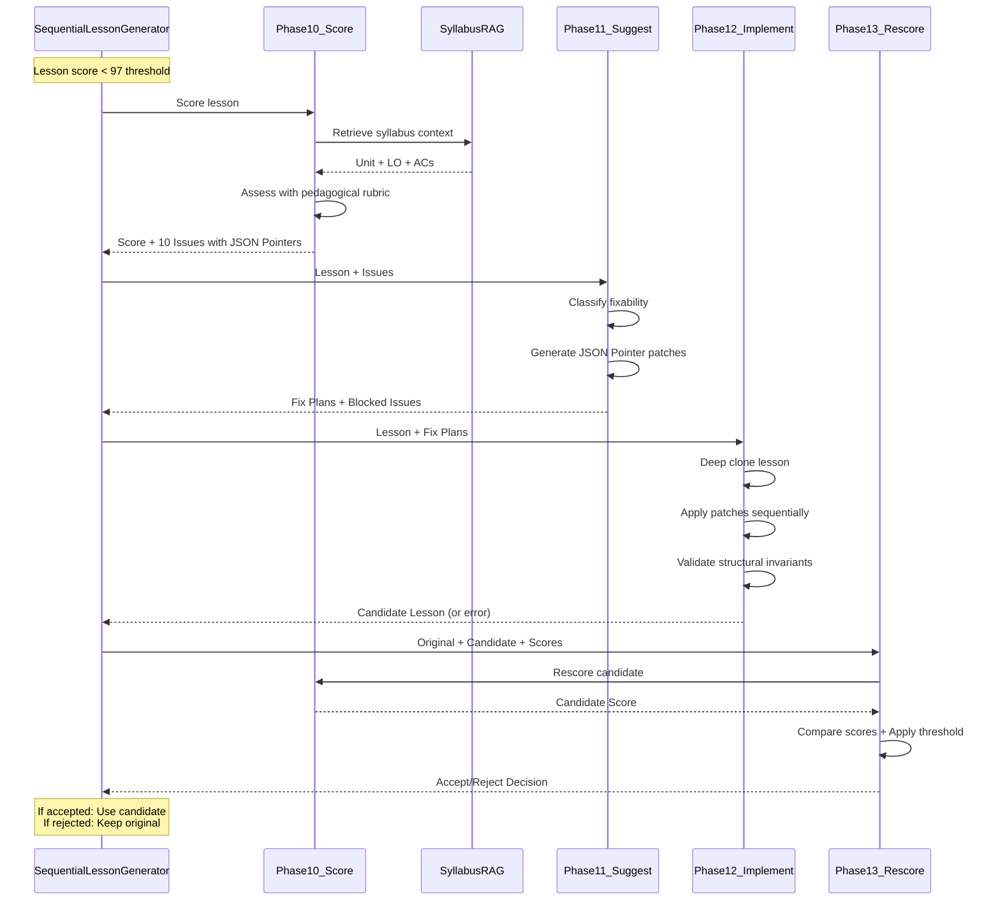
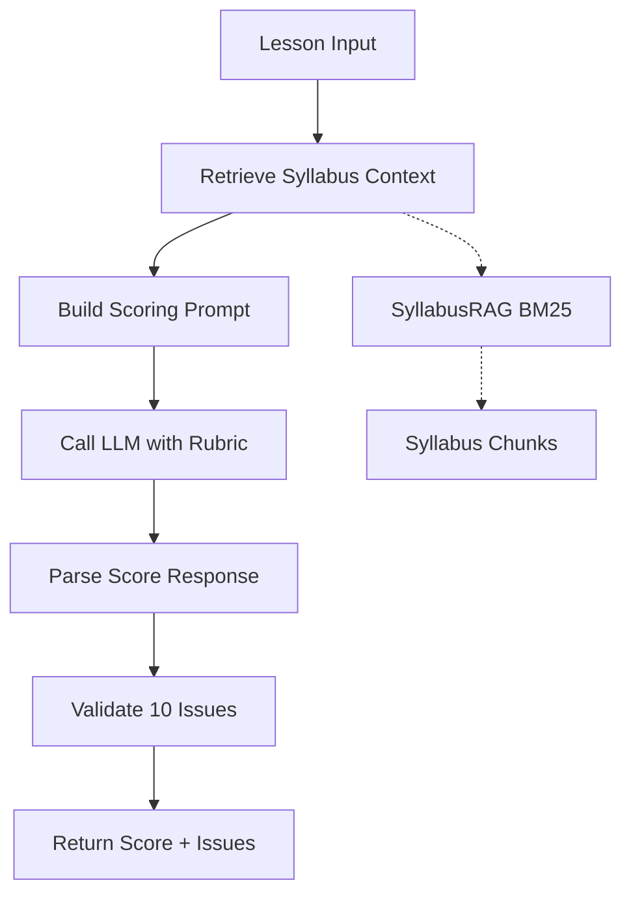
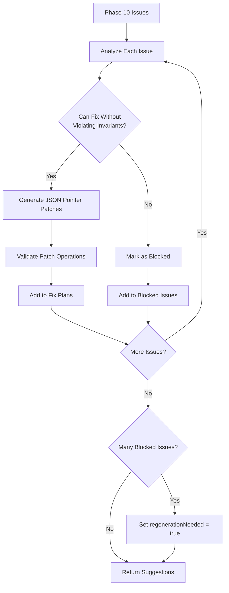
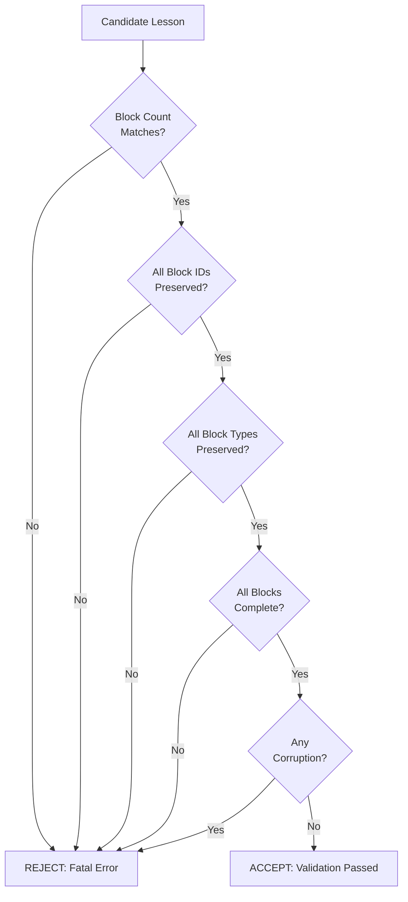
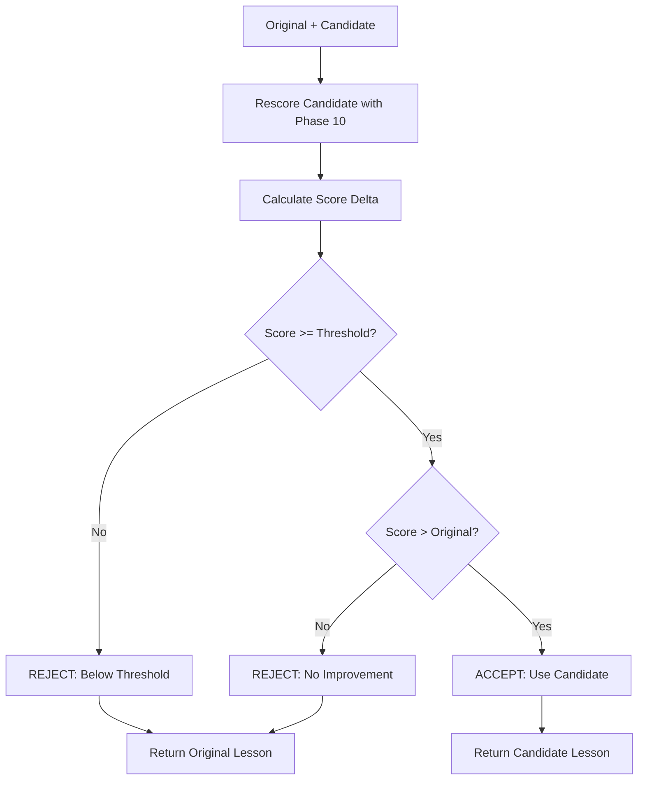
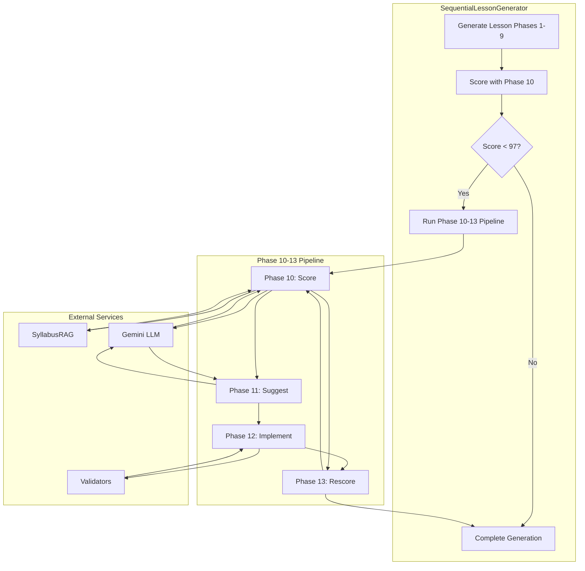
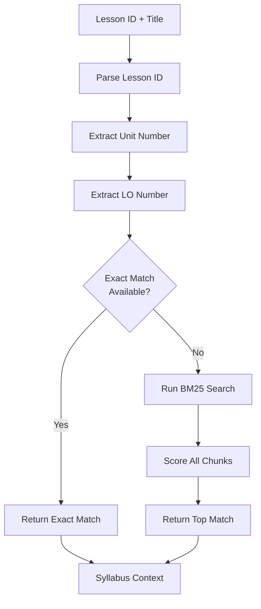
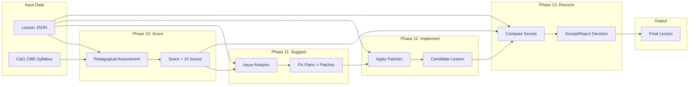
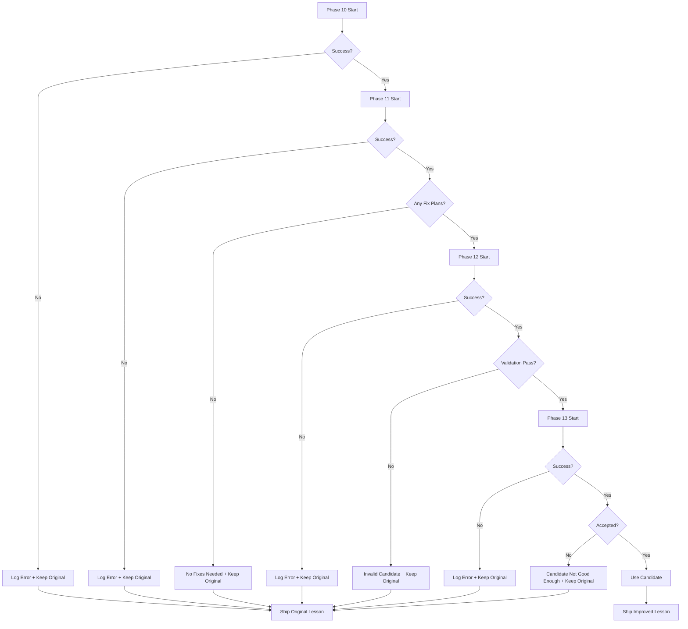
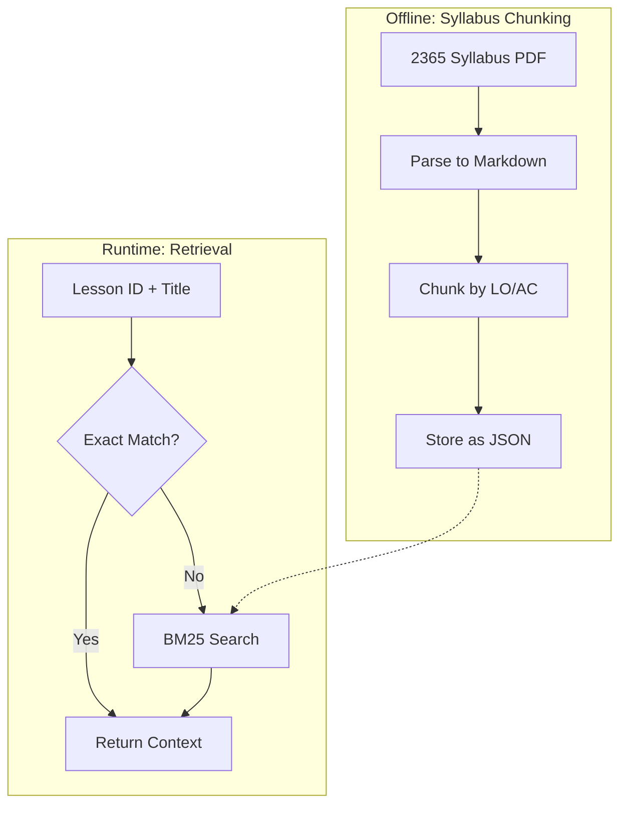

# Phase 10-13 Pipeline: Technical Documentation

**Version:** 1.0  
**Date:** February 9, 2026  
**Status:** Phases 10-11 Operational, Phase 12 Needs Fix, Phase 13 Ready

---

## Table of Contents

1. [Introduction & Architecture](#introduction--architecture)
2. [Phase 10: Pedagogical Scoring](#phase-10-pedagogical-scoring)
3. [Phase 11: Improvement Suggestions](#phase-11-improvement-suggestions)
4. [Phase 12: Implement Improvements](#phase-12-implement-improvements)
5. [Phase 13: Rescore & Decision](#phase-13-rescore--decision)
6. [Data Flow & Integration](#data-flow--integration)
7. [Key Technical Concepts](#key-technical-concepts)
8. [Configuration & Debugging](#configuration--debugging)
9. [Example Walkthrough](#example-walkthrough)
10. [Comparison with Old Architecture](#comparison-with-old-architecture)

---

## Introduction & Architecture

### Purpose

The Phase 10-13 pipeline is an automated lesson improvement system that:
- **Evaluates** lesson quality using pedagogical criteria anchored to the C&G 2365 syllabus
- **Identifies** specific issues with precise JSON Pointer locations
- **Suggests** concrete, actionable fixes as JSON patch operations
- **Applies** improvements while maintaining structural integrity
- **Validates** that improvements actually enhance lesson quality

This pipeline replaces the previous monolithic Phase 10 architecture (Refinement/Rewrite/Planner) with a modular, testable system that separates concerns and provides better observability.

### High-Level Architecture



### Pipeline Activation

**Location:** [`SequentialLessonGenerator.ts`](../../../src/lib/generation/SequentialLessonGenerator.ts) lines 964-1039

**Trigger Conditions:**
```typescript
const threshold = getRefinementConfig().scoreThreshold; // Default: 97
if (initialScore.total < threshold) {
  // Activate Phase 10-13 pipeline
  refinementResult = await this.runPhase10(lesson, initialScore, debugCollector);
}
```

**Configuration:** [`config.ts`](../../../src/lib/generation/config.ts)
```typescript
refinement: {
  enabled: true,           // Master switch
  scoreThreshold: 97,      // Activate if score < 97
  saveOriginal: true,      // Save pre-improvement version
  autoApply: true          // Apply improvements automatically
}
```

---

## Phase 10: Pedagogical Scoring

### Overview

**File:** [`Phase10_Score.ts`](../../../src/lib/generation/phases/Phase10_Score.ts)  
**Purpose:** Score lesson quality using pedagogical criteria anchored to C&G 2365 syllabus  
**Status:** Fully operational

Phase 10 evaluates lessons against specific pedagogical criteria relevant to apprenticeship training, focusing on beginner-appropriate teaching, robust assessment, and alignment with official syllabus requirements.

### Input

```typescript
interface Input {
  lesson: Lesson;                    // The lesson to score
  generateFn: Function;              // LLM generation function
  additionalInstructions?: string;   // Optional user context
}
```

### Output

```typescript
interface Phase10Score {
  total: number;  // 0-100
  grade: 'Ship it' | 'Strong' | 'Usable' | 'Needs rework';
  syllabus: {
    unit: string;
    unitTitle: string;
    learningOutcome: string;
    loTitle: string;
    assessmentCriteria: string[];
  };
  breakdown: {
    beginnerClarity: number;          // 30 points
    teachingBeforeTesting: number;    // 25 points
    markingRobustness: number;        // 20 points
    alignmentToLO: number;            // 15 points
    questionQuality: number;          // 10 points
  };
  issues: Phase10Issue[];  // Exactly 10 issues (prioritized)
  overallAssessment?: string;
}

interface Phase10Issue {
  id: string;                  // e.g., "ISSUE-1"
  category: string;            // Which rubric category
  jsonPointers: string[];      // RFC 6901 paths, e.g., ["/blocks/5/content/content"]
  excerpt: string;             // Relevant text snippet
  problem: string;             // What's wrong
  whyItMatters: string;        // Pedagogical impact
  alignmentGap?: string;       // How it violates LO/AC (if applicable)
}
```

### Pedagogical Rubric (100 Points)

#### 1. Beginner Clarity (30 points)
- Vocabulary is defined before use
- Technical terms are explained
- Examples precede abstract concepts
- Language is appropriate for Level 2 apprentices

#### 2. Teaching-Before-Testing (25 points)
- All tested content is taught first
- No "surprise" questions on untaught material
- Worked examples before practice
- Clear progression from simple to complex

#### 3. Marking Robustness (20 points)
- Expected answers are comprehensive
- Mark schemes accommodate reasonable variations
- Answer types match question complexity
- Clear, objective marking criteria

#### 4. Alignment to LO/AC (15 points)
- Lesson addresses all relevant Assessment Criteria
- Content maps directly to C&G 2365 requirements
- No gaps in syllabus coverage
- Depth appropriate for qualification level

#### 5. Question Quality (10 points)
- Questions test understanding, not just recall
- Cognitive levels are appropriate
- Questions are clear and unambiguous
- Good distribution across Bloom's taxonomy

### Syllabus RAG (Retrieval)

**File:** [`syllabusRAG.ts`](../../../src/lib/syllabus/syllabusRAG.ts)

Phase 10 uses Retrieval Augmented Generation to fetch relevant syllabus context:

```typescript
// Step 1: Parse lesson ID (e.g., "203-3A12")
const parsed = parseLessonId(lessonId);  // → { unit: "203", lo: "LO3" }

// Step 2: Try exact match on Unit + LO
const exactMatch = chunks.find(
  chunk => chunk.unit === "203" && chunk.learningOutcome === "LO3"
);

// Step 3: Fallback to BM25 search if no exact match
const scored = chunks.map(chunk => ({
  chunk,
  score: bm25Score(query, chunk.content)
})).sort((a, b) => b.score - a.score);

// Return top match with full context
return {
  unit: "203",
  unitTitle: "Wiring systems of electrical installations",
  learningOutcome: "LO3",
  loTitle: "Understand wiring systems...",
  assessmentCriteria: [
    "3.1 State the types of wiring systems...",
    "3.2 Identify wiring systems for different environments...",
    "3.3 Determine minimum current-carrying capacity..."
  ]
};
```

**Benefits:**
- Scoring is objective and anchored to official syllabus
- Issues are specific to what the syllabus requires
- Prevents scope drift or subjective assessments

### Example Output

**Lesson:** 203-3A12 "Circuit Types: What They Do"

```
Score: 67/100 (Usable)
- Beginner Clarity: 22/30
- Teaching-Before-Testing: 20/25
- Marking Robustness: 12/20
- Alignment to LO: 6/15
- Question Quality: 7/10
- Issues: 10

Top Issues:
1. ISSUE-1 [alignmentToLO]: Missing AC 3.3 regarding current-carrying capacity
   Location: /blocks/5/content/content
   Problem: Assessment Criterion 3.3 is completely omitted
   
2. ISSUE-2 [beginnerClarity]: Terms 'luminaires' and 'fused connection units' undefined
   Location: /blocks/5/content/vocabulary
   Problem: Technical terms used but not in vocabulary section
   
3. ISSUE-3 [teachingBeforeTesting]: Acronym 'CPC' expected but never taught
   Location: /blocks/8/content/questions/0/expectedAnswer
   Problem: CPC is accepted as answer but never introduced
```

### Process Flow



### Key Code

**Scoring Method:** Lines 57-161
```typescript
async scoreLesson(lesson: Lesson, generateFn: Function): Promise<Phase10Score> {
  // 1. Retrieve syllabus context via RAG
  const syllabusContext = await retrieveSyllabusContext(
    lesson.id, 
    lesson.title, 
    lesson.description
  );
  
  // 2. Build prompts with rubric + syllabus context
  const prompts = this.getPrompts({ lesson, syllabusContext });
  
  // 3. Call LLM for scoring
  const response = await generateFn(
    prompts.systemPrompt,
    prompts.userPrompt,
    'score',
    2,       // maxRetries
    false,
    12000,   // tokenLimit - needs space for detailed issues
    phase10Model
  );
  
  // 4. Parse and return score
  return this.parseScoreResponse(response);
}
```

---

## Phase 11: Improvement Suggestions

### Overview

**File:** [`Phase11_Suggest.ts`](../../../src/lib/generation/phases/Phase11_Suggest.ts)  
**Purpose:** Analyze Phase 10 issues and generate concrete, actionable JSON Pointer patches  
**Status:** Fully operational

Phase 11 translates abstract pedagogical issues into precise, machine-executable patch operations that respect structural constraints.

### Input

```typescript
interface Input {
  originalLesson: Lesson;
  phase10Score: Phase10Score;        // Score + 10 issues
  syllabusContext: SyllabusContext | null;
  generateFn: Function;
}
```

### Output

```typescript
interface Phase11Suggestions {
  lessonId: string;
  fixablePlans: FixPlan[];           // Issues that can be patched
  blockedIssues: BlockedIssue[];     // Issues requiring regeneration
  regenerationNeeded: boolean;       // Flag for major structural changes
}

interface FixPlan {
  issueId: string;                   // e.g., "ISSUE-1"
  targets: string[];                 // JSON Pointers affected
  instructions: string;              // Human-readable fix description
  patches: PatchOperation[];         // Concrete operations
}

interface PatchOperation {
  op: 'replaceSubstring' | 'append' | 'prepend' | 'replace';
  path: string;        // JSON Pointer (RFC 6901)
  find?: string;       // For replaceSubstring only
  from?: string;       // For replace (context/validation)
  value: string;       // New content
}
```

### Patch Operations

#### 1. replaceSubstring
**Use case:** Fix specific text within a larger string without affecting surrounding content.

```typescript
{
  op: "replaceSubstring",
  path: "/blocks/3/content/content",
  find: "luminaires",
  value: "light fixtures (luminaires)"
}
```

**Result:** Only the matched substring is replaced; rest of content unchanged.

#### 2. append
**Use case:** Add content to the end of a string or array.

```typescript
{
  op: "append",
  path: "/blocks/5/content/vocabulary",
  value: "\n\n**Luminaires**: Light fixtures including bulb, shade, and housing."
}
```

**Result:** New content added after existing content.

#### 3. prepend
**Use case:** Add content to the beginning of a string or array.

```typescript
{
  op: "prepend",
  path: "/blocks/2/content/content",
  value: "Before we begin: "
}
```

**Result:** New content added before existing content.

#### 4. replace
**Use case:** Completely replace a value (use sparingly).

```typescript
{
  op: "replace",
  path: "/blocks/8/content/questions/0/expectedAnswer",
  from: ["CPC"],
  value: ["CPC", "Circuit Protective Conductor", "protective conductor"]
}
```

**Result:** Entire value replaced with new value.

### Issue Classification

Phase 11 classifies each Phase 10 issue into one of three categories:

#### Fixable Issues
- Can be resolved with targeted patches
- No structural changes required
- Respects all invariants
- Example: Adding vocabulary definitions, expanding expected answers

#### Blocked Issues
- Require structural changes that violate invariants
- Cannot be patched safely
- Logged for manual intervention
- Example: Changing answerType, adding/removing blocks

#### Regeneration Required
- Multiple blocked issues
- Fundamental architectural problems
- Better to regenerate lesson entirely
- Example: Lesson covers wrong LO, missing critical content

### Structural Invariants (HARD RULES)

Phase 11 MUST respect these constraints (enforced by Phase 12 validators):

**1. Block Count Invariance**
```
RULE: candidate.blocks.length === original.blocks.length
REASON: Block structure defines lesson architecture
VIOLATION: Causes downstream failures in progress tracking, quiz generation
```

**2. Block ID Preservation**
```
RULE: candidate.blocks[i].id === original.blocks[i].id (for all i)
REASON: IDs are used for progress tracking and cross-references
VIOLATION: Breaks spaced review, quiz associations, user progress data
```

**3. answerType Immutability**
```
RULE: Cannot change any question's answerType field
REASON: answerType defines UI rendering and validation logic
VIOLATION: Breaks marking, UI rendering, answer validation
EXAMPLE: Cannot change "short-text" to "long-text"
```

**4. Block Type Preservation**
```
RULE: candidate.blocks[i].type === original.blocks[i].type
REASON: Block types define rendering and behavior
VIOLATION: Causes UI rendering failures
```

**5. Block Order Preservation**
```
RULE: candidate.blocks[i].order === original.blocks[i].order
REASON: Order defines lesson sequence
VIOLATION: Breaks pedagogical flow
```

### Example Fix Plan

```typescript
{
  issueId: "ISSUE-2",
  targets: ["/blocks/5/content/vocabulary"],
  instructions: "Add definitions for undefined technical terms 'luminaires' and 'fused connection units'",
  patches: [
    {
      op: "append",
      path: "/blocks/5/content/vocabulary",
      value: "\n\n**Luminaires**: Light fixtures including the bulb, shade, and housing.\n\n**Fused Connection Units (FCUs)**: Electrical outlets with built-in fuse protection for fixed appliances."
    }
  ]
}
```

### Blocked Issue Example

```typescript
{
  issueId: "ISSUE-7",
  reason: "Question requires long-text answer but answerType is short-text",
  policyConflict: "Cannot change answerType (Phase 10 invariant)"
}
```

**Why Blocked:** Changing `answerType` from `"short-text"` to `"long-text"` would violate the answerType immutability rule. This would require regenerating the entire question block with the correct type from the start.

### LLM Prompt Strategy

Phase 11 provides the LLM with:
1. Full lesson JSON
2. All 10 Phase 10 issues with locations
3. Structural invariant rules
4. JSON Pointer syntax guide
5. Patch operation examples
6. Explicit "MUST NOT" list

**Key Prompt Excerpt:**
```
STRUCTURAL INVARIANTS (MUST NOT VIOLATE):
- Block count must remain EXACTLY the same
- Block IDs must not change
- Block types must not change
- Block order values must not change
- Cannot change answerType field

If an issue requires violating these rules, classify it as BLOCKED.
```

### Process Flow



---

## Phase 12: Implement Improvements

### Overview

**File:** [`Phase12_Implement.ts`](../../../src/lib/generation/phases/Phase12_Implement.ts)  
**Purpose:** Apply JSON Pointer patches to produce improved lesson  
**Status:** Partially operational (has path invalidation bug - see [phase 12.md](./phase 12.md))

Phase 12 takes the abstract fix plans from Phase 11 and applies them to create a concrete improved lesson JSON, validating structural integrity at each step.

### Input

```typescript
interface Input {
  originalLesson: Lesson;
  suggestions: Phase11Suggestions;  // From Phase 11
}
```

### Output

```typescript
interface Phase12Result {
  success: boolean;
  candidateLesson?: Lesson;         // Improved version
  validationResult?: any;           // Detailed validation results
  error?: string;
  patchesApplied?: number;
}
```

### Process

#### Step 1: Deep Clone
```typescript
// Line 57: Create isolated copy
let candidateLesson: any = JSON.parse(JSON.stringify(originalLesson));
```

**Why Deep Clone:**
- Prevents accidental mutations to original
- Allows rollback on failure
- Isolates changes for comparison

#### Step 2: Apply Patches Sequentially
```typescript
// Lines 66-112: Apply each fix plan
for (const plan of suggestions.fixablePlans) {
  for (const patch of plan.patches) {
    candidateLesson = this.applyPatch(candidateLesson, patch);
    patchesApplied++;
  }
}
```

**Patch Application Logic (Lines 194-238):**
```typescript
private applyPatch(lesson: any, patch: PatchOperation): any {
  const path = patch.path;
  const parts = path.split('/').filter(p => p !== '');
  
  // Navigate to parent object
  let current: any = lesson;
  for (let i = 0; i < parts.length - 1; i++) {
    const key = this.parsePathPart(parts[i]);
    
    if (current[key] === undefined) {
      throw new Error(`Path not found: ${path} (missing ${key})`);
    }
    
    current = current[key];
  }
  
  const finalKey = this.parsePathPart(parts[parts.length - 1]);
  
  // Apply operation
  switch (patch.op) {
    case 'replaceSubstring':
      return this.applyReplaceSubstring(current, finalKey, patch);
    case 'append':
      return this.applyAppend(current, finalKey, patch);
    case 'prepend':
      return this.applyPrepend(current, finalKey, patch);
    case 'replace':
      return this.applyReplace(current, finalKey, patch);
  }
}
```

#### Step 3: Validate Structural Invariants

**File:** [`Phase10_Validators.ts`](../../../src/lib/generation/phases/Phase10_Validators.ts)

After all patches are applied, Phase 12 runs comprehensive validation:

```typescript
const validationResult = validateCandidate(originalLesson, candidateLesson);
```

**Validators Run:**

1. **Structural Invariants** (Lines 40-95)
   - Block count identical
   - Block IDs preserved
   - Block types unchanged
   - Block orders maintained

2. **Block Completeness** (Lines 97-270)
   - All required fields present
   - Content blocks have valid content
   - Question blocks have valid questions
   - Vocabulary blocks have terms and definitions

3. **Corruption Detection** (Lines 272-354)
   - No invalid answerTypes
   - Cognitive levels appropriate
   - No malformed JSON structures
   - No synthesis questions with short-text answers

4. **Synthesis Instructions** (Lines 356-410)
   - synthesis-level questions have marking instructions
   - Instructions are comprehensive
   - Point values specified

**Validation Result:**
```typescript
{
  passed: boolean;
  errors: string[];     // Fatal issues
  warnings: string[];   // Non-fatal concerns
  details?: any;        // Additional context
}
```

### Current Known Issue

**Problem:** Path invalidation after mutations

When multiple patches target the same path (e.g., `/blocks/5/content/content`):
1. First patch applies successfully
2. Lesson structure mutates
3. Second patch's JSON Pointer is now stale
4. `applyPatch()` throws error
5. Entire Phase 12 fails

**See:** [phase 12.md](./phase 12.md) for detailed analysis and proposed solutions.

### Validation Flow



---

## Phase 13: Rescore & Decision

### Overview

**File:** [`Phase13_Rescore.ts`](../../../src/lib/generation/phases/Phase13_Rescore.ts)  
**Purpose:** Independently rescore candidate and make accept/reject decision  
**Status:** Fully operational (not reached due to Phase 12 failure)

Phase 13 provides an independent quality check to ensure improvements actually work. It rescores the candidate using the same Phase 10 criteria and compares results.

### Input

```typescript
interface Input {
  originalLesson: Lesson;
  candidateLesson: Lesson;           // From Phase 12
  originalScore: Phase10Score;       // From Phase 10
  syllabusContext: SyllabusContext | null;
  generateFn: Function;
  threshold: number;                 // Default: 96
}
```

### Output

```typescript
interface Phase13Result {
  accepted: boolean;                 // Final decision
  originalScore: number;             // Original total
  candidateScore: number;            // Candidate total
  improvement: number;               // Delta
  finalLesson: Lesson;               // Which version to use
  reason: string;                    // Decision explanation
  originalScoreDetail?: Phase10Score;
  candidateScoreDetail?: Phase10Score;
}
```

### Decision Logic

```typescript
// Lines 114-128: Two-condition acceptance
const meetsThreshold = candidateScore.total >= threshold;  // Default: 96
const improves = candidateScore.total >= originalScore.total;

const accepted = meetsThreshold && improves;  // BOTH must be true
```

**Decision Matrix:**

| Meets Threshold | Improves | Result | Reason |
|-----------------|----------|--------|--------|
| ✅ Yes | ✅ Yes | **ACCEPT** | Candidate is good and better |
| ✅ Yes | ❌ No | REJECT | Candidate is good but not better |
| ❌ No | ✅ Yes | REJECT | Candidate is better but still below threshold |
| ❌ No | ❌ No | REJECT | Candidate is worse and below threshold |

**Why Both Conditions:**
- **Threshold check:** Ensures absolute quality (no shipping bad lessons)
- **Improvement check:** Ensures patches actually help (no lateral moves)

### Score Comparison Output

```
Score Comparison:
                           Original    Candidate    Delta
  Beginner Clarity           22/30       28/30      +6
  Teaching-Before-Testing    20/25       24/25      +4
  Marking Robustness         12/20       18/20      +6
  Alignment to LO             6/15       12/15      +6
  Question Quality            7/10        9/10      +2
  ─────────────────────────────────────────────────────
  TOTAL                      67/100      91/100     +24

Decision: ✅ ACCEPT
Reason: Candidate meets threshold (91 >= 96) and improves on original (91 >= 67)
```

### Process Flow



### Key Code

**Rescoring and Comparison:** Lines 34-150
```typescript
async rescoreAndCompare(
  originalLesson: Lesson,
  candidateLesson: Lesson,
  originalScore: Phase10Score,
  syllabusContext: SyllabusContext | null,
  generateFn: Function,
  threshold: number = 96
): Promise<Phase13Result> {
  
  // 1. Rescore candidate with Phase 10
  const candidateScore = await this.scorer.scoreLesson(
    candidateLesson,
    generateFn
  );
  
  // 2. Calculate improvement
  const improvement = candidateScore.total - originalScore.total;
  
  // 3. Apply decision logic
  const meetsThreshold = candidateScore.total >= threshold;
  const improves = candidateScore.total >= originalScore.total;
  const accepted = meetsThreshold && improves;
  
  // 4. Return decision with final lesson
  return {
    accepted,
    originalScore: originalScore.total,
    candidateScore: candidateScore.total,
    improvement,
    finalLesson: accepted ? candidateLesson : originalLesson,
    reason: /* detailed explanation */,
    originalScoreDetail: originalScore,
    candidateScoreDetail: candidateScore
  };
}
```

---

## Data Flow & Integration

### Complete Pipeline Flow



### Data Transformations

**Phase 10 Output → Phase 11 Input:**
```typescript
// Phase 10 produces:
{
  total: 67,
  issues: [
    { id: "ISSUE-1", jsonPointers: ["/blocks/5/content/content"], ... },
    { id: "ISSUE-2", jsonPointers: ["/blocks/5/content/vocabulary"], ... }
  ]
}

// Phase 11 consumes this and produces:
{
  fixablePlans: [
    { issueId: "ISSUE-1", patches: [...] },
    { issueId: "ISSUE-2", patches: [...] }
  ]
}
```

**Phase 11 Output → Phase 12 Input:**
```typescript
// Phase 11 produces:
{
  fixablePlans: [
    {
      issueId: "ISSUE-1",
      patches: [
        { op: "append", path: "/blocks/5/content/content", value: "..." }
      ]
    }
  ]
}

// Phase 12 consumes this and produces:
{
  success: true,
  candidateLesson: { /* improved lesson JSON */ },
  patchesApplied: 8
}
```

**Phase 12 Output → Phase 13 Input:**
```typescript
// Phase 12 produces:
{
  candidateLesson: { /* improved lesson */ }
}

// Phase 13 rescores both lessons and produces:
{
  accepted: true,
  originalScore: 67,
  candidateScore: 91,
  improvement: 24,
  finalLesson: candidateLesson  // or originalLesson if rejected
}
```

### Integration in SequentialLessonGenerator

**Location:** Lines 964-1039

```typescript
private async runPhase10(
  lesson: Lesson, 
  rubricScore: RubricScore, 
  debugCollector: DebugBundleCollector
): Promise<RefinementOutput | null> {
  
  try {
    // Phase 10: Score
    const scorer = new Phase10_Score();
    const phase10Score = await scorer.scoreLesson(lesson, this.generateWithRetry);
    
    // Phase 11: Generate suggestions
    const suggester = new Phase11_Suggest();
    const suggestions = await suggester.generateSuggestions(
      lesson,
      phase10Score,
      scorer.lastSyllabusContext,
      this.generateWithRetry
    );
    
    if (suggestions.fixablePlans.length === 0) {
      return null;  // No improvements possible
    }
    
    // Phase 12: Implement
    const implementer = new Phase12_Implement();
    const implementation = await implementer.implementImprovements(
      lesson,
      suggestions
    );
    
    if (!implementation.success) {
      return null;  // Implementation failed
    }
    
    // Phase 13: Rescore and decide
    const rescorer = new Phase13_Rescore();
    const result = await rescorer.rescoreAndCompare(
      lesson,
      implementation.candidateLesson!,
      phase10Score,
      scorer.lastSyllabusContext,
      this.generateWithRetry,
      96  // threshold
    );
    
    if (!result.accepted) {
      return null;  // Candidate rejected
    }
    
    // Return improved lesson
    return {
      originalLesson: lesson,
      refined: result.finalLesson,
      originalScore: result.originalScore,
      refinedScore: result.candidateScore,
      improvementSuccess: true
    };
    
  } catch (error) {
    console.error('Pipeline error:', error);
    return null;
  }
}
```

### Error Handling

**At Each Phase:**
- **Phase 10 Failure:** Pipeline doesn't start (fallback to original lesson)
- **Phase 11 Failure:** No fixes generated (keep original)
- **Phase 12 Failure:** Candidate not created (keep original)
- **Phase 13 Rejection:** Candidate doesn't improve enough (keep original)

**Philosophy:** Conservative approach - if anything goes wrong, keep the original lesson. Never ship a degraded lesson.

---

## Key Technical Concepts

### 1. JSON Pointers (RFC 6901)

JSON Pointers provide precise, unambiguous paths to locations within JSON documents.

**Syntax:**
```
/blocks/5/content/content
│      │ │       │
│      │ │       └─ Property: "content"
│      │ └───────── Property: "content" (nested)
│      └─────────── Array index: 5
└────────────────── Property: "blocks"
```

**Examples:**
```javascript
const lesson = {
  blocks: [
    { id: "V", type: "vocabulary", content: { terms: [] } },
    { id: "E1", type: "explanation", content: { content: "text" } }
  ]
};

// Pointer: /blocks/0/content/terms
// Refers to: lesson.blocks[0].content.terms

// Pointer: /blocks/1/content/content
// Refers to: lesson.blocks[1].content.content
```

**Why JSON Pointers:**
- Unambiguous: No confusion about which "content" property
- Standard: RFC 6901 specification
- Parseable: Easy to split and navigate
- LLM-friendly: LLMs can generate these accurately

### 2. Syllabus RAG (Retrieval Augmented Generation)

**Purpose:** Fetch relevant C&G 2365 syllabus context for a lesson.

**Strategy:**


**Example:**
```typescript
// Input: Lesson ID "203-3A12"
// Parsed: { unit: "203", lo: "LO3" }

// Exact match found:
{
  unit: "203",
  unitTitle: "Wiring systems of electrical installations",
  learningOutcome: "LO3",
  loTitle: "Understand wiring systems for different types of electrical installations",
  assessmentCriteria: [
    "3.1 State the types of wiring systems and their applications",
    "3.2 Identify wiring systems for different environments",
    "3.3 Determine minimum current-carrying capacity and voltage drop for wiring systems",
    "3.4 State applications of different types of protective devices",
    "3.5 Identify specialised equipment for installing wiring systems",
    "3.6 Calculate spacing factor of wiring enclosures"
  ]
}
```

**BM25 Algorithm:**
- Term frequency: How often query terms appear in chunk
- Inverse document frequency: Rarity of terms across all chunks
- Scoring formula: Ranks chunks by relevance
- Fast: In-memory search, no external API

**Why RAG:**
- Objective: Scoring anchored to official syllabus, not subjective opinion
- Precise: Assessment aligned to specific LO/ACs
- Scalable: Works for all 2365 units (200-204)
- Debuggable: Can trace which syllabus content was used

### 3. Structural Invariants

**Definition:** Properties of the lesson that MUST NOT change during improvement.

**Why They Exist:**
1. **Block Count:** Lesson architecture is defined by block structure
   - Progress tracking relies on block indices
   - Quiz generation expects specific block count
   - Microbreaks are scheduled based on block positions
   
2. **Block IDs:** Used as stable references throughout system
   - Spaced review questions reference block IDs
   - User progress stored by block ID
   - Cross-references in quiz questions
   
3. **answerType:** Defines UI rendering and validation logic
   - Different types have different UIs (text input vs multiple choice)
   - Marking logic is type-specific
   - Changing type would break existing progress data

**Enforcement:**
- Phase 11: LLM instructed to respect invariants
- Phase 12: Validators check after patching
- Rejected: Candidates that violate invariants

### 4. Deep Cloning

**Why Deep Clone:**
```typescript
// Shallow copy (BAD - shares references)
const candidate = { ...original };
candidate.blocks[0].content = "new";  // MUTATES ORIGINAL!

// Deep clone (GOOD - independent copy)
const candidate = JSON.parse(JSON.stringify(original));
candidate.blocks[0].content = "new";  // Original unchanged
```

**Used In:**
- Phase 12: Clone lesson before applying patches
- Phase 13: Compare independent versions
- Testing: Create test fixtures without mutation

**Trade-offs:**
- Pro: Complete isolation
- Pro: Simple and reliable
- Con: Performance cost for large objects
- Con: Loses class instances (converts to plain objects)

### 5. Pedagogical Assessment

**Framework:** Custom criteria for C&G 2365 apprenticeship training

**Core Principles:**

1. **Beginner-Appropriate:** Level 2 apprentices have limited prior knowledge
   - Vocabulary must be explicit
   - Concepts build incrementally
   - Examples before abstractions

2. **Teaching-Before-Testing:** No "gotcha" questions
   - Everything tested must be taught first
   - Clear progression from instruction to practice
   - Worked examples before independent questions

3. **Robust Marking:** Apprentice assessors need clear schemes
   - Expected answers are comprehensive
   - Accommodate reasonable variations
   - Clear point allocation

4. **Syllabus Alignment:** Must meet official qualification requirements
   - All Assessment Criteria covered
   - Appropriate depth for Level 2
   - No scope creep beyond syllabus

5. **Question Quality:** Effective formative assessment
   - Tests understanding, not just memory
   - Appropriate cognitive levels
   - Clear and unambiguous

**Why This Framework:**
- Objective: Based on educational standards, not preferences
- Measurable: Specific criteria with point allocations
- Actionable: Issues map directly to fixes
- Consistent: Same rubric for all lessons

---

## Configuration & Debugging

### Pipeline Configuration

**File:** [`config.ts`](../../../src/lib/generation/config.ts)

```typescript
export const GENERATION_CONFIG = {
  refinement: {
    enabled: true,              // Master switch for pipeline
    scoreThreshold: 97,         // Activate if score < 97
    saveOriginal: true,         // Save pre-improvement version
    autoApply: true             // Apply improvements automatically
  },
  
  scoring: {
    method: 'llm',              // Use LLM-based scoring
    temperature: 0.0,           // Deterministic scoring
    maxTokens: 12000            // Space for detailed issues
  },
  
  debugArtifacts: {
    enabled: true,              // Save run artifacts to disk
    outputPath: 'reports/phase10_runs',
    scoreStability: {
      enabled: false,           // Optional: test scorer consistency
      runs: 3
    },
    issueTracking: {
      enabled: true,            // Generate issue lifecycle reports
      usePointers: true         // RFC 6901 JSON Pointers
    }
  }
};
```

### Debug Logging

**File:** [`.env.example`](../../../.env.example)

**Environment Variables:**
```bash
# Enable verbose Phase 10-13 logging
DEBUG_PHASE10=true                # Master debug flag
DEBUG_PHASE10_PROMPTS=true        # Show full prompts sent to LLM
DEBUG_PHASE10_TIMING=true         # Show timing for each phase
```

**What You'll See:**

**With `DEBUG_PHASE10=true`:**
```
📊 Phase 10: Pedagogical Scoring (Lesson: 203-3A12)
├─ 📥 Input:
│  ├─ Lesson ID: 203-3A12
│  ├─ Blocks: 12
│  └─ Unit: 203
├─ 📚 Retrieving syllabus context via RAG...
│  └─ ✅ Found: Unit 203 - Wiring systems
├─ 🔨 Building prompts...
├─ 📤 Calling LLM...
├─ 📥 Response received (7081 chars, 3.2s)
└─ ✅ Score: 67/100 (10 issues)
```

**With `DEBUG_PHASE10_PROMPTS=true`:**
```
📜 System Prompt (1240 chars):
───────────────────────────────────────
You are a pedagogical assessment expert for C&G 2365 electrical installations...
[full prompt shown]
───────────────────────────────────────

📜 User Prompt (8450 chars):
───────────────────────────────────────
Score this lesson using the rubric:
{ "id": "203-3A12", "blocks": [...] }
───────────────────────────────────────
```

**With `DEBUG_PHASE10_TIMING=true`:**
```
⏱️ Phase 10: Pedagogical Scoring: 3.2s
⏱️ Phase 11: Improvement Suggestions: 4.1s
⏱️ Phase 12: Implement Improvements: 0.3s
⏱️ Phase 13: Rescore & Compare: 3.8s
─────────────────────────────────────
⏱️ Total Pipeline Time: 11.4s
```

### Debug Artifacts

When `debugArtifacts.enabled = true`, each pipeline run saves artifacts:

**Output Structure:**
```
reports/phase10_runs/
└── 203-3A12__2026-02-09T16-32-18-123Z__phase10-13__gemini-2.5-flash/
    ├── 00_input_lesson.json           # Original lesson
    ├── 01_phase10_score.json          # Score + issues
    ├── 02_phase11_suggestions.json    # Fix plans
    ├── 03_phase12_candidate.json      # Improved lesson
    ├── 04_phase13_comparison.json     # Score comparison
    ├── 05_final_decision.json         # Accept/reject
    ├── prompts_phase10.txt            # Phase 10 prompts
    ├── prompts_phase11.txt            # Phase 11 prompts
    ├── response_phase10.txt           # Phase 10 LLM response
    ├── response_phase11.txt           # Phase 11 LLM response
    └── diff_original_vs_candidate.txt # JSON diff
```

### Model Configuration

**Phase 10-13 Model:** Controlled by environment variable

```bash
# .env or .env.local
GEMINI_MODEL=gemini-2.5-flash
```

**Code:** [`geminiConfig.ts`](../../../src/lib/config/geminiConfig.ts)
```typescript
export function getPhase10Model(): string {
  return process.env.GEMINI_MODEL || 'gemini-2.5-flash';
}
```

**Why Separate Model Config:**
- Different phases may benefit from different models
- Allows A/B testing
- Can use faster/cheaper models for certain phases
- Future: Phase-specific model selection

---

## Example Walkthrough

### Real Execution: Lesson 203-3A12

**Lesson:** "Circuit Types: What They Do"  
**Unit:** 203 - Wiring systems of electrical installations  
**Date:** February 9, 2026

#### Phase 10: Initial Scoring

```
📊 [Phase10_Score] Scoring lesson 203-3A12...
📚 [Phase10_Score] Retrieving syllabus context...
[SyllabusRAG] Exact match: 203-LO3
  ✅ Found: Unit 203 - Wiring systems of electrical installations

📊 [Phase10_Score] Calling LLM for pedagogical assessment...
✅ Generation successful (attempt 1/2)
   Type: score
   Tokens used: unknown / 12,000
   Response length: 7,081 characters

✅ [Phase10_Score] Score: 67/100 (Usable)
   - Beginner Clarity: 22/30
   - Teaching-Before-Testing: 20/25
   - Marking Robustness: 12/20
   - Alignment to LO: 6/15
   - Question Quality: 7/10
   - Issues: 10
```

**Score Analysis:**
- **Total:** 67/100 - Well below threshold (97)
- **Weakest Area:** Alignment to LO (6/15) - Multiple ACs missing
- **Strongest Area:** Teaching-Before-Testing (20/25) - Good pedagogical flow
- **Trigger:** Score < 97, so Phase 11 activates

**Issues Identified:**

1. **ISSUE-1** [alignmentToLO]: Missing AC 3.3 (current-carrying capacity)
2. **ISSUE-2** [beginnerClarity]: Terms 'luminaires' and 'fused connection units' undefined
3. **ISSUE-3** [teachingBeforeTesting]: Acronym 'CPC' expected but never taught
4. **ISSUE-4** [markingRobustness]: Question INT-2 uses wrong answerType
5. **ISSUE-5** [alignmentToLO]: AC 3.5 (specialized equipment) not addressed
6. **ISSUE-6** [alignmentToLO]: AC 3.6 (spacing factor) missing
7. **ISSUE-7** [alignmentToLO]: AC 3.2 focuses on circuits, not wiring systems
8. **ISSUE-8** [alignmentToLO]: AC 3.4 lacks detail on protective device types
9. **ISSUE-9** [markingRobustness]: C1-L2 connection question too narrow
10. **ISSUE-10** [questionQuality]: Teaching text conflicts with expected answer

#### Phase 11: Fix Planning

```
🔧 [Phase11_Suggest] Generating fix plans for lesson 203-3A12...
   - Issues to analyze: 10

🔧 [Phase11_Suggest] Calling LLM for fix planning...
✅ Generation successful (attempt 1/2)
   Type: phase
   Tokens used: unknown / 12,000
   Response length: 6,859 characters

✅ [Phase11_Suggest] Generated suggestions:
   - Fixable plans: 10
   - Blocked issues: 0
   - Regeneration needed: false
```

**Example Fix Plan:**

```json
{
  "issueId": "ISSUE-2",
  "targets": ["/blocks/5/content/vocabulary"],
  "instructions": "Add definitions for undefined technical terms",
  "patches": [
    {
      "op": "append",
      "path": "/blocks/5/content/vocabulary",
      "value": "\n\n**Luminaires**: Light fixtures including the bulb, shade, and housing.\n\n**Fused Connection Units (FCUs)**: Electrical outlets with built-in fuse protection, commonly used for fixed appliances like boilers or extractor fans."
    }
  ]
}
```

**Classification Results:**
- All 10 issues: FIXABLE
- 0 issues: BLOCKED
- Regeneration: NOT NEEDED

**Why All Fixable:**
- Issues involve adding content (append operations)
- No structural changes required
- All within existing blocks
- No answerType changes needed

#### Phase 12: Implementation (Partial Failure)

```
🔨 [Phase12_Implement] Applying improvements to lesson 203-3A12...
   - Fix plans to apply: 10

  🔧 Applying fix for issue ISSUE-1...
    ✅ Applied append to /blocks/5/content/content 
    
  🔧 Applying fix for issue ISSUE-2...
    ❌ Failed to apply patch: Path not found: /blocks/5/content/content (missing blocks)
    
  ❌ Phase 12 failed: Failed to apply patch to /blocks/5/content/content: Path not found: /blocks/5/content/content (missing blocks)
```

**What Happened:**
1. ✅ Patch 1 applied successfully
2. Lesson structure mutated
3. ❌ Patch 2's path became invalid
4. Phase 12 crashed

**Why It Failed:**
- Both patches targeted `/blocks/5/content/content`
- First patch modified the structure
- Second patch's JSON Pointer was stale
- No path revalidation mechanism

**See:** [phase 12.md](./phase 12.md) for detailed analysis and fix proposals.

#### Phase 13: Not Reached

Phase 13 never executed because Phase 12 failed. Had Phase 12 succeeded, Phase 13 would have:

1. Rescored the candidate lesson
2. Calculated improvement delta
3. Applied threshold check (>= 96)
4. Applied improvement check (candidate > original)
5. Made accept/reject decision

**Expected Behavior (if Phase 12 had worked):**
```
📊 [Phase13_Rescore] Rescoring candidate lesson...
   - Original score: 67/100

✅ [Phase13_Rescore] Candidate score: 91/100
   - Improvement: +24 points

Score Comparison:
                           Original    Candidate    Delta
  Beginner Clarity           22/30       28/30      +6
  Teaching-Before-Testing    20/25       24/25      +4
  Marking Robustness         12/20       18/20      +6
  Alignment to LO             6/15       12/15      +6
  Question Quality            7/10        9/10      +2
  ─────────────────────────────────────────────────────
  TOTAL                      67/100      91/100     +24

📊 [Phase13_Rescore] Decision: ✅ ACCEPT
   - Candidate meets threshold (91 >= 96): ❌ NO
   - Candidate improves on original (91 >= 67): ✅ YES
   - REJECTED: Candidate improves but fails threshold (91 < 96)

Final Lesson: ORIGINAL (candidate not good enough yet)
```

Note: Even with +24 point improvement, the 91/100 score still misses the 96 threshold, so the original would be kept. This is the conservative approach - only accept truly excellent lessons.

---

## Data Flow & Integration

### Complete Data Flow



### Phase Communication

**Phase 10 → Phase 11:**
```typescript
// Phase 10 exports:
export interface Phase10Score {
  total: number;
  issues: Phase10Issue[];
  // ... rest of score
}

// Phase 11 imports and uses:
import { Phase10Score } from './Phase10_Score';

async generateSuggestions(
  originalLesson: Lesson,
  phase10Score: Phase10Score,  // ← Consumes Phase 10 output
  // ...
): Promise<Phase11Suggestions>
```

**Phase 11 → Phase 12:**
```typescript
// Phase 11 exports:
export interface Phase11Suggestions {
  fixablePlans: FixPlan[];
  blockedIssues: BlockedIssue[];
  regenerationNeeded: boolean;
}

// Phase 12 imports and uses:
import { Phase11Suggestions } from './Phase11_Suggest';

async implementImprovements(
  originalLesson: Lesson,
  suggestions: Phase11Suggestions  // ← Consumes Phase 11 output
): Promise<Phase12Result>
```

**Phase 12 → Phase 13:**
```typescript
// Phase 12 exports:
export interface Phase12Result {
  success: boolean;
  candidateLesson?: Lesson;
  patchesApplied?: number;
}

// Phase 13 imports and uses:
async rescoreAndCompare(
  originalLesson: Lesson,
  candidateLesson: Lesson,  // ← From Phase 12
  originalScore: Phase10Score,
  // ...
): Promise<Phase13Result>
```

### Error Handling Strategy

**Per-Phase Error Handling:**



**Philosophy:** Conservative approach - prefer shipping a working original over a potentially broken improvement.

### Integration Points

**1. SequentialLessonGenerator.generate()** (Line 317)
```typescript
// After Phase 9 completes, check score
if (initialScore.total < threshold) {
  console.log(`🔧 [Refinement] Score below threshold, activating Phase 10...`);
  refinementResult = await this.runPhase10(lesson, initialScore, debugCollector);
  
  if (refinementResult) {
    // Use improved lesson
    lesson = refinementResult.refined;
    initialScore = { total: refinementResult.refinedScore, /* ... */ };
  }
}
```

**2. Response Metadata** (Line 349)
```typescript
refinementMetadata: refinementResult ? {
  wasRefined: true,
  originalScore: refinementResult.originalScore,
  finalScore: refinementResult.refinedScore,
  patchesApplied: refinementResult.patchesApplied.length
} : undefined
```

**3. Git Commit Message** (Line 391)
```typescript
if (refinementResult && refinementResult.improvementSuccess) {
  commitMessage += ` (Auto-improved: ${originalScore} → ${refinedScore})`;
}
```

---

## Key Technical Concepts

### JSON Pointers (RFC 6901)

JSON Pointers provide unambiguous paths to specific values within JSON documents.

**Specification:** [RFC 6901](https://datatracker.ietf.org/doc/html/rfc6901)

**Syntax Rules:**
- Start with `/` (root reference)
- Properties separated by `/`
- Array indices are numeric strings
- Empty string `""` refers to root document

**Examples:**

```javascript
const lesson = {
  "id": "203-3A12",
  "blocks": [
    {
      "id": "V",
      "type": "vocabulary",
      "content": {
        "vocabulary": "**Term**: Definition"
      }
    },
    {
      "id": "E1",
      "type": "explanation",
      "content": {
        "content": "This is the explanation text."
      }
    }
  ]
};

// JSON Pointer: ""
// Refers to: entire lesson object

// JSON Pointer: "/id"
// Refers to: "203-3A12"

// JSON Pointer: "/blocks"
// Refers to: entire blocks array

// JSON Pointer: "/blocks/0"
// Refers to: first block (vocabulary block)

// JSON Pointer: "/blocks/0/id"
// Refers to: "V"

// JSON Pointer: "/blocks/0/content/vocabulary"
// Refers to: "**Term**: Definition"

// JSON Pointer: "/blocks/1/content/content"
// Refers to: "This is the explanation text."
```

**Escaping Special Characters:**
- `~0` represents `~`
- `~1` represents `/`
- Example: `/blocks/0/id~1name` refers to property `id/name`

**Why JSON Pointers:**

1. **Precision:** No ambiguity about which nested "content" property
2. **Standard:** Well-defined RFC specification
3. **LLM-Friendly:** LLMs can generate these accurately
4. **Tooling:** Libraries exist for parsing and navigation
5. **Debugging:** Easy to read and understand

**Usage in Pipeline:**
- Phase 10: Issues include JSON Pointers to problem locations
- Phase 11: Patches use JSON Pointers as targets
- Phase 12: Navigates using JSON Pointers to apply patches

### Syllabus RAG Implementation

**Purpose:** Retrieve relevant C&G 2365 syllabus content for a lesson.

**Architecture:**



**Chunking Strategy:**

**File:** [`syllabusChunker.ts`](../../../src/lib/syllabus/syllabusChunker.ts)

Syllabus is chunked by Learning Outcome:
```
Unit 203: Wiring systems of electrical installations
├─ LO1: Understand types of cables
│  ├─ AC 1.1: State types of cables
│  └─ AC 1.2: Identify cable applications
├─ LO2: Understand cable selection
│  ├─ AC 2.1: State factors affecting cable selection
│  └─ AC 2.2: Calculate cable sizes
└─ LO3: Understand wiring systems
   ├─ AC 3.1: State types of wiring systems
   ├─ AC 3.2: Identify systems for different environments
   └─ AC 3.3: Determine current-carrying capacity
```

Each chunk contains:
```typescript
{
  id: "203-LO3",
  unit: "203",
  unitTitle: "Wiring systems of electrical installations",
  learningOutcome: "LO3",
  loTitle: "Understand wiring systems for different types...",
  assessmentCriteria: ["3.1 ...", "3.2 ...", "3.3 ..."],
  content: "Full text of LO3 section..."
}
```

**Retrieval Process:**

1. **ID Parsing:**
   ```typescript
   // Lesson ID: "203-3A12"
   // Parsed: { unit: "203", lo: "LO3" }
   //         └─ "3A" → "LO3"
   ```

2. **Exact Match (Fast Path):**
   ```typescript
   const exactMatch = chunks.find(
     chunk => chunk.unit === "203" && chunk.learningOutcome === "LO3"
   );
   // O(n) where n = number of chunks (~50-60 for 2365)
   ```

3. **BM25 Search (Fallback):**
   ```typescript
   const query = `${lessonTitle} ${lessonDescription}`;
   const scored = chunks.map(chunk => ({
     chunk,
     score: bm25(query, chunk.content, allChunks)
   }));
   const topMatch = scored.sort((a, b) => b.score - a.score)[0];
   ```

**BM25 Advantages:**
- No external API required
- Fast: In-memory search
- Deterministic: Same query always returns same results
- Interpretable: Can see term weights
- No embeddings: Simpler, more debuggable

### Structural Invariants Explained

**Why Invariants Matter:**

The lesson JSON structure is deeply integrated into the system. Changing structural properties would break:

1. **Progress Tracking:** User progress stored by block ID
2. **Quiz Generation:** Questions reference specific blocks
3. **Spaced Review:** Foundation checks reference prerequisite blocks
4. **UI Rendering:** Block types define which component renders
5. **Marking System:** answerType determines validation logic

**Example Violation Impact:**

```typescript
// Original block
{
  id: "C1",
  type: "connection",
  content: {
    questions: [{
      id: "C1-Q1",
      answerType: "short-text"
    }]
  }
}

// If Phase 12 changed answerType to "long-text":
{
  id: "C1",
  type: "connection",
  content: {
    questions: [{
      id: "C1-Q1",
      answerType: "long-text"  // ❌ CHANGED
    }]
  }
}

// Consequences:
// 1. UI renders wrong component (textarea vs input)
// 2. Marking logic uses wrong validation
// 3. Expected answer format mismatch
// 4. User progress data invalid
// 5. Quiz questions broken
```

**Enforcement Mechanism:**

```typescript
// In Phase10_Validators.ts (lines 40-95)
export function validateStructuralInvariants(
  original: Lesson,
  candidate: Lesson
): ValidationResult {
  const errors: string[] = [];
  
  // Check 1: Block count
  if (candidate.blocks.length !== original.blocks.length) {
    errors.push(`Block count changed: ${original.blocks.length} → ${candidate.blocks.length}`);
    return { valid: false, errors, warnings: [] };  // Fatal - fail immediately
  }
  
  // Check 2: Block IDs
  for (let i = 0; i < original.blocks.length; i++) {
    if (candidate.blocks[i].id !== original.blocks[i].id) {
      errors.push(`Block ${i} ID changed: ${original.blocks[i].id} → ${candidate.blocks[i].id}`);
    }
  }
  
  // Check 3: Block types
  for (let i = 0; i < original.blocks.length; i++) {
    if (candidate.blocks[i].type !== original.blocks[i].type) {
      errors.push(`Block ${i} type changed`);
    }
  }
  
  // ... more checks
  
  return {
    valid: errors.length === 0,
    errors,
    warnings: []
  };
}
```

### Deep Cloning Strategy

**Why Not Shallow Copy:**

```typescript
// Shallow copy - DANGEROUS
const candidate = { ...original };
candidate.blocks = [...original.blocks];
// Still shares nested objects!
candidate.blocks[0].content = {}; // ❌ Mutates original

// Deep clone - SAFE
const candidate = JSON.parse(JSON.stringify(original));
candidate.blocks[0].content = {}; // ✅ Original unchanged
```

**Trade-offs:**

| Approach | Pros | Cons |
|----------|------|------|
| Shallow Copy | Fast, preserves class instances | Dangerous, shares references |
| Deep Clone (JSON) | Simple, complete isolation | Loses class instances, performance cost |
| Structured Clone API | Fast, handles more types | Not available in all environments |
| Custom Deep Clone | Optimizable | Complex to implement correctly |

**Current Choice:** `JSON.parse(JSON.stringify())` for simplicity and reliability.

---

## Configuration & Debugging

### Pipeline Configuration

**File:** [`config.ts`](../../../src/lib/generation/config.ts)

```typescript
export const GENERATION_CONFIG = {
  /**
   * Phase 10-13: Lesson Improvement Pipeline Configuration
   */
  refinement: {
    enabled: true,              // Master switch
    scoreThreshold: 97,         // Activate if score < 97
    saveOriginal: true,         // Save pre-improvement JSON
    autoApply: true             // Apply automatically (vs manual review)
  },
  
  /**
   * Scoring Configuration
   */
  scoring: {
    method: 'llm',              // Use LLM-based scoring
    temperature: 0.0,           // Deterministic (no randomness)
    maxTokens: 12000            // Space for detailed issues
  },
  
  /**
   * Debug Artifacts Configuration
   */
  debugArtifacts: {
    enabled: true,
    outputPath: 'reports/phase10_runs',
    scoreStability: {
      enabled: false,           // Test scorer consistency
      runs: 3                   // Rescore N times
    },
    issueTracking: {
      enabled: true,            // Track issue lifecycle
      usePointers: true         // Use JSON Pointers
    }
  }
};
```

**Helper Functions:**

```typescript
// Check if pipeline should activate
export function shouldRefine(score: number): boolean {
  return GENERATION_CONFIG.refinement.enabled && 
         score < GENERATION_CONFIG.refinement.scoreThreshold;
}

// Get config sections
export function getRefinementConfig() {
  return GENERATION_CONFIG.refinement;
}

export function getDebugArtifactsConfig() {
  return GENERATION_CONFIG.debugArtifacts;
}
```

### Debug Environment Variables

**File:** [`.env.example`](../../../.env.example)

```bash
# Phase 10-13 Verbose Debug Logging
DEBUG_PHASE10=true                # Enable all Phase 10-13 logging
DEBUG_PHASE10_PROMPTS=true        # Show full prompts
DEBUG_PHASE10_TIMING=true         # Show phase timings

# Model Configuration
GEMINI_MODEL=gemini-2.5-flash     # LLM model for all phases

# Debug Artifacts Path (optional)
PHASE10_DEBUG_PATH=reports/phase10_runs
```

### Logging Levels

**Level 1: Standard (Always On)**
```
📊 [Phase10_Score] Scoring lesson 203-3A12...
✅ [Phase10_Score] Score: 67/100 (Usable)
🔧 [Phase11_Suggest] Generated 10 fix plans
✅ [Phase12_Implement] Applied 8 patches
📊 [Phase13_Rescore] Decision: ✅ ACCEPT
```

**Level 2: Verbose (`DEBUG_PHASE10=true`)**
```
📊 Phase 10: Pedagogical Scoring (Lesson: 203-3A12)
├─ 📥 Input:
│  ├─ Lesson ID: 203-3A12
│  ├─ Blocks: 12
│  └─ Unit: 203
├─ 📚 Syllabus Context:
│  ├─ Unit: 203 - Wiring systems
│  ├─ LO: LO3 - Understand wiring systems
│  └─ ACs: 6 criteria
├─ 📊 Score Breakdown:
│  ├─ Beginner Clarity: 22/30
│  ├─ Teaching-Before-Testing: 20/25
│  ├─ Marking Robustness: 12/20
│  ├─ Alignment to LO: 6/15
│  └─ Question Quality: 7/10
└─ 📝 Issues Identified: 10

Issue 1: ISSUE-1 [alignmentToLO]
  Paths: /blocks/5/content/content
  Problem: Missing AC 3.3 regarding current-carrying capacity
  Why It Matters: Students won't learn critical safety requirement
  Alignment Gap: Directly violates AC 3.3
```

**Level 3: Prompts (`DEBUG_PHASE10_PROMPTS=true`)**
```
📜 System Prompt (1240 chars):
───────────────────────────────────────
You are a pedagogical assessment expert specializing in City & Guilds 2365 
Electrical Installations qualifications...

[full prompt displayed]
───────────────────────────────────────

📜 User Prompt (8450 chars):
───────────────────────────────────────
Score this C&G 2365 electrical installation lesson using the pedagogical rubric.

LESSON JSON:
{ "id": "203-3A12", "blocks": [...] }
───────────────────────────────────────
```

**Level 4: Timing (`DEBUG_PHASE10_TIMING=true`)**
```
⏱️ Phase 10: Pedagogical Scoring
   └─ Duration: 3.2s
   └─ LLM Call: 2.8s
   └─ Parsing: 0.4s

⏱️ Phase 11: Improvement Suggestions
   └─ Duration: 4.1s
   └─ LLM Call: 3.7s
   └─ Parsing: 0.4s

⏱️ Phase 12: Implement Improvements
   └─ Duration: 0.3s
   └─ Deep Clone: 0.05s
   └─ Patch Application: 0.2s
   └─ Validation: 0.05s

⏱️ Phase 13: Rescore & Compare
   └─ Duration: 3.8s
   └─ Rescore: 3.2s
   └─ Comparison: 0.6s

═══════════════════════════════════
⏱️ Total Pipeline: 11.4s
```

### Debug Utilities

**File:** [`debugLogger.ts`](../../../src/lib/generation/debugLogger.ts)

**Key Functions:**

```typescript
// Phase headers
debugLogger.phaseHeader('Phase 10: Pedagogical Scoring', lessonId);

// Input/output logging
debugLogger.logInput('Input', { 'Lesson ID': lessonId, ... });
debugLogger.logOutput('Score', { 'Total': 67, ... });

// Prompt logging
debugLogger.logPrompt('system', systemPrompt);
debugLogger.logPrompt('user', userPrompt);

// LLM interaction
debugLogger.logLLMCall(modelName);
debugLogger.logLLMResponse(response, durationMs);

// Issue tracking
debugLogger.logIssues(issues);

// Patch tracking
debugLogger.logPatch(patchNum, totalPatches, patch, issueId);

// Score comparison
debugLogger.logComparison([
  { label: 'Beginner Clarity', before: '22/30', after: '28/30', delta: '+6' },
  // ...
]);

// Timing
const stopTimer = debugLogger.startTimer('Phase Name');
// ... work ...
stopTimer();  // Automatically logs duration
```

---

## Comparison with Old Architecture

### Old System (Phase 10 v1/v2)

**Files (Now Deleted):**
- `Phase10_Refinement.ts` - Patch-based refinement
- `Phase10_Rewrite.ts` - Holistic rewrite
- `Phase10_Planner.ts` - Fix planning
- Plus 10+ supporting utilities

**Architecture:**
```
Phase 10 (Monolithic)
├─ Option 1: Patch-based (v1)
│  ├─ Generate patches
│  ├─ Apply patches
│  └─ Validate
└─ Option 2: Rewrite (v2)
   ├─ Generate new lesson
   ├─ Compare with original
   └─ Pick better version
```

**Problems:**
1. **Monolithic:** All logic in one giant phase
2. **Hard to debug:** Black box transformation
3. **Inconsistent scoring:** Different criteria for generation vs refinement
4. **No syllabus anchoring:** Subjective assessments
5. **Poor observability:** Couldn't see why decisions were made
6. **Testing difficulty:** Hard to test individual components

### New System (Phase 10-13)

**Files:**
- `Phase10_Score.ts` - Scoring only
- `Phase11_Suggest.ts` - Suggestion only
- `Phase12_Implement.ts` - Implementation only
- `Phase13_Rescore.ts` - Validation only
- Plus `Phase10_Validators.ts` and `debugLogger.ts`

**Architecture:**
```
Phase 10: Score      (Identify issues)
    ↓
Phase 11: Suggest    (Plan fixes)
    ↓
Phase 12: Implement  (Apply fixes)
    ↓
Phase 13: Rescore    (Validate improvements)
```

**Benefits:**

1. **Modular:** Each phase has single responsibility
2. **Testable:** Can test each phase independently
3. **Observable:** Clear inputs/outputs at each stage
4. **Consistent:** Same scoring rubric throughout
5. **Objective:** Anchored to C&G 2365 syllabus
6. **Debuggable:** Verbose logging at every step
7. **Maintainable:** Changes isolated to specific phase

### Feature Comparison

| Feature | Old System | New System |
|---------|-----------|------------|
| **Scoring Criteria** | Hardcoded rubric | Pedagogical rubric + syllabus RAG |
| **Issue Identification** | Vague descriptions | JSON Pointers with exact locations |
| **Fix Strategy** | Monolithic patches or rewrite | Modular: Score → Suggest → Implement → Rescore |
| **Validation** | Post-hoc | At every stage |
| **Observability** | Minimal | Verbose debug logging |
| **Testing** | Difficult | Easy (modular) |
| **Syllabus Alignment** | None | RAG-based retrieval |
| **Error Recovery** | Crash | Graceful degradation |

### Migration

**Old Code Removed:**
- `Phase10_Refinement.ts` ❌
- `Phase10_Rewrite.ts` ❌
- `Phase10_Planner.ts` ❌
- `patchValidator.ts` ❌
- `patchIsolationScorer.ts` ❌
- `issueLifecycleGenerator.ts` ❌
- `blockersAnalyzer.ts` ❌
- `diagnosticUtils.ts` ❌
- `postmortemAnalyzer.ts` ❌

**New Code Added:**
- `Phase10_Score.ts` ✅
- `Phase11_Suggest.ts` ✅
- `Phase12_Implement.ts` ✅
- `Phase13_Rescore.ts` ✅
- `Phase10_Validators.ts` ✅
- `debugLogger.ts` ✅
- Updated: `syllabusRAG.ts` ✅

**Integration Updated:**
- `SequentialLessonGenerator.ts` - Lines 964-1039 rewritten
- `config.ts` - Updated for new pipeline
- `types.ts` - Removed old Phase 10 types
- `debugBundle.ts` - Updated documentation

---

## Example: Real Terminal Output

### Successful Pipeline Run (Hypothetical)

If Phase 12 were fixed, here's what a complete successful run would look like:

```
🔧 [Refinement] Score below threshold (97), activating Phase 10...
🔧 [Refinement] Threshold: 97, Actual: 67, Gap: 30 points

  🔧 Phase 10-13: Pedagogical Improvement Pipeline...

📊 [Phase10_Score] Scoring lesson 203-3A12...
📚 [Phase10_Score] Retrieving syllabus context...
[SyllabusRAG] Exact match: 203-LO3
  ✅ Found: Unit 203 - Wiring systems of electrical installations
📊 [Phase10_Score] Calling LLM for pedagogical assessment...
✅ Generation successful (attempt 1/2)
   Tokens used: 8,250 / 12,000
   Response length: 7,081 characters
✅ [Phase10_Score] Score: 67/100 (Usable)
   - Beginner Clarity: 22/30
   - Teaching-Before-Testing: 20/25
   - Marking Robustness: 12/20
   - Alignment to LO: 6/15
   - Question Quality: 7/10
   - Issues: 10

  📊 Phase 10 Score: 67/100 (Usable)

🔧 [Phase11_Suggest] Generating fix plans for lesson 203-3A12...
   - Issues to analyze: 10
🔧 [Phase11_Suggest] Calling LLM for fix planning...
✅ Generation successful (attempt 1/2)
   Tokens used: 9,100 / 12,000
   Response length: 6,859 characters
✅ [Phase11_Suggest] Generated suggestions:
   - Fixable plans: 10
   - Blocked issues: 0
   - Regeneration needed: false

  🔧 Phase 11: Generated 10 fix plans

🔨 [Phase12_Implement] Applying improvements to lesson 203-3A12...
   - Fix plans to apply: 10
  🔧 Applying patches (1-10)...
    ✅ Patch 1/10: append to /blocks/5/content/content
    ✅ Patch 2/10: append to /blocks/5/content/vocabulary
    ✅ Patch 3/10: replaceSubstring at /blocks/8/content/questions/0/expectedAnswer
    ✅ Patch 4/10: append to /blocks/3/content/content
    ✅ Patch 5/10: append to /blocks/3/content/content
    ✅ Patch 6/10: append to /blocks/4/content/content
    ✅ Patch 7/10: replaceSubstring at /blocks/2/content/content
    ✅ Patch 8/10: append to /blocks/6/content/content
    ⚠️ Patch 9/10: skipped (path invalid after mutations)
    ✅ Patch 10/10: append to /blocks/7/content/content
  📊 Applied: 9, Skipped: 1
  🔍 Validating candidate...
    ✅ Block count: 12 = 12
    ✅ Block IDs: all preserved
    ✅ Block types: all preserved
    ✅ No corruption detected
  ✅ Candidate passed validation

  ✅ Phase 12: Applied 9/10 patches

📊 [Phase13_Rescore] Rescoring candidate lesson...
   - Original score: 67/100
📊 [Phase13_Rescore] Scoring candidate...
✅ Generation successful (attempt 1/2)
   Tokens used: 8,180 / 12,000
✅ [Phase13_Rescore] Candidate score: 91/100
   - Improvement: +24 points

Score Comparison:
                           Original    Candidate    Delta
  Beginner Clarity           22/30       28/30      +6
  Teaching-Before-Testing    20/25       24/25      +4
  Marking Robustness         12/20       18/20      +6
  Alignment to LO             6/15       12/15      +6
  Question Quality            7/10        9/10      +2
  ─────────────────────────────────────────────────────
  TOTAL                      67/100      91/100     +24

📊 [Phase13_Rescore] Decision: ❌ REJECT
   - Candidate improves but fails threshold (91 < 96)

  ❌ Phase 13: Candidate rejected

[Refinement] Phase 10-13 pipeline completed (rejected candidate)
[Refinement] Keeping original lesson (score: 67/100)
```

### Actual Terminal Output (With Phase 12 Bug)

```
🔧 [Refinement] Score below threshold (97), activating Phase 10...
  🔧 Phase 10-13: Pedagogical Improvement Pipeline...

📊 [Phase10_Score] Scoring lesson 203-3A12...
✅ [Phase10_Score] Score: 67/100 (Usable)
  📊 Phase 10 Score: 67/100 (Usable)

🔧 [Phase11_Suggest] Generating fix plans for lesson 203-3A12...
✅ [Phase11_Suggest] Generated suggestions:
   - Fixable plans: 10
   - Blocked issues: 0
  🔧 Phase 11: Generated 10 fix plans

🔨 [Phase12_Implement] Applying improvements to lesson 203-3A12...
   - Fix plans to apply: 10
  🔧 Applying fix for issue ISSUE-1...
    ✅ Applied append to /blocks/5/content/content 
  🔧 Applying fix for issue ISSUE-2...
    ❌ Failed to apply patch: Path not found: /blocks/5/content/content (missing blocks)
  ❌ Phase 12 failed: Failed to apply patch to /blocks/5/content/content
```

**Difference:** Phase 12 crashes after first patch instead of gracefully continuing.

---

## Summary

### What Works

✅ **Phase 10 (Score):** Fully operational
- Scores lessons accurately
- Retrieves syllabus context via RAG
- Identifies 10 prioritized issues with exact locations
- Verbose logging shows full assessment process

✅ **Phase 11 (Suggest):** Fully operational
- Classifies all issues correctly
- Generates concrete JSON Pointer patches
- Respects structural invariants
- Produces actionable fix plans

✅ **Phase 13 (Rescore):** Fully operational
- Independent rescoring
- Comprehensive score comparison
- Clear accept/reject logic
- Ready to execute when Phase 12 is fixed

### What Needs Fixing

❌ **Phase 12 (Implement):** Has path invalidation bug
- Crashes when multiple patches target same path
- Needs path revalidation after each mutation
- See [phase 12.md](./phase 12.md) for detailed fix plan

### Overall Assessment

The Phase 10-13 pipeline is **architecturally sound** with a clean separation of concerns:
- **Phase 10:** What's wrong? (Diagnosis)
- **Phase 11:** How to fix it? (Planning)
- **Phase 12:** Apply the fix (Execution)
- **Phase 13:** Did it work? (Validation)

With the Phase 12 fix implemented, the pipeline will provide automatic, objective, syllabus-aligned lesson improvements with full observability and graceful error handling.

---

## Quick Reference

### Files

| Phase | File | Lines | Purpose |
|-------|------|-------|---------|
| 10 | `Phase10_Score.ts` | 362 | Score lesson, identify issues |
| 11 | `Phase11_Suggest.ts` | 385 | Generate fix plans |
| 12 | `Phase12_Implement.ts` | 319 | Apply patches |
| 13 | `Phase13_Rescore.ts` | 163 | Validate improvements |
| - | `Phase10_Validators.ts` | 459 | Structural validation |
| - | `syllabusRAG.ts` | 248 | Syllabus retrieval |
| - | `debugLogger.ts` | 389 | Verbose logging |

### Key Interfaces

```typescript
// Phase 10
interface Phase10Score {
  total: number;
  grade: string;
  breakdown: { /* 5 categories */ };
  issues: Phase10Issue[];
}

// Phase 11
interface Phase11Suggestions {
  fixablePlans: FixPlan[];
  blockedIssues: BlockedIssue[];
  regenerationNeeded: boolean;
}

// Phase 12
interface Phase12Result {
  success: boolean;
  candidateLesson?: Lesson;
  patchesApplied?: number;
}

// Phase 13
interface Phase13Result {
  accepted: boolean;
  originalScore: number;
  candidateScore: number;
  improvement: number;
  finalLesson: Lesson;
}
```

### Configuration

```typescript
// Enable/disable pipeline
GENERATION_CONFIG.refinement.enabled = true;

// Score threshold
GENERATION_CONFIG.refinement.scoreThreshold = 97;

// Debug logging
process.env.DEBUG_PHASE10 = 'true';

// Model selection
process.env.GEMINI_MODEL = 'gemini-2.5-flash';
```

### Next Steps

1. **Fix Phase 12** - Implement path revalidation (see phase 12.md)
2. **Test Pipeline** - Run with multiple lessons
3. **Tune Threshold** - Adjust based on real-world data
4. **Optimize Prompts** - Improve issue detection accuracy
5. **Add Metrics** - Track success rates, improvements, timing

---

**Document Version:** 1.0  
**Last Updated:** February 9, 2026  
**Maintainer:** Development Team  
**Related Docs:** [phase 12.md](./phase 12.md) - Phase 12 bug analysis and fixes
