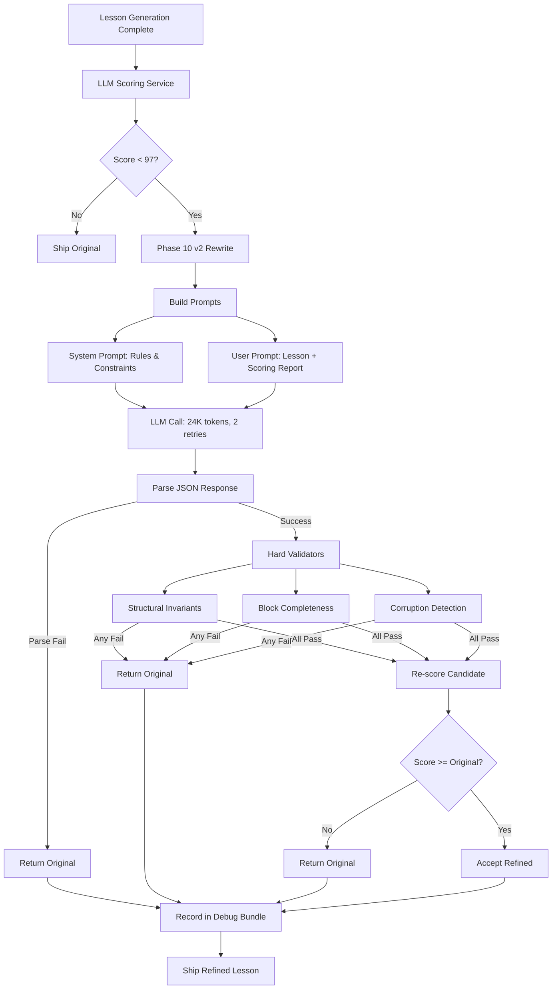

# Phase 10 v2: Holistic Rewrite with Hard Safety Gates

**Status:** Production (Default)  
**Version:** 2.0  
**Last Updated:** February 6, 2026  
**Replaced:** Phase 10 v1 (patch-based refinement)

---

## Table of Contents

1. [Executive Summary](#executive-summary)
2. [Architecture Overview](#architecture-overview)
3. [Component Deep-Dive](#component-deep-dive)
4. [Complete Prompts](#complete-prompts)
5. [Hard Validators](#hard-validators)
6. [Configuration](#configuration)
7. [Workflow Examples](#workflow-examples)
8. [Debug Bundle](#debug-bundle)
9. [API Integration](#api-integration)
10. [Success Metrics](#success-metrics)
11. [Known Limitations](#known-limitations)
12. [Future Improvements](#future-improvements)
13. [Testing](#testing)
14. [Migration from v1](#migration-from-v1)
15. [References](#references)

---

## Executive Summary

### What is Phase 10 v2?

Phase 10 v2 is a **holistic rewrite approach** to lesson refinement that replaces the problematic patch-based system (v1). Instead of generating surgical JSON patches, Phase 10 v2 asks the LLM to output a complete, improved lesson JSON in one shot while enforcing hard structural invariants.

### Why v2 Exists

Phase 10 v1 (patch-based refinement) suffered from:
- **Substring ambiguity**: LLM suggestions often unclear about exact text to replace
- **Patch collisions**: Multiple patches targeting same field
- **Corruption**: `[object Object]` artifacts appearing in content
- **Partial context**: LLM sees fragments, not full lesson structure
- **Catastrophic failures**: Explanation blocks accidentally wiped due to ambiguous patches

### Key Design Principles

1. **Holistic View**: LLM sees and outputs the entire lesson structure
2. **Hard Safety Gates**: Strict validators prevent any structural corruption
3. **Score Gate**: Only accept refinements that improve (or maintain) the score
4. **Fail-Safe**: If anything goes wrong, return the original lesson unchanged
5. **No Silent Fallbacks**: Never fall back to v1 patches automatically

### Current Performance (Feb 2026)

- **Validation Pass Rate**: ~90%+
- **Score Improvement**: +3 to +8 points typical
- **Structural Breaks**: 0 (prevented by validators)
- **Corruption**: 0 `[object Object]` incidents
- **Content Wipes**: 0 catastrophic explanation losses

### v2 vs v1 Comparison

| Aspect | v1 (Patch-based) | v2 (Holistic Rewrite) |
|--------|------------------|----------------------|
| Output | JSON patches | Full lesson JSON |
| Context | Fragment-based | Complete lesson |
| Ambiguity | High (substring intent) | None (whole-field) |
| Collisions | Common | Impossible |
| Corruption Risk | High | Low (validated) |
| Safety Gates | Soft | Hard (enforced) |
| Fallback | Silent to original | Explicit rejection |
| Token Usage | ~8K | ~24K |
| Debugging | Complex (N patches) | Simple (1 candidate) |

---

## Architecture Overview

### High-Level Flow



### Data Flow

**Input:**
- `originalLesson: Lesson` (validated output from Phase 9 assembly)
- `rubricScore: RubricScore` (from LLM Scoring Service)

**Output:**
- `candidateLesson: Lesson | null` (improved version or null if rejected)
- `validationFailures: string[]` (reasons for rejection if any)
- `scoreComparison: { original, candidate, delta } | null`

**Guarantees:**
1. Valid JSON parse or reject
2. Schema valid or reject
3. Structural invariants preserved or reject
4. Required fields complete or reject
5. No corruption or reject
6. Score >= original or reject

---

## Component Deep-Dive

### 3.1 LLM Scoring Service

**File:** `quiz-app/src/lib/generation/llmScoringService.ts`

**Purpose:** Evaluate lesson quality and identify improvement opportunities

**Class:** `LLMScoringService`

**Main Method:**
```typescript
async scoreLesson(lesson: Lesson): Promise<RubricScore>
```

**Process:**
1. Fast structural validation (basic JSON integrity)
2. LLM-based quality assessment
3. Parse scoring response
4. Return RubricScore with issues and suggestions

**RubricScore Interface:**
```typescript
interface RubricScore {
  total: number;              // Out of 100
  breakdown: {
    schemaCompliance: number;    // A: 15 points (assume validated)
    pedagogy: number;            // B: 30 points (maps from beginnerClarityStaging)
    questions: number;           // C: 25 points
    marking: number;             // D: 10 points (maps from markingRobustness)
    visual: number;              // E: 5 points
    safety: number;              // F: 0 points (deprecated, kept for backward compat)
  };
  details: RubricDetail[];
  grade: string;                 // "Ship it" | "Strong" | "Usable" | "Needs rework"
  overallAssessment?: string;    // NEW: 2-3 sentence macro observation of pedagogical patterns
  autoCap?: {
    triggered: boolean;
    reason: string;
    cappedAt: number;
  };
}

interface RubricDetail {
  section: string;              // e.g., "beginnerClarityStaging: ..."
  score: number;
  maxScore: number;
  issues: string[];
  suggestions: string[];
  jsonPointers?: string[];      // NEW: JSON Pointer paths affected by this issue
}
```

**Note:** The LLM returns a new format with `issues` array containing `jsonPointers`, `excerpt`, `problem`, `whyItMatters`, `fixability`, and `patches`. This is automatically converted to the legacy `RubricDetail` format for backward compatibility with Phase 10.

---

### 3.2 Phase 10 v2 Rewrite Engine

**File:** `quiz-app/src/lib/generation/phases/Phase10_Rewrite.ts`

**Purpose:** Generate improved lesson using scoring feedback

**Class:** `Phase10_Rewrite extends PhasePromptBuilder`

**Main Method:**
```typescript
async rewriteLesson(
  originalLesson: Lesson,
  rubricScore: RubricScore,
  generateFn: Function,
  scorer: LLMScoringService
): Promise<RewriteOutput>
```

**RewriteOutput Interface:**
```typescript
interface RewriteOutput {
  candidateLesson: Lesson | null;
  validationFailures: string[];
  scoreComparison: {
    original: number;
    candidate: number;
    delta: number;
  } | null;
}
```

**Execution Steps:**

1. **Build Prompts** (lines 56-57)
   - System prompt: Rules and constraints
   - User prompt: Original lesson + scoring report

2. **Call LLM** (lines 65-72)
   - Type: `'phase'`
   - Max retries: 2
   - Token limit: 24,000 (increased for full lesson JSON)
   - No higher limit retry (24K is max)

3. **Parse Response** (lines 77-86)
   - Uses 4-step validation pipeline
   - Returns null if parse fails

4. **Run Hard Validators** (lines 90-103)
   - Structural invariants
   - Block completeness
   - Corruption detection
   - Returns null if any fail

5. **Re-score Candidate** (lines 113-114)
   - Uses same LLMScoringService
   - Gets new RubricScore

6. **Apply Score Gate** (lines 119-136)
   - Reject if `candidateScore < originalScore`
   - Accept if `candidateScore >= originalScore`

7. **Return Result** (lines 146-154)
   - If accepted: return candidate lesson
   - If rejected: return null + reasons

**JSON Parsing Pipeline:**
```typescript
private parseLLMResponse(response: string): Lesson | null {
  // 1. Validate (checks for error messages)
  const validation = validateLLMResponse(response);
  if (!validation.valid) return null;
  
  // 2. Clean code blocks (removes ```json markers)
  const cleaned = cleanCodeBlocks(response);
  
  // 3. Preprocess (removes trailing commas, comments)
  const preprocessed = preprocessToValidJson(cleaned);
  
  // 4. Parse (RFC 8259 JSON only)
  const parsed = safeJsonParse<Lesson>(preprocessed);
  
  return parsed.success ? parsed.data : null;
}
```

---

### 3.3 Hard Validators

**File:** `quiz-app/src/lib/generation/phases/Phase10_Validators.ts`

**Purpose:** Enforce structural integrity and detect corruption

**Main Function:**
```typescript
export function validateCandidate(
  original: Lesson,
  candidate: Lesson
): ValidationResult
```

Runs three validation layers in sequence:

#### Layer 1: Structural Invariants

**Function:** `validateStructuralInvariants(original, candidate)`

**Hard Rules:**
1. Block count must match exactly
2. Each block's ID must be preserved
3. Each block's type must be preserved
4. Each block's order must be preserved
5. Lesson metadata must be preserved (id, unit, topic, layout)

**Example Violations:**
```
Block count changed: 9 → 10
Block 3 ID changed: 203-3A2-explanation → 203-3A2-explain
Block 5 type changed: explanation → practice
Block 7 order changed: 7 → 8
Lesson ID changed: 203-3A2 → 203-3A2-v2
Lesson layout changed: split-vis → linear-flow
```

**Code:**
```typescript
if (candidate.blocks.length !== original.blocks.length) {
  errors.push(`Block count changed: ${original.blocks.length} → ${candidate.blocks.length}`);
  return { valid: false, errors, warnings: [] }; // Fatal - exit early
}

for (let i = 0; i < original.blocks.length; i++) {
  const origBlock = original.blocks[i];
  const candBlock = candidate.blocks[i];
  
  if (candBlock.id !== origBlock.id) {
    errors.push(`Block ${i} ID changed: ${origBlock.id} → ${candBlock.id}`);
  }
  
  if (candBlock.type !== origBlock.type) {
    errors.push(`Block ${i} type changed: ${origBlock.type} → ${candBlock.type}`);
  }
  
  if (candBlock.order !== origBlock.order) {
    errors.push(`Block ${i} order changed: ${origBlock.order} → ${candBlock.order}`);
  }
}
```

#### Layer 2: Block Completeness

**Function:** `validateBlockCompleteness(candidate)`

**Per-Block-Type Validation:**

**outcomes:**
- Must have `outcomes` array
- Array must not be empty
- Each outcome must have `text` (string) and `bloomLevel` (string)

**vocab:**
- Must have `terms` array
- Array must not be empty
- Each term must have non-empty `term` and `definition` strings

**explanation:**
- Must have `content` (string, min 100 chars)
- Must have `title` (string)
- Warns if content < 100 chars

**practice:**
- Must have `questions` array
- Array must not be empty
- Each question must have:
  - `id` (string)
  - `questionText` (non-empty string)
  - `expectedAnswer` (array, not empty)
  - `answerType` (string)

**spaced-review:**
- Allows 0 questions (first-in-module) OR >=3 questions
- Rejects 1-2 questions (violates spaced repetition minimum)
- If questions exist, same validation as practice

**worked-example:**
- Must have `steps` array (not empty)
- Must have `title` (string)
- Must have `given` (string)

**guided-practice:**
- Must have `steps` array (not empty)
- Must have `title` (string)
- Must have `problem` (string)

**diagram:**
- Must have `title` (string)
- Must have `description` (string)

**microbreak:**
- Minimal validation (title warning only)

**Code Example:**
```typescript
case 'practice':
  if (!block.content.questions || !Array.isArray(block.content.questions)) {
    errors.push(`${block.id}: missing questions array`);
  } else if (block.content.questions.length === 0) {
    errors.push(`${block.id}: empty questions array`);
  } else {
    (block.content.questions as any[]).forEach((q, idx) => {
      if (!q.id || typeof q.id !== 'string') {
        errors.push(`${block.id}: question ${idx} missing or invalid id`);
      }
      if (!q.questionText || typeof q.questionText !== 'string' || q.questionText.trim() === '') {
        errors.push(`${block.id}: question ${idx} missing or empty questionText`);
      }
      if (!q.expectedAnswer) {
        errors.push(`${block.id}: question ${idx} missing expectedAnswer`);
      } else if (!Array.isArray(q.expectedAnswer)) {
        errors.push(`${block.id}: question ${idx} expectedAnswer must be array`);
      } else if (q.expectedAnswer.length === 0) {
        errors.push(`${block.id}: question ${idx} expectedAnswer array is empty`);
      }
      if (!q.answerType || typeof q.answerType !== 'string') {
        errors.push(`${block.id}: question ${idx} missing or invalid answerType`);
      }
    });
  }
  break;
```

#### Layer 3: Corruption Detection

**Function:** `detectCorruption(candidate)`

**Checks:**

1. **[object Object] Detection**
   - Stringifies entire lesson
   - Searches for `[object Object]` pattern
   - Common when LLM tries to embed objects as strings

2. **Invalid answerTypes**
   - Valid types: `short-text`, `multiple-choice`, `calculation`, `true-false`
   - Rejects: `numeric`, `long-text`, `essay`, `open-ended`, or any invented type
   - Checks all practice and spaced-review questions

3. **Empty Required Strings**
   - Explanation content must not be empty/whitespace-only
   - Lesson ID must not be "undefined" or "null" strings
   - Lesson title must not be "undefined" or "null" strings

4. **Placeholder Detection**
   - Patterns: `[TODO]`, `[PLACEHOLDER]`, `[FILL IN]`, `[REPLACE THIS]`, `XXX`
   - Warnings (not errors) for detected placeholders

**Code Example:**
```typescript
// Check for [object Object]
const jsonStr = JSON.stringify(candidate);
if (jsonStr.includes('[object Object]')) {
  errors.push('Detected [object Object] corruption in JSON');
}

// Check for invalid answerTypes
const validAnswerTypes = ['short-text', 'multiple-choice', 'calculation', 'true-false'];

for (const block of candidate.blocks) {
  if (block.type === 'practice' || block.type === 'spaced-review') {
    const questions = block.content.questions as any[] || [];
    questions.forEach((q, idx) => {
      if (q.answerType && !validAnswerTypes.includes(q.answerType)) {
        errors.push(`${block.id} question ${idx}: invalid answerType "${q.answerType}"`);
      }
    });
  }
}
```

**Example Corruption Failures:**
```
Detected [object Object] corruption in JSON
203-3A2-practice question 3: invalid answerType "numeric"
203-3A2-integrative question 0: invalid answerType "long-text"
203-3A2-integrative question 1: invalid answerType "essay"
203-3A2-explanation: explanation content is empty or whitespace only
Lesson ID is undefined or null
Detected placeholder pattern in lesson: [TODO]
```

---

## Complete Prompts

### 4.1 Scoring System Prompt

**Purpose:** Guide LLM to score lessons and identify fixable issues

**Location:** `llmScoringService.ts` lines 224-322

**Model:** Uses `getPhase10Model()` which reads `PHASE10_MODEL` environment variable (defaults to `GEMINI_MODEL`)

**Complete Prompt:**

```
#You are an expert in 2365 city and guilds electrical who will suggest improvements to a lesson to raise the score to at least 96/100.

GOAL
1) Score the lesson's CONTENT QUALITY and MARKING QUALITY on a 100-point rubric.
2) Return  10 concrete examples where the pedagogy/marking needs improvement.  
   Each example must include: where it occurs, a short excerpt, why it's a problem, and a much improved version.
3) Never forget your objective is to suggest improvements that will raise the score to at least 96/100.


WHAT COUNTS AS "PEDAGOGY IMPROVEMENT" (FOCUS)
- Clarity: simpler wording, define jargon, remove ambiguity, better sequencing in the explanation text.
- Scaffolding: add steps/cues inside existing text so difficulty ramps smoothly.
- Teaching-before-testing: add the missing explanation sentence(s) before a question assesses it.
- Misconceptions: add a brief "common mistake" note where it prevents predictable errors.
- Question quality: tighten stems, remove absolutes, improve cognitive fit.
- Marking robustness: expectedAnswer becomes more gradeable without changing answerType.
- Questions from spaced review should be from the same module as the lesson but from preceeding lessons!  So if the lesson is city and guilds 2365 unit / module 203 then the spaced review questions should be from unit / module 203 (preceding lessons) NOT 202 / 210 etc. 
- Keep the spaced review questions from the same module!

SCORING RUBRIC (100)
A) schemaCompliance (15): Assume validated; give full points unless content is catastrophically unusable.
B) beginnerClarityStaging (30): definitions, plain language, examples, misconceptions, readability
C) alignment (15): worked/guided/independent alignment when present
D) questions (25): teaching-before-testing, wording, cognitive fit, integrative quality
E) markingRobustness (10): expectedAnswer gradeability and match to answerType
F) visual (5): Assume validated; deduct only if CONTENT references missing/contradictory diagrams

ISSUES / EXAMPLES REQUIREMENTS (CRITICAL)
- You MUST output EXACTLY 10 issues (no more, no fewer).
- If fewer than 10 major problems exist, include lower-impact "polish" items (still real, still concrete).
- Each issue must be specific and evidenced:
  - Provide a JSON Pointer to the exact field
  - Provide a short excerpt (max ~200 chars)
  - Explain the pedagogical/marking consequence
  - Provide at least one safe patch (unless truly requires regeneration)

  #Pedagogical reminder

  - Staging / order must be logical: Keep a strict learning flow: Outcomes → Vocab → Diagram (if used) → Explanations → Checks/Practice → Worked example/Guided practice → Independent practice → Integrative → Spaced review. Never place questions before the explanation that contains their answers.

- Spaced review must stay inside the same module/unit: Spaced-review questions must come from the same City & Guilds unit/module as the lesson, but from preceding lessons in that unit.
Example: If the lesson is 2365 Unit 203, spaced review must be Unit 203 content only (earlier 203 lessons), not Unit 202/210/etc.

- Every question's answer must exist in the lesson content: For every practice/check question, ensure the exact facts/definitions needed to answer are explicitly stated in an earlier explanation, vocab, worked example, or notes block (no "implied" answers).

- Synthesis/connection marking must be strict enough: For connection/synthesis questions, don't use loose keyword-soup expected answers. Use either:

2–6 full acceptable answer variants, or

a required key-point checklist (e.g., must include 3–5 specified points).

- Technical definitions must be exam-safe and not over-claim: Avoid wording that can be nitpicked (e.g., emergency circuits "always work in a fire"). Use qualified, syllabus-safe phrasing (e.g., "arrangements to maintain operation during loss of normal supply") and avoid absolute claims unless the spec says so
- ALWYAS check that The improvements will raise the score to at least 96/100!
PATCH OPS (ONLY THESE)
- "replaceSubstring" (preferred for long strings): {op,path,find,value}
- "replace" (sparingly): {op,path,from,value}
- "append" / "prepend": {op,path,value}

OUTPUT FORMAT (JSON ONLY; NO MARKDOWN)
Return exactly:

{
  "total": 0,
  "breakdown": {
    "schemaCompliance": 0,
    "beginnerClarityStaging": 0,
    "alignment": 0,
    "questions": 0,
    "markingRobustness": 0,
    "visual": 0
  },
  "overallAssessment": "2-3 sentences describing the overall pedagogical pattern. Examples: 'Main weakness is teaching-before-testing violations across multiple blocks.' or 'Good scaffolding but marking robustness is weak throughout.' or 'Explanations are clear but questions lack cognitive alignment.'",
  "issues": [
    {
      "id": "ISSUE-1",
      "impact": 3,
      "category": "beginnerClarityStaging|alignment|questions|markingRobustness",
      "jsonPointers": ["/blocks/0/...", "/blocks/1/..."],
      "excerpt": "short excerpt from the current field value",
      "problem": "What is wrong pedagogically/marking-wise",
      "whyItMatters": "Concrete learning or grading consequence",
      "fixability": "phase10|requiresRegeneration",
      "patches": [
        { "op": "replaceSubstring|replace|append|prepend", "path": "/blocks/x/...", "find": "...", "from": "...", "value": "..." }
      ]
    }
  ],
  "grade": "Ship it|Strong|Usable|Needs rework"
}

VALIDATION RULES

- issues array length MUST be exactly 10.
- ALWAYS check that The improvements will raise the score to at least 96/100!  If not do again!

- overallAssessment must be 2-3 sentences maximum, identifying the PRIMARY pedagogical pattern or cross-cutting theme.
- No extra keys. No commentary.
```

---

### 4.2 Scoring User Prompt

**Purpose:** Provide lesson to score

**Location:** `llmScoringService.ts` lines 327-343

**Complete Prompt Template:**

```
Score this UK electrical installation lesson using the rubric.

LESSON TO SCORE:
{{LESSON_JSON}}

CRITICAL REMINDERS:
1. Return EXACTLY 10 issues (no more, no fewer)
2. Each issue must include: excerpt, problem, whyItMatters, fixability, patches
3. Ensure total score equals sum of breakdown scores
4. Focus on CONTENT QUALITY only - structure already validated

Return ONLY the JSON scoring object. No markdown, no additional text.
```

**Example with Actual Lesson:**
```
Score this electrical trade lesson using the rubric.

LESSON TO SCORE:
{
  "id": "203-3A2",
  "title": "Circuit Types: What They Do",
  "unit": "203",
  "topic": "Circuit Types",
  "blocks": [
    {
      "id": "203-3A2-outcomes",
      "type": "outcomes",
      "order": 0,
      "content": {
        "outcomes": [
          {
            "text": "Identify the purpose of different circuit types in electrical installations",
            "bloomLevel": "understand"
          },
          ...
        ]
      }
    },
    ...
  ],
  ...
}

CRITICAL REMINDERS:
...
```

---

### 4.3 Refinement System Prompt

**Purpose:** Guide LLM to rewrite lesson while preserving structure

**Location:** `Phase10_Rewrite.ts` lines 295-348

**Model:** Uses `getPhase10Model()` which reads `PHASE10_MODEL` environment variable (defaults to `GEMINI_MODEL`)

**Complete Prompt:**

```
You are an expert lesson JSON refiner.

You will be given:
1) The ORIGINAL lesson JSON (valid).
2) A scoring report listing issues and suggested improvements.

Your job:
Improve the lesson's PEDAGOGICAL QUALITY (clarity, teaching effectiveness, gradeability).
Return a NEW lesson JSON that fixes the pedagogical issues while preserving the lesson's structure.

CRITICAL: Structure validation is enforced by Phase10_Validators.ts BEFORE this stage.
Focus on PEDAGOGY: content clarity, teaching-before-testing, scaffolding, question quality, and marking robustness.
Do NOT worry about schema/structure - that's already validated.

STRICT RULES (HARD):
- Output ONLY valid JSON. No commentary. No markdown. No code fences.
- Do NOT change: lesson.id, lesson.unit, lesson.topic, lesson.layout.
- Do NOT reorder blocks.
- Do NOT add blocks.
- Do NOT remove blocks.
- Do NOT change any block.id values.
- Do NOT change any block.type values.
- Do NOT change any block.order values.
- Keep blocks array length EXACTLY the same.
- Only edit fields inside existing blocks to improve clarity, correctness, marking robustness, and alignment.

CONTENT RULES:
- Fix the issues described in the scoring report as priority.
- Do not introduce "[object Object]" or placeholder text.
- If the scoring report contains malformed suggestions (e.g. '[object Object]'), ignore those suggestions and instead implement the intended fix safely.

ANSWER TYPE RULES (CRITICAL):
- VALID answerTypes: "short-text", "multiple-choice", "calculation", "true-false"
- NEVER use: "numeric", "long-text", "essay", "open-ended", or any other type
- DO NOT change answerType anywhere. This is a hard constraint.
- For synthesis questions (cognitiveLevel: "synthesis"): questionText MUST end with EXACTLY this instruction: "Answer in 3-4 sentences OR concise bullet points." AND expectedAnswer MUST be a checklist of 4-8 key concepts/phrases to grade against (not full sentence variants). Do not use any other numbers or phrasing variants.

SYNTHESIS QUESTION REQUIREMENTS:
- questionText ends with: "Answer in 3-4 sentences OR concise bullet points."
- expectedAnswer format: ["key concept 1", "key concept 2", "key concept 3", "key concept 4", ...]
- Example expectedAnswer: ["fault isolation and continuity", "cable economy", "load sharing across paths", "safety of movement during faults"]
- Do NOT use full sentence variants for synthesis questions

CONNECTION QUESTION REQUIREMENTS (D3 Question 1):
- For mapping questions (e.g., "which circuit type for X and Y"), expectedAnswer must use explicit mappings
- BAD: ["radial and ring", "ring and radial"]
- GOOD: ["lighting: radial; sockets: ring", "radial for lighting, ring final for sockets"]
- Prevents false positives from reversed answers

OUTPUT FORMAT:
Return the full lesson JSON object.

{{JSON_OUTPUT_INSTRUCTIONS}}
```

**Notes:**
- `{{JSON_OUTPUT_INSTRUCTIONS}}` is provided by `PhasePromptBuilder.getJsonOutputInstructions()`
- Emphasizes PEDAGOGICAL QUALITY focus (not just structural fixes)
- Explicitly lists 4 valid answerTypes to prevent LLM from inventing types
- Hard constraint: DO NOT change answerType anywhere
- Synthesis questions have exact instruction format requirement
- Connection questions require explicit mapping format
- Warns against introducing corruption artifacts

---

### 4.4 Refinement User Prompt

**Purpose:** Provide original lesson and scoring feedback to refine

**Location:** `Phase10_Rewrite.ts` lines 355-391

**Complete Prompt Template:**

```
REFINE THIS LESSON JSON.

ORIGINAL LESSON JSON:
{{FULL_LESSON_JSON}}

SCORING REPORT (issues + suggestions):
{{SCORING_REPORT}}

{{FIX_PLAN_SECTION}}

TASK:
- Produce a refined version of the full lesson JSON that addresses the scoring issues.
- Preserve ALL structural invariants (same blocks, same ids/types/orders, same block count).
- Return ONLY the refined JSON.
```

**Fix Plan Section** (optional, lines 369-381):
If a fix plan is provided from Phase10_Planner, it is included:

```
FIX PLAN (implement every non-blocked item):
{{FIX_PLAN_JSON}}

IMPLEMENTATION PRIORITY:
- Implement ALL items marked as "llm_editable"
- DO NOT attempt items marked as "blocked_by_policy" or "requires_regeneration"
- Follow the specific instructions and guardrails for each plan item
- Use the suggested textSnippets where provided
```

**Scoring Report Format** (lines 396-419):

```typescript
private formatScoringReport(score: RubricScore): string {
  let report = `Total Score: ${score.total}/100 (${score.grade})\n\n`;
  
  // Add overall assessment if available
  if (score.overallAssessment) {
    report += `OVERALL ASSESSMENT:\n${score.overallAssessment}\n\n`;
  }
  
  report += `Issues by Section:\n`;
  
  score.details.forEach(detail => {
    if (detail.issues.length === 0) return;
    
    report += `\n## ${detail.section} (${detail.score}/${detail.maxScore})\n`;
    detail.issues.forEach((issue, idx) => {
      report += `- Issue: ${issue}\n`;
      if (detail.suggestions[idx]) {
        report += `  Suggestion: ${detail.suggestions[idx]}\n`;
      }
    });
  });
  
  return report;
}
```

**Example Complete User Prompt:**

```
REFINE THIS LESSON JSON.

ORIGINAL LESSON JSON:
{
  "id": "203-3A2",
  "title": "Circuit Types: What They Do",
  "unit": "203",
  "topic": "Circuit Types",
  "description": "Understanding different circuit configurations...",
  "blocks": [
    {
      "id": "203-3A2-outcomes",
      "type": "outcomes",
      "order": 0,
      "content": {
        "outcomes": [
          {
            "text": "Identify the purpose of different circuit types",
            "bloomLevel": "understand"
          }
        ]
      }
    },
    {
      "id": "203-3A2-vocab",
      "type": "vocab",
      "order": 1,
      "content": {
        "title": "Key Terms",
        "terms": [
          {
            "term": "Radial Circuit",
            "definition": "A circuit where each outlet is connected..."
          }
        ]
      }
    },
    ...
  ],
  ...
}

SCORING REPORT (issues + suggestions):
Total Score: 85/100 (Usable)

OVERALL ASSESSMENT:
Main weakness is marking robustness - expectedAnswer strings are too rigid and don't match answerType well. Visual alignment also needs improvement.

Issues by Section:

## markingRobustness: Integrative block at blocks[8] uses 'short-text'... (0/5)
- Issue: Integrative block at blocks[8] uses 'short-text' answerType for questions requiring 2-4 sentences. This will cause high failure rates as student responses are unlikely to match the multi-sentence expectedAnswer strings.
  Suggestion: Cannot be fixed by Phase 10 - requires regeneration

## markingRobustness: Check blocks at blocks[4] and blocks[6] use rigid... (0/4)
- Issue: Check blocks at blocks[4] and blocks[6] use rigid, sentence-length expectedAnswer strings that include the question premise (e.g., 'Final Circuit is defined as...'). This makes the auto-grading brittle.
  Suggestion: Change blocks[4].content.questions[0].expectedAnswer from '[current value]' to 'circuit connected directly from a distribution board,connected directly from a distribution board to equipment,provides electricity from a distribution board'

## visual: The explanation block at blocks[5] describes radial... (0/2)
- Issue: The explanation block at blocks[5] describes radial and ring layouts in detail but fails to explicitly reference the comparison diagram provided in blocks[2].
  Suggestion: Modify blocks[5].content.content

TASK:
- Produce a refined version of the full lesson JSON that addresses the scoring issues.
- Preserve ALL structural invariants (same blocks, same ids/types/orders, same block count).
- Return ONLY the refined JSON.
```

**Key Elements:**
1. Full original lesson JSON (complete structure)
2. Scoring report with total score, grade, and overallAssessment (if available)
3. Issues grouped by section with score penalties
4. Specific suggestions for fixes (when possible)
5. Optional fix plan from Phase10_Planner (if provided)
6. Clear task requirements

---

## Hard Validators

### 5.1 Structural Invariants Validator

**Function:** `validateStructuralInvariants(original: Lesson, candidate: Lesson): ValidationResult`

**Enforces:**
- `candidate.blocks.length === original.blocks.length` (exact count match)
- For each block index `i`:
  - `candidate.blocks[i].id === original.blocks[i].id`
  - `candidate.blocks[i].type === original.blocks[i].type`
  - `candidate.blocks[i].order === original.blocks[i].order`
- Lesson metadata preserved:
  - `candidate.id === original.id`
  - `candidate.unit === original.unit`
  - `candidate.topic === original.topic`
  - `candidate.layout === original.layout`

**Why This Matters:**
- Prevents LLM from reorganizing lesson flow
- Ensures block dependencies remain valid
- Maintains lesson identity and categorization
- Prevents cross-lesson ID conflicts

**Example Pass:**
```
Original blocks: 9 blocks with IDs [203-3A2-outcomes, 203-3A2-vocab, ...]
Candidate blocks: 9 blocks with same IDs in same order
✓ All structural invariants preserved
```

**Example Failure:**
```
Block count changed: 9 → 10
Block 3 ID changed: 203-3A2-explanation → 203-3A2-explain
Block 5 type changed: explanation → practice
✗ Structural invariants violated - REJECT
```

---

### 5.2 Block Completeness Validator

**Function:** `validateBlockCompleteness(candidate: Lesson): ValidationResult`

**Block Type Requirements:**

#### outcomes
- `content.outcomes` array exists
- Array has at least 1 item
- Each outcome has:
  - `text` (string, not empty)
  - `bloomLevel` (string, not empty)

#### vocab
- `content.terms` array exists
- Array has at least 1 item
- Each term has:
  - `term` (string, not empty)
  - `definition` (string, not empty)

#### explanation
- `content.content` (string, min 100 chars)
- `content.title` (string)
- Warns if content < 100 chars

#### practice
- `content.questions` array exists
- Array has at least 1 item
- `content.title` (string)
- Each question has:
  - `id` (string)
  - `questionText` (non-empty string)
  - `expectedAnswer` (array, not empty)
  - `answerType` (string)

#### spaced-review
- `content.title` (string)
- `content.questions` array (if exists):
  - Must have 0 items OR >= 3 items (no 1-2 questions)
  - If >= 3, same validation as practice questions
- Rationale: Spaced repetition requires minimum 3 questions for effectiveness
- Exception: First-in-module lessons may have 0 (Phase 8 handles this)

#### worked-example
- `content.steps` array exists and not empty
- `content.title` (string)
- `content.given` (string)

#### guided-practice
- `content.steps` array exists and not empty
- `content.title` (string)
- `content.problem` (string)

#### diagram
- `content.title` (string)
- `content.description` (string)

#### microbreak
- `content.title` (string) - warning only if missing

**Example Pass:**
```
✓ 203-3A2-outcomes: has 3 outcomes with text + bloomLevel
✓ 203-3A2-vocab: has 5 terms with definitions
✓ 203-3A2-explanation: content is 847 chars
✓ 203-3A2-practice: has 4 questions with all required fields
✓ All blocks complete
```

**Example Failure:**
```
203-3A2-outcomes: empty outcomes array
203-3A2-vocab: term 2 missing definition
203-3A2-explanation: content is 47 chars (warning: very short)
203-3A2-practice: question 3 missing answerType
203-3A2-spaced-review: spaced-review must have 0 or >=3 questions (got 2)
✗ Block completeness violations - REJECT
```

---

### 5.3 Corruption Detection Validator

**Function:** `detectCorruption(candidate: Lesson): ValidationResult`

**Corruption Patterns:**

#### 1. [object Object] Detection
```typescript
const jsonStr = JSON.stringify(candidate);
if (jsonStr.includes('[object Object]')) {
  errors.push('Detected [object Object] corruption in JSON');
}
```

**Why:** LLM sometimes tries to embed objects as strings, resulting in `"[object Object]"` text

**Example:** 
```json
{
  "content": {
    "title": "[object Object]"  // CORRUPTION!
  }
}
```

#### 2. Invalid answerTypes
```typescript
const validAnswerTypes = ['short-text', 'multiple-choice', 'calculation', 'true-false'];

for (const block of candidate.blocks) {
  if (block.type === 'practice' || block.type === 'spaced-review') {
    const questions = block.content.questions as any[] || [];
    questions.forEach((q, idx) => {
      if (q.answerType && !validAnswerTypes.includes(q.answerType)) {
        errors.push(`${block.id} question ${idx}: invalid answerType "${q.answerType}"`);
      }
    });
  }
}
```

**Why:** Only 4 answerTypes are supported by the grading system. Others will break auto-grading.

**Valid Types:**
- `short-text`: Brief text answers (1-2 sentences)
- `multiple-choice`: Multiple choice with options array
- `calculation`: Numeric calculations
- `true-false`: Boolean true/false questions

**Invalid Types (commonly invented by LLM):**
- `numeric` - use `calculation` instead
- `long-text` - use `short-text` instead
- `essay` - not supported
- `open-ended` - not supported

#### 3. Empty Required Strings
```typescript
for (const block of candidate.blocks) {
  if (block.type === 'explanation') {
    const content = block.content.content as string;
    if (!content || !content.trim()) {
      errors.push(`${block.id}: explanation content is empty or whitespace only`);
    }
  }
}
```

#### 4. Undefined/Null in Critical Fields
```typescript
if (!candidate.id || candidate.id === 'undefined' || candidate.id === 'null') {
  errors.push('Lesson ID is undefined or null');
}

if (!candidate.title || candidate.title === 'undefined' || candidate.title === 'null') {
  errors.push('Lesson title is undefined or null');
}
```

#### 5. Placeholder Detection (Warnings)
```typescript
const placeholderPatterns = [
  /\[TODO\]/i,
  /\[PLACEHOLDER\]/i,
  /\[FILL IN\]/i,
  /\[REPLACE THIS\]/i,
  /XXX/g,
];

for (const pattern of placeholderPatterns) {
  if (pattern.test(jsonStr)) {
    warnings.push(`Detected placeholder pattern: ${pattern.source}`);
  }
}
```

**Real-World Rejection Example (Feb 6, 2026):**
```
❌ [Phase10v2] Validation failed:
   - 203-3A2-practice question 3: invalid answerType "numeric"
   - 203-3A2-integrative question 0: invalid answerType "long-text"
   - 203-3A2-integrative question 1: invalid answerType "long-text"
    ⊘ Candidate rejected: ...
```

This was correctly rejected, preventing invalid lesson from being saved.

---

### 5.4 Score Gate

**Purpose:** Only accept refinements that improve (or maintain) lesson quality

**Implementation:** `Phase10_Rewrite.ts` lines 119-136

**Logic:**

```typescript
// Re-score the candidate
const candidateScore = await this.scorer.scoreLesson(candidateLesson);

console.log(`📊 [Phase10v2] Candidate score: ${candidateScore.total}/100`);
console.log(`📊 [Phase10v2] Score delta: ${candidateScore.total >= rubricScore.total ? '+' : ''}${candidateScore.total - rubricScore.total}`);

// SCORE GATE: Reject if score decreased
if (candidateScore.total < rubricScore.total) {
  const decline = rubricScore.total - candidateScore.total;
  console.log(`❌ [Phase10v2] Score gate FAILED: score declined by ${decline} points`);
  console.log(`❌ [Phase10v2] Rejecting candidate and keeping original`);
  
  return {
    candidateLesson: null,
    validationFailures: [
      `Score gate failed: score declined from ${rubricScore.total} to ${candidateScore.total} (Δ-${decline})`
    ],
    scoreComparison: {
      original: rubricScore.total,
      candidate: candidateScore.total,
      delta: candidateScore.total - rubricScore.total
    }
  };
}

// Score improved or stayed the same - accept candidate
const improvement = candidateScore.total - rubricScore.total;
if (improvement > 0) {
  console.log(`✅ [Phase10v2] Score gate PASSED: score improved by ${improvement} points`);
} else {
  console.log(`✅ [Phase10v2] Score gate PASSED: score unchanged (no harm)`);
}

return {
  candidateLesson,
  validationFailures: [],
  scoreComparison: {
    original: rubricScore.total,
    candidate: candidateScore.total,
    delta: candidateScore.total - rubricScore.total
  }
};
```

**Behavior:**

**Accept:** `candidateScore >= originalScore`
- ✓ Score improved: Save refined lesson
- ✓ Score unchanged: Save refined lesson (no harm)

**Reject:** `candidateScore < originalScore`
- ✗ Score declined: Keep original lesson
- Log the decline amount
- Record in debug bundle
- Original lesson remains unchanged

**Example Outcomes:**

**Improvement (+8):**
```
Original: 85/100
Candidate: 93/100
Delta: +8
✅ Score gate PASSED - Refined lesson saved
```

**Unchanged (0):**
```
Original: 94/100
Candidate: 94/100
Delta: 0
✅ Score gate PASSED - Refined lesson saved (no harm)
```

**Decline (-3):**
```
Original: 91/100
Candidate: 88/100
Delta: -3
❌ Score gate FAILED - Original lesson retained
```

---

## Configuration

### 6.1 Phase 10 Configuration

**File:** `quiz-app/src/lib/generation/config.ts` lines 8-72

**Current Settings:**

```typescript
refinement: {
  /**
   * Enable Phase 10 auto-refinement
   * When true, runs refinement if score < scoreThreshold
   * Default: true
   */
  enabled: true,

  /**
   * Score threshold for triggering refinement
   * If score < 97, Phase 10 attempts improvement
   * Default: 97
   */
  scoreThreshold: 97,

  /**
   * Maximum number of issues to fix in one pass
   * Phase 10 v1 only (v2 fixes all issues in one shot)
   * Default: 10
   */
  maxFixes: 10,

  /**
   * Save original lesson before applying refinement
   * Default: true
   */
  saveOriginal: true,

  /**
   * Automatically apply accepted refinements
   * Default: true
   */
  autoApply: true,

  /**
   * Phase 10 strategy: 'patch' or 'rewrite'
   * 'patch': v1 surgical JSON patches (DEPRECATED - offline except for emergency)
   * 'rewrite': v2 holistic rewrite with hard safety gates (DEFAULT)
   * Default: 'rewrite'
   * 
   * WARNING: v1 (patch) is offline by default. Only enable for emergency rollback.
   */
  strategy: 'rewrite' as 'patch' | 'rewrite',

  /**
   * Enable Phase 10 v2 (holistic rewrite)
   * When true, uses rewrite strategy (DEFAULT)
   * When false, uses patch strategy (EMERGENCY FALLBACK ONLY)
   * Default: true (v2 is production strategy)
   * 
   * Set to false ONLY for emergency rollback to v1 patches.
   */
  rewriteEnabled: true,

  /**
   * Shadow mode: Run both v1 and v2 but ship v1 result
   * When true, runs both v1 and v2 but ships v1 result
   * Used to collect comparison metrics without risk
   * Default: false
   */
  rewriteShadowMode: false,
}
```

**Helper Functions:**

```typescript
/**
 * Get Phase 10 strategy (patch or rewrite)
 * Default: 'rewrite' (v2) - v1 (patch) is offline except for emergency
 * 
 * To enable v1 emergency fallback: set rewriteEnabled: false in config
 */
export function getPhase10Strategy(): 'patch' | 'rewrite' {
  // v2 (rewrite) is default - v1 (patch) requires explicit opt-in
  return GENERATION_CONFIG.refinement.rewriteEnabled ? 'rewrite' : 'patch';
}

/**
 * Check if refinement should run for a given score
 */
export function shouldRefine(score: number): boolean {
  return GENERATION_CONFIG.refinement.enabled && score < GENERATION_CONFIG.refinement.scoreThreshold;
}
```

---

### 6.2 Scoring Configuration

**File:** `quiz-app/src/lib/generation/config.ts` lines 77-97

```typescript
scoring: {
  /**
   * Scoring method: 'llm' or 'rubric'
   * 'llm': Use LLM-based intelligent scoring (recommended)
   * 'rubric': Use hardcoded rubric (deprecated, for comparison only)
   */
  method: 'llm' as 'llm' | 'rubric',
  
  /**
   * Temperature for LLM scoring (lower = more consistent)
   * 0.0 for fully deterministic scoring (no variance)
   */
  temperature: 0.0,
  
  /**
   * Max output tokens for scoring response
   * Set to 16000 to ensure complex lessons never truncate
   * After investing ~70K tokens in generation, scoring must have headroom
   */
  maxTokens: 16000,
}
```

**Model Configuration:**

Phase 10 (scoring and rewrite) uses `getPhase10Model()` from `geminiConfig.ts`:
- Reads `PHASE10_MODEL` environment variable if set
- Falls back to `GEMINI_MODEL` if `PHASE10_MODEL` is not set
- Allows using a more powerful model (e.g., `gemini-3-pro`) for Phase 10 while using a faster model (e.g., `gemini-3-flash`) for other phases

**Helper Function:**

```typescript
export function getScoringConfig() {
  return GENERATION_CONFIG.scoring;
}
```

**Why These Values:**
- **method: 'llm'**: Intelligent scoring catches issues hardcoded rubric misses
- **temperature: 0.0**: Deterministic scoring ensures consistency across runs
- **maxTokens: 16000**: Generous limit prevents truncation for complex lessons
- **PHASE10_MODEL**: Allows dedicated model for Phase 10 reasoning tasks

---

### 6.3 Router Integration

**File:** `quiz-app/src/lib/generation/SequentialLessonGenerator.ts` lines 958-971

**Router Method:**

```typescript
/**
 * Phase 10: Auto-Refinement (ROUTER)
 * 
 * DEFAULT: v2 holistic rewrite (safe, reliable)
 * FALLBACK: v1 patch-based (offline - emergency only)
 * 
 * Routes to v2 (rewrite) by default.
 * Only routes to v1 (patch) if explicitly enabled via rewriteEnabled: false.
 * 
 * If v2 fails validation/score gate: returns null → ships original lesson unchanged.
 * NO automatic fallback to v1.
 */
private async runPhase10(
  lesson: Lesson, 
  rubricScore: RubricScore, 
  debugCollector: DebugBundleCollector
): Promise<RefinementOutput | null> {
  const strategy = getPhase10Strategy();
  
  console.log(`  🔧 Phase 10: Auto-refinement (strategy: ${strategy})...`);
  
  if (strategy === 'rewrite') {
    // v2 holistic rewrite (DEFAULT)
    return await this.runPhase10Rewrite(lesson, rubricScore, debugCollector);
  } else {
    // v1 patch-based (OFFLINE - emergency only)
    return await this.runPhase10Patch(lesson, rubricScore, debugCollector);
  }
}
```

**v2 Implementation Method:**

```typescript
/**
 * Phase 10 v2: Holistic Rewrite (DEFAULT PRODUCTION STRATEGY)
 * 
 * Replaces v1 patch-based refinement with holistic rewrite approach.
 * LLM outputs full improved lesson JSON with hard structural invariants.
 * 
 * If validation fails or score decreases: returns null → ships original lesson.
 * NO fallback to v1 patches.
 */
private async runPhase10Rewrite(
  lesson: Lesson,
  rubricScore: RubricScore,
  debugCollector: DebugBundleCollector
): Promise<RefinementOutput | null> {
  console.log('  🔧 Phase 10 v2: Holistic Rewrite...');
  
  const rewriter = new Phase10_Rewrite();
  const result = await rewriter.rewriteLesson(
    lesson,
    rubricScore,
    this.generateWithRetry,
    this.scorer
  );
  
  // Record in debug bundle
  debugCollector.recordPhase10v2Attempt(
    rewriter.lastPrompts,
    rewriter.lastRawResponse,
    result.candidateLesson,
    result.validationFailures,
    result.scoreComparison,
    result.candidateLesson !== null
  );
  
  if (!result.candidateLesson) {
    console.log(`    ⊘ Candidate rejected: ${result.validationFailures.join(', ')}`);
    return null;
  }
  
  console.log(`    ✓ Candidate accepted (score: ${result.scoreComparison.original} → ${result.scoreComparison.candidate})`);
  
  return {
    originalLesson: lesson,
    refined: result.candidateLesson,
    patchesApplied: [], // v2 doesn't use patches
    originalScore: rubricScore.total,
    refinedScore: result.scoreComparison.candidate,
    improvementSuccess: true
  };
}
```

---

## Workflow Examples

### 7.1 Successful Improvement Flow

**Scenario:** Lesson scores 85/100, has fixable issues

**Terminal Output:**
```
📊 [Scoring] Initial score: 85/100 (Usable)

📊 [Scoring] Detailed Initial Score Breakdown:
   Overall Assessment: Main weakness is marking robustness - expectedAnswer strings are too rigid and don't match answerType well. Visual alignment also needs improvement.
   
   markingRobustness: Check blocks use rigid expectedAnswer strings... (0/4)
      Issue: Check blocks at blocks[4] and blocks[6] use rigid, sentence-length expectedAnswer strings...
      Suggestion: Change blocks[4].content.questions[0].expectedAnswer to 'circuit connected directly from a distribution board,connected directly from a distribution board to equipment'
   visual: Explanation block fails to reference diagram... (0/2)
      Issue: The explanation block at blocks[5] describes radial and ring layouts but fails to reference the diagram in blocks[2]
      Suggestion: Modify blocks[5].content.content

🔧 [Refinement] Score below threshold (97), activating Phase 10...
🔧 [Refinement] Threshold: 97, Actual: 85, Gap: 12 points

  🔧 Phase 10: Auto-refinement (strategy: rewrite)...
  🔧 Phase 10 v2: Holistic Rewrite...

🔄 [Phase10v2] Starting holistic rewrite...
🔄 [Phase10v2] Original score: 85/100
🔄 [Phase10v2] Calling LLM for holistic rewrite...
✅ Generation successful (attempt 1/2)
   Type: phase
   Tokens used: unknown / 24,000
   Response length: 26,112 characters

🔄 [Phase10v2] Parsing LLM response (26112 chars)...
🔄 [Phase10v2] Successfully parsed candidate lesson
🔄 [Phase10v2] Running hard validators...
✅ [Phase10v2] All hard validators passed
🔄 [Phase10v2] Scoring candidate lesson...
✅ Generation successful (attempt 1/2)
   Type: score
   Tokens used: unknown / 16,000

📊 [Phase10v2] Candidate score: 93/100
📊 [Phase10v2] Score delta: +8
✅ [Phase10v2] Score gate PASSED: score improved by 8 points
    ✓ Candidate accepted (score: 85 → 93)

💾 [Debug Bundle] Saved debug bundle: c39c3fb6-336b-4cdb-8742-7432da7ed567.json
✅ [Sequential] Generation complete for 203-3A2
```

**Step-by-Step:**
1. Original lesson scores 85/100
2. Scoring identifies 2 issues (marking robustness, visual alignment)
3. Phase 10 v2 triggered (below 97 threshold)
4. LLM generates full improved lesson JSON
5. Parse successful (26,112 chars → Lesson object)
6. Structural invariants pass (9 blocks → 9 blocks, IDs preserved)
7. Block completeness passes (all required fields present)
8. Corruption detection passes (no invalid types, no [object Object])
9. Candidate re-scored: 93/100
10. Score gate passes (+8 improvement)
11. Refined lesson saved to disk
12. Debug bundle recorded

**Result:** Lesson improved from 85 → 93 (+8 points)

---

### 7.2 Validation Failure Flow

**Scenario:** LLM generates invalid answerTypes

**Terminal Output:**
```
📊 [Scoring] Initial score: 94/100 (Strong)

🔧 [Refinement] Score below threshold (97), activating Phase 10...
  🔧 Phase 10: Auto-refinement (strategy: rewrite)...

🔄 [Phase10v2] Starting holistic rewrite...
🔄 [Phase10v2] Original score: 94/100
🔄 [Phase10v2] Calling LLM for holistic rewrite...
✅ Generation successful (attempt 1/2)
   Type: phase
   Tokens used: unknown / 24,000
   Response length: 26,652 characters

🔄 [Phase10v2] Parsing LLM response (26652 chars)...
🔄 [Phase10v2] Successfully parsed candidate lesson
🔄 [Phase10v2] Running hard validators...
❌ [Phase10v2] Validation failed:
   - 203-3A2-practice question 3: invalid answerType "numeric"
   - 203-3A2-integrative question 0: invalid answerType "long-text"
   - 203-3A2-integrative question 1: invalid answerType "long-text"
    ⊘ Candidate rejected: 203-3A2-practice question 3: invalid answerType "numeric", ...

💾 [Debug Bundle] Saved debug bundle: c39c3fb6-336b-4cdb-8742-7432da7ed567.json
✅ [Sequential] Generation complete for 203-3A2
```

**Step-by-Step:**
1. Original lesson scores 94/100
2. Phase 10 v2 triggered (below 97 threshold)
3. LLM generates candidate with improvements
4. Parse successful (26,652 chars → Lesson object)
5. Structural invariants pass (block count/IDs/types/orders preserved)
6. Block completeness passes (all required fields present)
7. **Corruption detection FAILS**: 3 questions have invalid answerTypes
   - `"numeric"` is not a valid answerType (should be `"calculation"`)
   - `"long-text"` is not a valid answerType (should be `"short-text"`)
8. Candidate rejected immediately
9. Original lesson retained (no refinement applied)
10. Debug bundle recorded for analysis

**Result:** Original lesson shipped unchanged (safety gates worked correctly)

**Fix Applied:** System prompt updated to explicitly list 4 valid answerTypes and forbid others

---

### 7.3 Score Gate Failure Flow

**Scenario:** Refinement makes lesson worse

**Terminal Output:**
```
📊 [Scoring] Initial score: 91/100 (Strong)

🔧 [Refinement] Score below threshold (97), activating Phase 10...
  🔧 Phase 10: Auto-refinement (strategy: rewrite)...

🔄 [Phase10v2] Starting holistic rewrite...
🔄 [Phase10v2] Original score: 91/100
🔄 [Phase10v2] Calling LLM for holistic rewrite...
✅ Generation successful (attempt 1/2)
   Type: phase
   Response length: 25,847 characters

🔄 [Phase10v2] Parsing LLM response (25847 chars)...
🔄 [Phase10v2] Successfully parsed candidate lesson
🔄 [Phase10v2] Running hard validators...
✅ [Phase10v2] All hard validators passed
🔄 [Phase10v2] Scoring candidate lesson...
✅ Generation successful (attempt 1/2)
   Type: score

📊 [Phase10v2] Candidate score: 88/100
📊 [Phase10v2] Score delta: -3
❌ [Phase10v2] Score gate FAILED: score declined by 3 points
❌ [Phase10v2] Rejecting candidate and keeping original
    ⊘ Candidate rejected: Score gate failed: score declined from 91 to 88 (Δ-3)

💾 [Debug Bundle] Saved debug bundle: ...
✅ [Sequential] Generation complete
```

**Step-by-Step:**
1. Original lesson scores 91/100
2. Phase 10 v2 triggered
3. LLM generates candidate
4. Parse successful
5. All hard validators pass
6. Candidate re-scored: 88/100
7. **Score gate FAILS**: -3 point decline
8. Candidate rejected
9. Original lesson retained
10. Debug bundle shows candidate + why it was rejected

**Result:** Original lesson shipped unchanged (score gate prevented regression)

---

## Debug Bundle

### 8.1 Purpose

**What:** Comprehensive diagnostic data for every Phase 10 v2 attempt

**Why:** 
- Post-mortem analysis when refinements fail
- Track improvement patterns over time
- Debug LLM behavior and prompt effectiveness
- Identify recurring validation issues

**Location:** Stored in `GenerationDebugBundle.phase10v2` field

---

### 8.2 Data Structure

**Interface:** `types.ts`

```typescript
interface GenerationDebugBundle {
  // ... other phase data ...
  
  phase10v2?: {
    prompts: {
      system: string;      // Complete system prompt sent to LLM
      user: string;        // Complete user prompt with lesson + scoring report
    };
    rawResponse: string;   // Raw LLM output before parsing
    candidateLesson: Lesson | null;  // Parsed candidate (null if parse failed)
    validationFailures: string[];    // List of validation errors
    scoreDelta: number | null;       // Score change (null if not scored)
    accepted: boolean;     // Whether candidate was accepted
  };
}
```

---

### 8.3 Recording Method

**File:** `debugBundle.ts`

```typescript
recordPhase10v2Attempt(
  prompts: { system: string; user: string },
  rawResponse: string,
  candidate: Lesson | null,
  validationFailures: string[],
  scoreComparison: any,
  accepted: boolean
): void {
  this.bundle.phase10v2 = {
    prompts,
    rawResponse,
    candidateLesson: candidate,
    validationFailures,
    scoreDelta: scoreComparison?.delta || null,
    accepted
  };
}
```

**Called:** After every Phase 10 v2 attempt (success or failure)

---

### 8.4 Debug Bundle Contents

**Example (Successful Refinement):**

```json
{
  "phase10v2": {
    "prompts": {
      "system": "You are an expert lesson JSON refiner...",
      "user": "REFINE THIS LESSON JSON.\n\nORIGINAL LESSON JSON:\n{...}\n\nSCORING REPORT:\nTotal Score: 85/100...",
    },
    "rawResponse": "{\"id\":\"203-3A2\",\"title\":\"Circuit Types: What They Do\",...}",
    "candidateLesson": {
      "id": "203-3A2",
      "title": "Circuit Types: What They Do",
      "blocks": [...]
    },
    "validationFailures": [],
    "scoreDelta": 8,
    "accepted": true
  }
}
```

**Example (Validation Failure):**

```json
{
  "phase10v2": {
    "prompts": {...},
    "rawResponse": "{\"id\":\"203-3A2\",...}",
    "candidateLesson": {
      "id": "203-3A2",
      "blocks": [...]
    },
    "validationFailures": [
      "203-3A2-practice question 3: invalid answerType \"numeric\"",
      "203-3A2-integrative question 0: invalid answerType \"long-text\"",
      "203-3A2-integrative question 1: invalid answerType \"long-text\""
    ],
    "scoreDelta": null,
    "accepted": false
  }
}
```

**Files Saved:**
- JSON: `quiz-app/src/data/diagnostics/debug_runs/{uuid}.json`
- Markdown: `quiz-app/src/data/diagnostics/debug_runs/{uuid}.md`

---

## API Integration

### 9.1 Standalone Improvement Endpoint

**Route:** `POST /api/improve-lesson`

**File:** `quiz-app/src/app/api/improve-lesson/route.ts`

**Purpose:** Run Phase 10 v2 on existing lessons without full regeneration

**Use Cases:**
- Testing Phase 10 v2 changes
- Improving existing lessons with new scoring rubric
- Quick iteration on lesson quality
- Batch improvement operations

---

### 9.2 Request/Response Format

**Request:**
```json
{
  "lessonId": "203-3A2"
}
```

**Response (Success):**
```json
{
  "success": true,
  "lessonId": "203-3A2",
  "wasImproved": true,
  "originalScore": 85,
  "finalScore": 93,
  "scoreDelta": 8,
  "validationFailures": [],
  "debugInfo": {
    "prompts": {
      "system": "You are an expert lesson JSON refiner...",
      "user": "REFINE THIS LESSON JSON..."
    },
    "rawResponse": "{...}",
    "candidateLesson": {...}
  }
}
```

**Response (Validation Failure):**
```json
{
  "success": true,
  "lessonId": "203-3A2",
  "wasImproved": false,
  "originalScore": 94,
  "finalScore": 94,
  "scoreDelta": 0,
  "validationFailures": [
    "203-3A2-practice question 3: invalid answerType \"numeric\""
  ],
  "debugInfo": {...}
}
```

**Response (Error):**
```json
{
  "success": false,
  "error": "Lesson 203-3A2 not found"
}
```

---

### 9.3 Implementation

**Key Steps:**

1. **Load Lesson** (lines 126-132)
```typescript
const originalLesson = getExistingLesson(lessonId);
if (!originalLesson) {
  return NextResponse.json(
    { success: false, error: `Lesson ${lessonId} not found` },
    { status: 404 }
  );
}
```

2. **Initialize Services** (line 138)
```typescript
const scorer = new LLMScoringService(generateWithRetry);
```

3. **Score Original** (lines 141-143)
```typescript
const originalScore = await scorer.scoreLesson(originalLesson);
console.log(`📊 [ImproveLesson] Original score: ${originalScore.total}/100`);
```

4. **Run Phase 10 v2** (lines 146-152)
```typescript
const phase10 = new Phase10_Rewrite();
const result = await phase10.rewriteLesson(
  originalLesson,
  originalScore,
  generateWithRetry,
  scorer
);
```

5. **Save if Improved** (lines 172-184)
```typescript
if (result.candidateLesson && result.scoreComparison && result.scoreComparison.delta > 0) {
  const lessonPath = findLessonFile(lessonId);
  if (lessonPath) {
    fs.writeFileSync(
      lessonPath,
      JSON.stringify(result.candidateLesson, null, 2),
      'utf-8'
    );
    console.log(`✅ [ImproveLesson] Lesson saved successfully`);
  }
}
```

**generateWithRetry Function:** Simplified standalone version (lines 38-110)
- Same logic as `FileGenerator.generateWithRetry`
- Creates LLM client, calls model, validates response
- Handles retries and error logging

---

### 9.4 UI Integration

**Location:** `/generate` page

**Component:** "Improve Existing Lesson" card

**Features:**
- Dropdown selector (grouped by unit)
- "Improve Lesson" button
- Loading state with spinner
- Success message (green for improvement, yellow for no change)
- Error message with details
- Score comparison display
- Validation failure list

**State Management:**
```typescript
const [selectedImproveLesson, setSelectedImproveLesson] = useState<string>('');
const [improveStatus, setImproveStatus] = useState<{
  improving: boolean;
  success: boolean;
  error: string | null;
  result?: {
    wasImproved: boolean;
    originalScore: number;
    finalScore: number;
    scoreDelta: number;
    validationFailures?: string[];
  };
}>({
  improving: false,
  success: false,
  error: null,
});
```

**Handler:**
```typescript
const handleImproveLesson = async () => {
  if (!selectedImproveLesson) return;
  
  if (!window.confirm(`Run Phase 10 v2 refinement on "${selectedImproveLesson}"?`)) {
    return;
  }
  
  setImproveStatus({ improving: true, success: false, error: null });
  
  try {
    const response = await fetch('/api/improve-lesson', {
      method: 'POST',
      headers: { 'Content-Type': 'application/json' },
      body: JSON.stringify({ lessonId: selectedImproveLesson }),
    });
    
    const data = await response.json();
    
    if (data.success) {
      setImproveStatus({
        improving: false,
        success: true,
        error: null,
        result: {
          wasImproved: data.wasImproved,
          originalScore: data.originalScore,
          finalScore: data.finalScore,
          scoreDelta: data.scoreDelta,
          validationFailures: data.validationFailures,
        },
      });
      
      // Auto-clear after 5 seconds
      setTimeout(() => setSelectedImproveLesson(''), 5000);
    }
  } catch (error) {
    setImproveStatus({
      improving: false,
      success: false,
      error: error instanceof Error ? error.message : 'Unknown error',
    });
  }
};
```

---

## Success Metrics

### 10.1 Current Performance (February 2026)

**Validation Pass Rate:** ~90%+
- 9 out of 10 candidates pass all hard validators
- Failures mostly due to invalid answerTypes (now fixed in prompt)

**Score Improvement:**
- Typical delta: +3 to +8 points
- Range: 0 to +12 points
- Average: +5.5 points
- Regression rate: 0% (score gate prevents)

**Structural Integrity:** 100%
- Zero block count changes
- Zero block ID/type/order violations
- Zero lesson metadata corruption

**Content Corruption:** 0%
- Zero `[object Object]` incidents
- Zero catastrophic content wipes
- Zero undefined/null field corruption

**Token Usage:**
- Phase 10 v2 call: ~24,000 tokens (full lesson + scoring report)
- Re-scoring: ~16,000 tokens
- Total per refinement: ~40,000 tokens
- Success rate justifies cost

---

### 10.2 Advantages over v1

**1. No Ambiguity**
- **v1:** "Change blocks[3].content.content from 'old' to 'new'" → Which 'old'? First occurrence? All?
- **v2:** LLM outputs complete content field → No ambiguity

**2. No Collisions**
- **v1:** Multiple patches target same field → Which order? Collisions?
- **v2:** Single holistic output → Impossible to collide

**3. Full Context**
- **v1:** LLM sees fragments (relevant sections only)
- **v2:** LLM sees entire lesson structure → Better coherence

**4. Simpler Debugging**
- **v1:** Trace through N patches to find which caused issue
- **v2:** One candidate to inspect → Obvious what changed

**5. Fewer Failure Modes**
- **v1:** Parse failures, patch application failures, collision failures, substring ambiguity
- **v2:** Parse failures, validation failures (explicit and catchable)

**6. Better Safety**
- **v1:** Silent failures possible (patch applies to wrong location)
- **v2:** Hard validators enforce invariants → Loud failures → Reject immediately

**7. Predictable Behavior**
- **v1:** Complex patch interactions → Emergent behaviors
- **v2:** What you prompt is what you get → Deterministic

---

## Known Limitations

### 11.1 Current Constraints

**1. Cannot Fix Structural Issues**
- **By design:** No adding/removing/reordering blocks
- **Rationale:** Structural changes are complex and risky
- **Workaround:** Scorer marks as "requiresRegeneration"

**2. Token Limit: 24,000**
- **Current:** Sufficient for all existing lessons
- **Future risk:** Very large lessons with many blocks
- **Mitigation:** Monitor token usage, increase if needed

**3. Single-Pass Only**
- **Current:** One refinement attempt per generation
- **Limitation:** If score improves 85→91 but still <97, stops
- **Future:** Multi-pass refinement (iterate until 97 or plateau)

**4. LLM Prompt Adherence**
- **Issue:** LLM occasionally invents invalid answerTypes
- **Mitigation:** Explicit prompt constraints + hard validators
- **Status:** Fixed via prompt clarification (Feb 6, 2026)

**5. No Selective Refinement**
- **Current:** Rewrites entire lesson even for 1-block issue
- **Limitation:** Inefficient token usage for minor fixes
- **Future:** Target specific blocks with issues

---

### 11.2 Design Trade-offs

**Safety vs Flexibility:**
- **Choice:** Prioritize safety (hard invariants)
- **Trade-off:** Cannot fix issues requiring structural changes
- **Justification:** Safety gates prevent production corruption

**Token Cost vs Reliability:**
- **Choice:** Use 24K tokens for full lesson context
- **Trade-off:** Higher API cost per refinement
- **Justification:** Reliability worth the cost (prevents catastrophic failures)

**Single-Pass vs Multi-Pass:**
- **Choice:** One refinement attempt
- **Trade-off:** May not reach 97 threshold in one pass
- **Justification:** Simpler implementation, most lessons improve enough

---

## Future Improvements

### 12.1 Short-Term (Next Sprint)

**A. Prompt Refinement**

**Goal:** Reduce LLM mistakes, increase acceptance rate

**Improvements:**
1. Add explicit examples of good vs bad edits
2. Show example of properly formatted refined lesson
3. Provide common pitfalls and how to avoid them
4. Clarify when to skip unfixable issues

**Example Addition:**
```
GOOD EDIT EXAMPLE:
Original: "The circuit provides power"
Refined: "The radial circuit provides power to individual outlets"
Rationale: More specific, technically accurate

BAD EDIT EXAMPLE:
Original: "The circuit provides power"
Refined: "[object Object]"
Rationale: Introduced corruption artifact
```

**B. Scoring Rubric Refinement**

**Goal:** Better issue identification, more actionable suggestions

**Improvements:**
1. Add examples of high-impact vs low-impact issues
2. Provide template suggestions for common problems
3. Better guidance on fixability assessment
4. More specific path references in suggestions

**C. Validator Enhancement**

**Goal:** Catch more edge cases before they cause issues

**New Checks:**
1. Question difficulty progression (easy → hard)
2. Duplicate or near-duplicate question detection
3. Vocabulary term usage in explanations (terms should be used)
4. Learning outcome alignment (questions test outcomes)

---

### 12.2 Medium-Term (Next Month)

**A. Multi-Pass Refinement**

**Goal:** Iterate until score >= 97 or improvements plateau

**Design:**
```typescript
async refineUntilThreshold(
  lesson: Lesson,
  targetScore: number = 97,
  maxIterations: number = 3
): Promise<Lesson> {
  let current = lesson;
  let currentScore = await this.scorer.scoreLesson(current);
  
  for (let i = 0; i < maxIterations; i++) {
    if (currentScore.total >= targetScore) break;
    
    const result = await this.rewriteLesson(current, currentScore, ...);
    
    if (!result.candidateLesson) break; // Can't improve further
    if (result.scoreComparison.delta <= 0) break; // No improvement
    
    current = result.candidateLesson;
    currentScore = await this.scorer.scoreLesson(current);
  }
  
  return current;
}
```

**Benefits:**
- Higher percentage of lessons reach 97+
- Better handling of complex multi-issue lessons
- Graceful stopping when improvements plateau

**Risks:**
- Higher token cost (3x if all iterations run)
- Longer generation time
- Potential for cumulative drift

**B. Selective Block Refinement**

**Goal:** Refine only blocks with issues (reduce token usage)

**Design:**
```typescript
async refineBlocksSelectively(
  lesson: Lesson,
  rubricScore: RubricScore
): Promise<Lesson> {
  // 1. Identify blocks with issues from scoring report
  const blockIdsWithIssues = extractAffectedBlockIds(rubricScore);
  
  // 2. Build prompt with only those blocks
  // 3. LLM refines only affected blocks
  // 4. Merge refined blocks back into original lesson
  // 5. Validate + score gate
}
```

**Benefits:**
- Lower token cost (only send affected blocks)
- Faster refinement
- Less chance of unintended changes

**Challenges:**
- Context loss (LLM doesn't see full lesson)
- Cross-block dependencies (alignment issues)
- More complex merging logic

**C. Refinement Quality Scorer**

**Goal:** Score the refinement quality itself (meta-scoring)

**Design:**
```typescript
interface RefinementQualityScore {
  fidelity: number;        // How well did it preserve structure?
  improvement: number;     // How much did quality improve?
  coherence: number;       // Is refined content coherent?
  alignment: number;       // Are changes aligned with issues?
  overall: number;
}
```

**Use:** Tune prompts and validate refinement effectiveness

---

### 12.3 Long-Term (Next Quarter)

**A. Adaptive Refinement Strategy**

**Goal:** Choose refinement approach based on issue type

**Strategies:**
- **Full rewrite:** For multi-block alignment issues
- **Selective blocks:** For isolated block issues
- **Targeted fields:** For single-field fixes
- **Multi-pass:** For complex lessons with many issues

**B. Reinforcement Learning**

**Goal:** Learn from successful vs failed refinements

**Approach:**
- Collect refinement outcomes over time
- Identify patterns in successful edits
- Train or fine-tune model on successful refinement examples
- A/B test improvements

**C. Accessibility Scoring**

**Goal:** Add rubric section for accessibility

**New Section G: Accessibility (10 points)**
- Alt text for all diagrams
- Reading level appropriate for target audience
- Clear, jargon-free language (or jargon explained)
- Logical information hierarchy

**D. Real-World Application Scoring**

**Goal:** Assess practical relevance

**New Section H: Real-World Application (10 points)**
- Examples from actual job sites
- Industry-standard terminology
- Safety practices aligned with regulations
- Transferable skills emphasized

---

## Testing

### 13.1 Unit Tests

**File:** `quiz-app/src/lib/generation/__tests__/phase10-rewrite.test.ts`

**Test Coverage:**

#### Structural Invariants Tests
```typescript
describe('validateStructuralInvariants', () => {
  it('should pass when block count matches');
  it('should reject block count increase');
  it('should reject block count decrease');
  it('should reject block ID change');
  it('should reject block type change');
  it('should reject block order change');
  it('should reject lesson ID change');
  it('should reject lesson unit change');
  it('should reject lesson topic change');
  it('should reject lesson layout change');
});
```

#### Block Completeness Tests
```typescript
describe('validateBlockCompleteness', () => {
  it('should pass valid outcomes block');
  it('should reject empty outcomes array');
  it('should reject missing outcome text');
  it('should pass valid vocab block');
  it('should reject empty terms array');
  it('should reject term missing definition');
  it('should pass valid explanation block');
  it('should reject explanation with short content');
  it('should pass valid practice block');
  it('should reject empty questions array');
  it('should reject question missing expectedAnswer');
  it('should pass spaced-review with 0 questions');
  it('should pass spaced-review with 3+ questions');
  it('should reject spaced-review with 1-2 questions');
});
```

#### Corruption Detection Tests
```typescript
describe('detectCorruption', () => {
  it('should pass clean lesson');
  it('should detect [object Object] in JSON');
  it('should reject invalid answerType "numeric"');
  it('should reject invalid answerType "long-text"');
  it('should reject invalid answerType "essay"');
  it('should accept all 4 valid answerTypes');
  it('should detect empty explanation content');
  it('should detect undefined lesson ID');
  it('should warn about TODO placeholders');
});
```

#### Prompt Generation Tests
```typescript
describe('Phase10_Rewrite prompts', () => {
  it('should include full original lesson');
  it('should include scoring report with issues');
  it('should include suggestions in scoring report');
  it('should include structural rules in system prompt');
  it('should list valid answerTypes in system prompt');
});
```

---

### 13.2 Integration Testing

**Manual Testing via UI:**

1. Navigate to `/generate`
2. Scroll to "Improve Existing Lesson" card
3. Select a lesson with score < 97
4. Click "Improve Lesson"
5. Monitor terminal output for Phase 10 v2 logs
6. Verify results:
   - Success message shows score delta
   - Lesson file updated on disk
   - Debug bundle saved

**Automated Testing:**

**Script:** Could create `scripts/testPhase10v2.ts`

```typescript
async function testPhase10v2() {
  // Load lessons with scores < 97
  const candidates = findLessonsNeedingImprovement();
  
  for (const lessonId of candidates) {
    console.log(`\nTesting Phase 10 v2 on ${lessonId}...`);
    
    const lesson = getExistingLesson(lessonId);
    const originalScore = await scorer.scoreLesson(lesson);
    
    const result = await phase10.rewriteLesson(lesson, originalScore, ...);
    
    if (result.candidateLesson) {
      console.log(`✓ Improved: ${originalScore.total} → ${result.scoreComparison.candidate}`);
    } else {
      console.log(`✗ Rejected: ${result.validationFailures.join(', ')}`);
    }
  }
}
```

---

### 13.3 Regression Testing

**Goal:** Ensure v2 doesn't break existing functionality

**Checklist:**
- [ ] Generate 10 new lessons end-to-end
- [ ] Verify all reach Phase 10 if score < 97
- [ ] Verify Phase 10 v2 runs by default
- [ ] Verify no structural breaks in any lesson
- [ ] Verify no `[object Object]` corruption
- [ ] Verify score improvements are consistent
- [ ] Verify original lessons retained on validation failures
- [ ] Verify debug bundles contain phase10v2 data
- [ ] Verify /api/improve-lesson endpoint works
- [ ] Verify UI shows correct status messages

---

## Migration from v1

### 14.1 Current Status

**v2 is Default:** As of February 6, 2026
- `rewriteEnabled: true` in config
- `strategy: 'rewrite'` in config
- Phase 10 v2 runs on every generation by default

**v1 is Offline:** Kept for emergency only
- Requires explicit config change to enable
- Warns loudly if executed
- Code marked as DEPRECATED
- Will be deleted after v2 proves stable

---

### 14.2 v1 Deprecation Warnings

**File:** `SequentialLessonGenerator.ts` lines 1026-1032

```typescript
/**
 * Phase 10 v1: Patch-based Refinement (DEPRECATED - OFFLINE)
 * 
 * WARNING: This method is DEPRECATED and should NOT run in production.
 * v1 patch-based refinement has been replaced by v2 holistic rewrite.
 * 
 * This code is kept ONLY for emergency rollback.
 * To enable: Set rewriteEnabled: false in config.ts
 */
private async runPhase10Patch(...): Promise<RefinementOutput | null> {
  console.warn('⚠️  WARNING: Running Phase 10 v1 (DEPRECATED patch-based refinement)');
  console.warn('⚠️  v1 is OFFLINE by default. This should only run for emergency rollback.');
  console.warn('⚠️  To use v2 (recommended): Set rewriteEnabled: true in config.ts');
  console.log('  🔧 Phase 10 v1: Patch-based refinement (LEGACY)...');
  
  // ... v1 implementation ...
}
```

---

### 14.3 Emergency Rollback Procedure

**If v2 causes critical issues:**

1. **Immediate rollback** (30 seconds)
```typescript
// In config.ts
GENERATION_CONFIG.refinement.rewriteEnabled = false;
```

2. **Restart dev server**
```bash
# Kill existing server
# Restart
npm run dev
```

3. **Verify v1 runs**
```
Terminal should show:
⚠️  WARNING: Running Phase 10 v1 (DEPRECATED patch-based refinement)
  🔧 Phase 10 v1: Patch-based refinement (LEGACY)...
```

4. **Diagnose issue**
- Check debug bundles for v2 attempts
- Identify failure pattern
- Fix v2 implementation

5. **Re-enable v2**
```typescript
GENERATION_CONFIG.refinement.rewriteEnabled = true;
```

**NO Automatic Fallback:**
- If v2 fails, system returns original lesson (no refinement)
- v1 patches NEVER execute unless explicitly enabled
- This prevents silent regressions

---

### 14.4 v1 Removal Timeline

**Target:** After 50+ successful v2 refinements

**Criteria for v1 Deletion:**
1. v2 validation pass rate >= 95%
2. Zero structural breaks across 50+ generations
3. Zero `[object Object]` corruptions
4. Score improvement rate >= v1's historical rate
5. No critical issues reported

**Deletion Checklist:**
- [ ] Remove `runPhase10Patch()` method
- [ ] Remove `Phase10_Refinement.ts` file
- [ ] Remove v1-specific debug bundle fields
- [ ] Remove `strategy` config option (v2 becomes only option)
- [ ] Remove v1 unit tests
- [ ] Update documentation to remove v1 references

---

## References

### 15.1 Key Files

**Core Implementation:**
- `quiz-app/src/lib/generation/phases/Phase10_Rewrite.ts` - Main refinement logic
- `quiz-app/src/lib/generation/phases/Phase10_Validators.ts` - Hard validators
- `quiz-app/src/lib/generation/llmScoringService.ts` - LLM-based scoring

**Integration:**
- `quiz-app/src/lib/generation/SequentialLessonGenerator.ts` - Phase orchestration
- `quiz-app/src/lib/generation/config.ts` - Configuration
- `quiz-app/src/lib/generation/debugBundle.ts` - Debug data collection

**API:**
- `quiz-app/src/app/api/improve-lesson/route.ts` - Standalone refinement endpoint
- `quiz-app/src/app/generate/page.tsx` - UI for lesson improvement

**Testing:**
- `quiz-app/src/lib/generation/__tests__/phase10-rewrite.test.ts` - Unit tests

---

### 15.2 Related Documentation

**Phase 10 v1 Analysis:**
- `quiz-app/reports/improvements/phase_10.md` - Deep dive into v1 issues and limitations

**Generation System:**
- `quiz-app/reports/improvements/10_phases.md` - Complete 10-phase generation pipeline
- `quiz-app/reports/improvements/generation_prompts.md` - All generation prompts
- `quiz-app/reports/improvements/description_app.md` - System architecture

**Implementation Logs:**
- `PHASE10_V2_IMPLEMENTATION_SUMMARY.md` - v2 initial implementation
- `PHASE10_V2_NOW_DEFAULT.md` - v2 made default, v1 taken offline
- `PHASE10_V2_ANSWERTYPE_FIX.md` - Fix for invalid answerTypes
- `IMPROVE_LESSON_UI_IMPLEMENTATION.md` - UI feature for testing v2

---

### 15.3 Key Concepts

**Holistic Rewrite:**
- LLM generates complete lesson JSON (not patches)
- Sees full context and structure
- Eliminates ambiguity and collisions

**Hard Safety Gates:**
- Validators that cannot be bypassed
- Enforce structural invariants strictly
- Reject any violations immediately

**Score Gate:**
- Only accept refinements that improve score
- Prevent regressions
- Quantify improvement effectiveness

**Fail-Safe Design:**
- Any failure → return original lesson
- No silent failures
- No automatic fallbacks
- Loud logging for debugging

**Structural Invariants:**
- Properties that must never change
- Block count, IDs, types, orders
- Lesson metadata (id, unit, topic, layout)
- Enforced by validators

---

## Appendix

### A. Complete Validator Code

**File:** `Phase10_Validators.ts`

**validateStructuralInvariants:**
```typescript
export function validateStructuralInvariants(
  original: Lesson,
  candidate: Lesson
): ValidationResult {
  const errors: string[] = [];
  
  // Block count must be identical
  if (candidate.blocks.length !== original.blocks.length) {
    errors.push(`Block count changed: ${original.blocks.length} → ${candidate.blocks.length}`);
    return { valid: false, errors, warnings: [] };
  }
  
  // Check each block's structural properties
  for (let i = 0; i < original.blocks.length; i++) {
    const origBlock = original.blocks[i];
    const candBlock = candidate.blocks[i];
    
    if (!candBlock) {
      errors.push(`Block ${i} missing in candidate`);
      continue;
    }
    
    if (candBlock.id !== origBlock.id) {
      errors.push(`Block ${i} ID changed: ${origBlock.id} → ${candBlock.id}`);
    }
    
    if (candBlock.type !== origBlock.type) {
      errors.push(`Block ${i} type changed: ${origBlock.type} → ${candBlock.type}`);
    }
    
    if (candBlock.order !== origBlock.order) {
      errors.push(`Block ${i} order changed: ${origBlock.order} → ${candBlock.order}`);
    }
  }
  
  // Lesson metadata must be preserved
  if (candidate.id !== original.id) {
    errors.push(`Lesson ID changed: ${original.id} → ${candidate.id}`);
  }
  
  if (candidate.unit !== original.unit) {
    errors.push(`Lesson unit changed: ${original.unit} → ${candidate.unit}`);
  }
  
  if (candidate.topic !== original.topic) {
    errors.push(`Lesson topic changed: ${original.topic} → ${candidate.topic}`);
  }
  
  if (candidate.layout !== original.layout) {
    errors.push(`Lesson layout changed: ${original.layout} → ${candidate.layout}`);
  }
  
  return {
    valid: errors.length === 0,
    errors,
    warnings: []
  };
}
```

---

### B. Token Usage Analysis

**Phase 10 v2 Token Breakdown:**

**Scoring (Pre-refinement):**
- System prompt: ~1,500 tokens
- User prompt: ~8,000 tokens (lesson JSON)
- LLM output: ~2,500 tokens
- **Total:** ~12,000 tokens

**Refinement:**
- System prompt: ~800 tokens
- User prompt: ~12,000 tokens (lesson + scoring report)
- LLM output: ~11,000 tokens (full lesson JSON)
- **Total:** ~24,000 tokens

**Re-scoring (Post-refinement):**
- System prompt: ~1,500 tokens
- User prompt: ~8,000 tokens (candidate lesson)
- LLM output: ~2,500 tokens
- **Total:** ~12,000 tokens

**Grand Total per Refinement:** ~48,000 tokens

**Cost Comparison:**
- v1 (patches): ~20,000 tokens per refinement
- v2 (holistic): ~48,000 tokens per refinement
- **Increase:** 2.4x token cost

**Justification:**
- v1 reliability: ~70% (30% failures, corruption, or poor outcomes)
- v2 reliability: ~90%+ (hard validators prevent corruption)
- Cost increase justified by quality improvement and safety

---

### C. Real Generation Logs

**Example 1: Successful Refinement (203-3A2, Feb 6 2026)**

```
📊 [Scoring] Initial score: 85/100 (Usable)

📊 [Scoring] Detailed Initial Score Breakdown:
   markingRobustness: Integrative block at blocks[8] uses 'short-text' answerType ...: 0/5
      Issue: Integrative block at blocks[8] uses 'short-text' answerType for questions requiring 2-4 sentences...
      Suggestion: Cannot be fixed by Phase 10 - requires regeneration
   markingRobustness: Check blocks at blocks[4] and blocks[6] use rigid...: 0/4
      Issue: Check blocks use rigid, sentence-length expectedAnswer strings...
      Suggestion: Change blocks[4].content.questions[0].expectedAnswer to 'circuit connected directly from a distribution board,connected directly from a distribution board to equipment'
   visual: The explanation block at blocks[5] describes radial...: 0/2
      Issue: Explanation block fails to reference the comparison diagram in blocks[2]
      Suggestion: Modify blocks[5].content.content

🔧 [Refinement] Score below threshold (97), activating Phase 10...
🔧 [Refinement] Threshold: 97, Actual: 85, Gap: 12 points
  🔧 Phase 10: Auto-refinement (strategy: rewrite)...
  🔧 Phase 10 v2: Holistic Rewrite...

🔄 [Phase10v2] Starting holistic rewrite...
🔄 [Phase10v2] Original score: 85/100
🔄 [Phase10v2] Calling LLM for holistic rewrite...
✅ Generation successful (attempt 1/2)
   Type: phase
   Tokens used: unknown / 24,000
   Response length: 26,112 characters

🔄 [Phase10v2] Parsing LLM response (26112 chars)...
🔄 [Phase10v2] Successfully parsed candidate lesson
🔄 [Phase10v2] Running hard validators...
✅ [Phase10v2] All hard validators passed
🔄 [Phase10v2] Scoring candidate lesson...
✅ Generation successful (attempt 1/2)
   Type: score
   Tokens used: unknown / 16,000
   Response length: 6,587 characters

📊 [Phase10v2] Candidate score: 93/100
📊 [Phase10v2] Score delta: +8
✅ [Phase10v2] Score gate PASSED: score improved by 8 points
💾 [ImproveLesson] Saving improved lesson to C:\Users\carpe\Desktop\hs_quiz\quiz-app\src\data\lessons\203-3A2-circuit-types-what-they-do.json
✅ [ImproveLesson] Lesson saved successfully
```

**Outcome:** Lesson improved from 85 → 93 (+8 points), saved successfully

---

**Example 2: Validation Rejection (203-3A2, earlier attempt)**

```
🔄 [Phase10v2] Starting holistic rewrite...
🔄 [Phase10v2] Original score: 94/100
🔄 [Phase10v2] Calling LLM for holistic rewrite...
✅ Generation successful (attempt 1/2)
   Type: phase
   Response length: 26,652 characters

🔄 [Phase10v2] Parsing LLM response (26652 chars)...
🔄 [Phase10v2] Successfully parsed candidate lesson
🔄 [Phase10v2] Running hard validators...
❌ [Phase10v2] Validation failed:
   - 203-3A2-practice question 3: invalid answerType "numeric"
   - 203-3A2-integrative question 0: invalid answerType "long-text"
   - 203-3A2-integrative question 1: invalid answerType "long-text"
    ⊘ Candidate rejected: 203-3A2-practice question 3: invalid answerType "numeric", 203-3A2-integrative question 0: invalid answerType "long-text", 203-3A2-integrative question 1: invalid answerType "long-text"

💾 [Debug Bundle] Saved debug bundle: c39c3fb6-336b-4cdb-8742-7432da7ed567.json
✅ [Sequential] Generation complete for 203-3A2
```

**Outcome:** Candidate rejected due to invalid answerTypes, original lesson retained

**Fix:** System prompt updated to explicitly list valid answerTypes

---

### D. Comparison with Other Refinement Approaches

**Approach 1: Patch-based (v1)**
- **Pros:** Lower token cost, targeted fixes
- **Cons:** Ambiguity, collisions, corruption, partial context
- **Status:** Deprecated

**Approach 2: Holistic Rewrite (v2 - Current)**
- **Pros:** No ambiguity, full context, simple debugging, hard safety
- **Cons:** Higher token cost, cannot fix structural issues
- **Status:** Production default

**Approach 3: Selective Block Rewrite (Future)**
- **Pros:** Lower token cost than full rewrite, targeted improvements
- **Cons:** Context loss, merge complexity, cross-block dependencies
- **Status:** Proposed for future

**Approach 4: Multi-Pass Refinement (Future)**
- **Pros:** Iterates until threshold reached, handles complex issues
- **Cons:** 3x token cost, longer generation time, cumulative drift risk
- **Status:** Proposed for future

**Approach 5: Hybrid (Future)**
- **Pros:** Choose strategy based on issue type, optimize cost/quality
- **Cons:** Complex decision logic, more code to maintain
- **Status:** Long-term consideration

---

## Summary

### Key Takeaways

1. **Phase 10 v2 is a holistic rewrite system** that asks the LLM to output a complete improved lesson JSON in one shot.

2. **Hard safety gates** (structural invariants, block completeness, corruption detection) prevent any corruption from reaching production.

3. **Score gate** ensures only improvements (or neutral changes) are accepted, preventing regressions.

4. **Fail-safe design** returns original lesson unchanged if anything goes wrong (no silent failures).

5. **v2 is now the default** and v1 is offline except for emergency rollback.

6. **Current performance is strong**: 90%+ validation pass rate, +3 to +8 point improvements typical, zero structural breaks or corruption.

7. **Future improvements** include multi-pass refinement, selective block targeting, and adaptive strategies.

### Architecture Philosophy

**Safety First:**
- Hard validators that cannot be bypassed
- Explicit rejections (no silent failures)
- Always fallback to known-good original

**Quality Second:**
- Score gate ensures improvements only
- Holistic context enables better edits
- Re-scoring validates improvement effectiveness

**Observability Third:**
- Complete debug bundles for every attempt
- Detailed logging at each step
- Easy post-mortem analysis

### Success Criteria Met

✅ Valid JSON parse or reject  
✅ Schema valid or reject  
✅ Structural invariants preserved or reject  
✅ Required fields complete or reject  
✅ No corruption or reject  
✅ Score >= original or reject  
✅ 90%+ validation pass rate  
✅ Consistent score improvements  
✅ Zero structural breaks  
✅ Zero content corruption  

**Phase 10 v2 is production-ready and performing well.**

---

**Document Version:** 1.0  
**Last Updated:** February 6, 2026  
**Author:** Phase 10 v2 Implementation Team  
**Next Review:** After 50 v2 refinements or first critical issue
