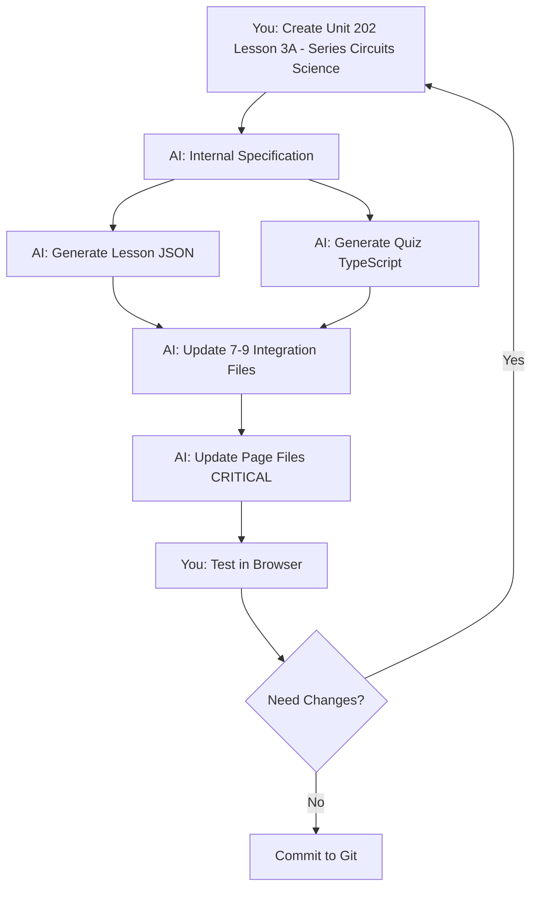

# Complete Guide to Lesson Creation

**The definitive reference for creating C&G 2365 electrical training lessons**

---

## 📖 Table of Contents

1. [Overview & Introduction](#overview--introduction)
2. [Quick Start](#quick-start)
3. [Working with AI to Generate Lessons](#working-with-ai-to-generate-lessons)
4. [Understanding Lesson Structure](#understanding-lesson-structure)
5. [Understanding Quiz Structure](#understanding-quiz-structure)
6. [Supplementary Lessons](#supplementary-lessons)
7. [Technical Details](#technical-details)
8. [Quality Standards & Error Prevention](#quality-standards--error-prevention)
9. [Testing & Validation](#testing--validation)
10. [Troubleshooting](#troubleshooting)
11. [Reference Section](#reference-section)

---

## Overview & Introduction

### What This System Does

This is an AI-driven lesson generation system for the C&G 2365 electrical training course. You provide minimal parameters (unit, topic, section), and the AI generates:

- **Complete lesson JSON** with 8-10 structured blocks
- **Comprehensive quiz** with 50 questions and misconception tracking
- **Automatic integration** into the codebase
- **Cumulative quiz support** for spaced repetition

### Who This Guide Is For

This guide is for **you (human) working with me (AI)**:
- You request lessons using simple commands
- I generate production-ready content
- You review, test, and iterate
- Together we maintain high-quality educational content

### C&G 2365 Course Structure

```
Units:
├── 201 - Health & Safety (Level 1)
├── 202 - Science & Electrical Principles (Level 2)
├── 203 - Installation & Wiring (Level 2)
├── 204 - Testing & Inspection (Level 2)
├── 210 - Health & Safety (Level 2)
└── 305 - Health & Safety (Level 3)

Lesson Structure:
├── Core Lessons (A variants) - Cover explicit syllabus outcomes
└── Supplementary Lessons (B/C/D variants) - Fill essential gaps
```

---

## Quick Start

### Request Format

To generate a lesson, use this simple format:

```
Create Unit [NUMBER], Lesson [ID] - [TOPIC] ([SECTION])
```

### Examples

```
Create Unit 202, Lesson 1A - Electrical Quantities & Units (Science)
Create Unit 202, Lesson 2A - Ohm's Law Basics (Science)
Create Unit 201, Lesson 1A - Health and Safety Legislation (Health & Safety)
```

### Common Sections

| Section Name | Description | Content Type |
|--------------|-------------|--------------|
| `Science 2365 Level 2` | Electrical principles | Circuits, calculations, theory |
| `Health & Safety Level 1` | Foundational safety | Regulations, PPE, basic procedures |
| `Health & Safety Level 2` | Advanced safety | Risk assessment, systems, management |

### Lesson ID Patterns

**Format:** `[UNIT]-[SEQUENCE][VARIANT]`

**Examples:**
- `202-1A` - First lesson in Unit 202 (core)
- `202-1B` - Supplementary lesson related to topic 1
- `202-2A` - Second lesson in Unit 202 (core)
- `202-7C` - Third supplementary lesson in topic 7 sequence

**Sequence:** 1, 2, 3, 4... (order within unit)  
**Variant:** A (core syllabus), B/C/D (supplementary)

### Layout Types

The AI automatically selects the appropriate layout based on content type:

| Layout | Use When | Example Topics |
|--------|----------|----------------|
| `split-vis` | Diagrams must stay visible, spatial/topology learning | Circuit diagrams, component layouts |
| `linear-flow` | Text-heavy, formulas, definitions, sequential reading | Calculations, regulations, theory |

**Override anytime:** Add `Layout: split-vis` or `Layout: linear-flow` to your request

### What You'll Receive

```
Generated files ready for review:

1. 202-3A-series-circuits.json (450 lines)
   ✅ 8-10 blocks with progressive learning structure
   ✅ Layout: split-vis (diagram stays visible)
   ✅ Prerequisites: 202-1A, 202-2A
   ✅ Learning outcomes: 3 (remember, understand, apply)

2. seriesCircuitsQuestions.ts (50 questions)
   ✅ Difficulty: 15 easy, 25 medium, 10 hard
   ✅ Types: 20 conceptual, 30 calculation
   ✅ All misconception codes mapped
   ✅ Auto-integrated into codebase

Integration: ✅ 7-9 files automatically updated
Cumulative Quiz: ✅ Auto-enabled for spaced repetition

Ready to test! Just restart dev server.
```

---

## Working with AI to Generate Lessons

### The Lesson Generation Flow



### Phase 1: What You Provide (Minimal Input)

**Required:**
- Unit number (e.g., 202)
- Lesson ID (e.g., 1A, 2A, 3B)
- Topic (what the lesson teaches)
- Section (Science, Health & Safety, etc.)

**Optional:**
- Layout preference: `Layout: split-vis` or `Layout: linear-flow`
- Prerequisites: `Prerequisites: 202-1A, 202-2A`
- Special focus: `Focus: Emphasize real-world applications`
- Question emphasis: `Questions: More calculation problems`

### Phase 2: What AI Generates

#### 1. Lesson JSON File

Complete lesson with 8-10 blocks:

1. **Outcomes Block** - Learning objectives (Bloom's taxonomy)
2. **Vocab Block** - 3-6 key terms with definitions
3. **Diagram Block** - Visual representation (if applicable)
4. **Explanation Block** - Core teaching content
   - **4.5. Understanding Check** - 3×L1 Recall + 1×L2 Connection
5. **Worked Example** - Step-by-step demonstration
6. **Guided Practice** - Scaffolded student work
7. **Practice Block** - 3-5 independent questions
   - **7.5/9.5. Integrative Question** - Big picture synthesis
8. **Spaced Review** - 4 questions from prerequisites

#### 2. Quiz TypeScript File

50 questions with:
- **Difficulty distribution:** 15 easy (30%), 25 medium (50%), 10 hard (20%)
- **Type distribution:** Discrimination, conceptual, calculation, application
- **Misconception codes:** Maps wrong answers to error types
- **Learning outcome links:** Each question tied to specific outcomes
- **Explanations:** Why correct answer is right

### Phase 3: Automatic Integration

The AI updates 7-9 files automatically:

| # | File | Purpose | Critical? |
|---|------|---------|-----------|
| 1 | `questions/index.ts` | Import & export new questions | Required |
| 2 | `questions.ts` | Add to main questions array | Required |
| 3 | `lessonIndex.ts` | Register lesson with order | Required |
| 4 | `questions/types.ts` | Add new tags/codes | If new types |
| 5 | `misconceptionCodes.ts` | Define new misconception codes | If new codes |
| 6 | **`learn/[lessonId]/page.tsx`** | **Import + LESSONS registry** | **🚨 CRITICAL** |
| 7 | **`learn/page.tsx`** | **Import + LESSONS array** | **🚨 CRITICAL** |

**⚠️ Steps 6 & 7 are CRITICAL:** Without them, the lesson exists in the database but is **INVISIBLE** on the website!

### Phase 4: Review & Iteration

If you need changes after generation:

**Minor Fixes:**
```
Fix: Question 3004 option 2 should be "35 Ω" not "30 Ω"
```

**Content Adjustments:**
```
Change: Add water pipe analogy to explanation block
Change: Worked example should use 9V instead of 12V
```

**Structural Changes:**
```
Rework: Need more conceptual questions, fewer calculations
Rework: Quiz difficulty should be 40% easy, 40% medium, 20% hard
```

The AI will make updates and re-validate before presenting again.

### Layout Decision Logic

The AI automatically chooses layout based on these rules:

**Choose `linear-flow` when:**
- ✅ Section: "Health & Safety", "Theory", "Regulations", "Procedures"
- ✅ Topic: "Calculations", "Formulas", "Definitions", "Units", "Measurements"
- ✅ Content: Regulations, PPE, risk assessment, safety procedures
- ✅ Format: Text-heavy, lists, sequential steps

**Choose `split-vis` when:**
- ✅ Section: "Science 2365" (circuit-based)
- ✅ Topic: "Circuit", "Series", "Parallel", "Diagram", "Layout", "Topology"
- ✅ Content: Spatial concepts, component placement
- ✅ Format: Essential diagrams that need to stay visible

**Manual override:** Always honored if you specify layout explicitly

---

## Understanding Lesson Structure

### The Two Layout Types

#### Layout A: Split-Vis (Split Visual)

**When to use:** Lessons where diagrams must stay visible while reading

```
Desktop View:
┌──────────────────────────────────┐
│  ┌──────────┬──────────────────┐ │
│  │          │                  │ │
│  │ DIAGRAM  │   EXPLANATION    │ │
│  │ (stays   │   (scrolls)      │ │
│  │  fixed)  │                  │ │
│  │          │                  │ │
│  └──────────┴──────────────────┘ │
└──────────────────────────────────┘

Mobile View:
┌──────────────────┐
│    DIAGRAM       │
│   (sticky top)   │
├──────────────────┤
│   EXPLANATION    │
│   (scrolls)      │
│                  │
└──────────────────┘
```

**Best for:**
- Circuit diagrams (series, parallel, mixed)
- Component layouts
- Spatial relationships
- Anything where image needs constant reference

**Examples:**
- Series circuits (students need to see circuit while reading about current flow)
- Parallel circuits (diagram shows the branches)
- Wiring layouts (spatial understanding is key)

#### Layout B: Linear-Flow

**When to use:** Text-heavy lessons without essential diagrams

```
Desktop & Mobile View:
┌─────────────────────────┐
│                         │
│       CONTENT           │
│    (single column,      │
│      scrolls)           │
│                         │
└─────────────────────────┘
```

**Best for:**
- Formulas and calculations
- Definitions and theory
- Safety regulations
- Step-by-step procedures
- Lists and sequential information

**Examples:**
- Ohm's Law calculations
- Health & Safety regulations
- Electrical quantities and units
- PPE requirements

### Block-by-Block Breakdown

Every lesson contains 8-10 blocks in this order:

#### Block 1: Outcomes Block

**Purpose:** Tell students what they'll be able to do by the end

**Structure:**
```json
{
  "id": "202-4A-outcomes",
  "type": "outcomes",
  "order": 1,
  "content": {
    "outcomes": [
      {
        "text": "State the three series circuit rules",
        "bloomLevel": "remember"
      },
      {
        "text": "Explain why current is the same in series",
        "bloomLevel": "understand"
      },
      {
        "text": "Calculate total resistance in series circuits",
        "bloomLevel": "apply"
      }
    ]
  }
}
```

**Bloom's Taxonomy Levels:**
- **Remember:** Define, list, name, state, identify, recall
- **Understand:** Explain, describe, summarize, compare, interpret
- **Apply:** Calculate, solve, apply, demonstrate, use

**Best Practices:**
- Include 3-4 outcomes
- Start with measurable action verbs
- Progress from simple (remember) to complex (apply)
- Make them testable (you can create quiz questions for each)

#### Block 2: Vocab Block

**Purpose:** Define 3-6 key technical terms students will encounter

**Structure:**
```json
{
  "id": "202-4A-vocab",
  "type": "vocab",
  "order": 2,
  "content": {
    "terms": [
      {
        "term": "Series Circuit",
        "definition": "A circuit where components are connected end-to-end in a single path with no branches"
      },
      {
        "term": "Total Resistance (R_total)",
        "definition": "The combined resistance of all components in a circuit, measured in Ohms (Ω)"
      }
    ]
  }
}
```

**Selection Criteria:**
- Essential to understanding the lesson
- Used multiple times in content
- Students may not know from previous lessons
- Technical/specific to this topic

**Definition Guidelines:**
- Keep to ONE sentence
- Use simple language students already know
- Include units where relevant (Ω, V, A)
- Don't use the term in its own definition

#### Block 3: Diagram Block

**Purpose:** Provide visual representation (Required for split-vis, optional for linear-flow)

**Structure:**
```json
{
  "id": "202-4A-diagram",
  "type": "diagram",
  "order": 3,
  "content": {
    "title": "Basic Series Circuit",
    "description": "A simple series circuit showing a battery, switch, and three resistors connected in a single path",
    "videoUrl": "",
    "diagramType": "series",
    "elementIds": ["battery", "switch", "R1", "R2", "R3"],
    "placeholderText": "Circuit diagram with 12V battery connected to three resistors in series"
  }
}
```

**Diagram Types:**
- `series` - Series circuits
- `parallel` - Parallel circuits
- `circuit` - Mixed/complex circuits
- `other` - Non-circuit diagrams (waveforms, layouts, equipment)

**Best Practices:**
- Make title descriptive but short (3-7 words)
- Write placeholderText for accessibility
- List all major elements in elementIds
- Reference diagram elements in explanation text

#### Block 4: Explanation Block

**Purpose:** Teach the core concepts ("I Do" - teacher demonstrates)

**Structure:**
```json
{
  "id": "202-4A-explain-rules",
  "type": "explanation",
  "order": 4,
  "content": {
    "title": "The Three Series Circuit Rules",
    "content": "When components are connected in series, they share a **single path** for current to flow...\n\n**Rule 1: Current is the Same Everywhere**\n\nIn a series circuit, the current is identical at every point..."
  }
}
```

**Content Structure:**
1. **What it is** - Definition in simple terms
2. **Why it matters** - Real-world relevance
3. **How it works** - The mechanism/process
4. **Rules or formulas** - If applicable
5. **Key points summary** - Wrap up main ideas

**Formatting:**
- Use `**text**` for bold emphasis on key terms
- Use `\n\n` for paragraph breaks
- Use numbered lists for rules/steps
- Connect to diagram and vocabulary

**Length Guidelines:**
- Minimum: 300 words (2-3 paragraphs)
- Ideal: 400-600 words (comprehensive but focused)
- Maximum: 800 words (split into two explanation blocks if longer)

#### Block 4.5: Understanding Check Block

**Purpose:** Immediate reinforcement after explanation with progressive depth-of-processing questions

**NEW STRUCTURE:** This addresses student discouragement by starting simple:

**Structure:**
```json
{
  "id": "202-4A-check-1",
  "type": "practice",
  "order": 4.5,
  "content": {
    "title": "Check Your Understanding: Series Circuit Rules",
    "mode": "conceptual",
    "sequential": true,
    "questions": [
      {
        "id": "202-4A-C1-L1-A",
        "questionText": "What does AC stand for?",
        "answerType": "short-text",
        "cognitiveLevel": "recall",
        "expectedAnswer": "Alternating Current",
        "hint": "Think about the full name for AC."
      },
      {
        "id": "202-4A-C1-L1-B",
        "questionText": "What does 'alternating' mean in the context of electric current?",
        "answerType": "short-text",
        "cognitiveLevel": "recall",
        "expectedAnswer": "The current changes direction, flowing forwards then backwards regularly",
        "hint": "Think about what makes AC different from DC."
      },
      {
        "id": "202-4A-C1-L1-C",
        "questionText": "How does DC current flow?",
        "answerType": "short-text",
        "cognitiveLevel": "recall",
        "expectedAnswer": "DC flows in only one direction continuously",
        "hint": "DC stands for Direct Current."
      },
      {
        "id": "202-4A-C1-L2",
        "questionText": "How do these characteristics affect which type is better for different applications?",
        "answerType": "short-text",
        "cognitiveLevel": "connection",
        "expectedAnswer": "AC is better for mains supply because it can be transformed. DC is better for electronics because it provides steady voltage.",
        "hint": "Think about transformers and long-distance transmission."
      }
    ]
  }
}
```

**Question Pattern: 3×L1 Recall + 1×L2 Connection**

- **Questions 1-3 (Level 1 - Recall):** Simple factual questions building foundational knowledge
- **Question 4 (Level 2 - Connection):** Shows relationships between the three facts

**Why This Structure:**
- Builds confidence with easy questions first
- Establishes foundation before making connections
- Reduces early discouragement
- Progressive complexity matches learning progression

**Cognitive Levels:**
- `recall` (Level 1) - Simple facts: "What is...?"
- `connection` (Level 2) - Relationships: "How do these relate?"
- `synthesis` (Level 3) - Integration: "Explain why... considering..." (used in integrative block)

#### Block 5: Worked Example Block

**Purpose:** Demonstrate step-by-step problem solving ("I Do" - teacher demonstrates)

**Structure:**
```json
{
  "id": "202-4A-worked-example",
  "type": "worked-example",
  "order": 5,
  "content": {
    "title": "Worked Example: Finding Total Resistance and Current",
    "given": "Three resistors (R1=4Ω, R2=6Ω, R3=2Ω) are connected in series to a 12V battery. Find total resistance and current.",
    "steps": [
      {
        "stepNumber": 1,
        "description": "Calculate total resistance using the series rule",
        "formula": "R_total = R1 + R2 + R3",
        "calculation": null,
        "result": null
      },
      {
        "stepNumber": 2,
        "description": "Substitute the values",
        "formula": "R_total = R1 + R2 + R3",
        "calculation": "R_total = 4Ω + 6Ω + 2Ω",
        "result": null
      },
      {
        "stepNumber": 3,
        "description": "Calculate the result",
        "formula": null,
        "calculation": "R_total = 12Ω",
        "result": "12Ω"
      }
    ],
    "notes": "Always include units in your answer. In series circuits, current is the same everywhere."
  }
}
```

**Four-Part Format:**
1. **Given** - What information is provided
2. **Steps** - Numbered sequence showing the process (3-6 steps ideal)
3. **Result** - Final answer with units
4. **Notes** - Additional tips or reminders

**Best Practices:**
- Use realistic values (avoid trick numbers)
- Show every step explicitly
- Explain what you're doing in each step
- Include units throughout
- Make the problem relevant to real electrical work

#### Block 6: Guided Practice Block

**Purpose:** Scaffolded practice where students try with prompts ("We Do" - teacher guides)

**Structure:**
```json
{
  "id": "202-4A-guided",
  "type": "guided-practice",
  "order": 6,
  "content": {
    "title": "Guided Practice (We Do)",
    "problem": "Two resistors (R1=8Ω, R2=4Ω) are connected in series with a 24V supply. Let's find total resistance and current together.",
    "steps": [
      {
        "stepNumber": 1,
        "prompt": "First, what is the total resistance? (Remember the series rule)",
        "expectedAnswer": ["12Ω", "12", "12 Ω", "12 ohms"],
        "hint": "In series, resistances add up: R_total = R1 + R2"
      },
      {
        "stepNumber": 2,
        "prompt": "Now, using Ohm's Law, calculate the current",
        "expectedAnswer": ["2A", "2", "2 A", "2 amps"],
        "hint": "Use I = V / R. You know V = 24V and R_total = 12Ω"
      }
    ]
  }
}
```

**Key Features:**
- Break problem into 2-3 prompted steps
- Questions guide thinking, not instructions
- Include multiple acceptable answer formats
- Hints point to relevant rules without solving

**Writing Good Prompts:**
- ✅ "What formula relates voltage, current, and resistance?"
- ❌ "Use Ohm's Law"
- ✅ "Looking at the circuit, what is the total resistance?"
- ❌ "Calculate R_total by adding R1 and R2"

#### Block 7: Practice Block

**Purpose:** Independent student work ("You Do")

**Structure:**
```json
{
  "id": "202-4A-practice",
  "type": "practice",
  "order": 7,
  "content": {
    "title": "Your Turn (You Do)",
    "questions": [
      {
        "id": "202-4A-P1",
        "questionText": "Three resistors of 3Ω, 5Ω, and 7Ω are connected in series. Calculate total resistance.",
        "answerType": "numeric",
        "expectedAnswer": ["15Ω", "15", "15 Ω", "15 ohms"],
        "hint": "Remember: In series, resistances add up"
      },
      {
        "id": "202-4A-P2",
        "questionText": "Explain why current is the same everywhere in a series circuit.",
        "answerType": "short-text",
        "expectedAnswer": ["only one path", "single path", "no branches"],
        "hint": "Think about the path that current takes"
      }
    ]
  }
}
```

**Question Types:**
- **Numeric** - Calculation practice: "Calculate the total resistance"
- **Short-text** - Conceptual understanding: "Explain why current is the same"
- **MCQ** - Quick checks: "Which rule describes voltage in series?"

**Distribution:** Aim for 2-3 numeric, 1-2 short-text, 0-1 MCQ (4-5 questions total)

**Difficulty Progression:**
1. Q1-2: Direct application of a single rule
2. Q3-4: Requires combining concepts or multiple steps
3. Q5 (optional): Challenge question or deeper conceptual

#### Block 7.5/9.5: Integrative Question Block

**Purpose:** Deep synthesis question tying all lesson concepts together

**Structure:**
```json
{
  "id": "202-7A-integrative",
  "type": "practice",
  "order": 9.5,
  "content": {
    "title": "Putting It All Together",
    "mode": "integrative",
    "questions": [
      {
        "id": "202-7A-INT-1",
        "questionText": "You've learned about AC vs DC, frequency (50 Hz), and UK mains supply (230V AC). Now explain: Why does the UK use 230V AC at 50Hz for the national grid rather than DC? What are the practical advantages? (3-4 sentences)",
        "answerType": "short-text",
        "cognitiveLevel": "synthesis",
        "expectedAnswer": "The UK uses 230V AC at 50 Hz because AC can be easily transformed to different voltages using transformers. This allows power stations to transmit electricity at very high voltages then step it down to safe 230V for homes. DC cannot be easily transformed, making it inefficient for national transmission.",
        "hint": "Think about transformers, transmission efficiency, and standardization."
      }
    ]
  }
}
```

**Key Features:**
- Appears AFTER practice block, BEFORE spaced review
- One "Big Picture Question" per lesson
- Special blue badge: "🏆 Putting It All Together"
- Requires 2-3 sentences to answer properly
- Shows synthesis of understanding (Level 2/3)
- Reinforces big picture once foundations are solid

**Best Practices:**
- Tie together ALL major concepts from lesson
- Ask for 3-4 sentences explicitly
- Cover the "big why" of the lesson
- Make it feel special with integrative mode
- Use `cognitiveLevel: "synthesis"`

#### Block 8: Spaced Review Block

**Purpose:** Reinforce prerequisite material (spaced repetition for retention)

**Structure:**
```json
{
  "id": "202-4A-spaced-review",
  "type": "spaced-review",
  "order": 8,
  "content": {
    "title": "Spaced Review (from prerequisites)",
    "questions": [
      "What does voltage measure in a circuit?",
      "State Ohm's Law and identify each variable",
      "What is the unit of electrical resistance?",
      "If you double resistance while keeping voltage constant, what happens to current?"
    ],
    "notes": "These questions review electrical quantities (202-1A) and Ohm's Law (202-2A)"
  }
}
```

**Key Features:**
- 4 questions reviewing prerequisite lessons
- Quick recall questions (not complex problems)
- Cover fundamental concepts students will use again
- Notes explain what's being reviewed

**Best Practices:**
- Review actual prerequisite lessons (not current lesson)
- Ask quick recall questions
- Cover concepts students will use again
- Keep questions short and clear

### Pedagogical Principles

#### The "I Do, We Do, You Do" Method

The lesson structure follows proven teaching methodology:

1. **I Do (Teacher demonstrates):**
   - Explanation block - Teach concepts
   - Understanding check - Verify comprehension
   - Worked example - Show problem solving

2. **We Do (Teacher guides):**
   - Guided practice - Scaffolded support

3. **You Do (Student independent):**
   - Practice block - Independent work
   - Integrative question - Synthesis

#### Progressive Depth of Processing

Questions increase in complexity throughout the lesson:

- **Level 1 (Recall):** Understanding checks Q1-3 - Simple facts
- **Level 2 (Connection):** Understanding checks Q4 - Relationships
- **Level 2/3 (Synthesis):** Integrative question - Big picture integration

This structure:
- Builds confidence early (simple questions first)
- Establishes foundation before making connections
- Reduces early discouragement
- Matches natural learning progression

#### Spaced Repetition

- **Spaced review blocks:** Reinforce earlier lessons
- **Cumulative quizzes:** Mix current + previous lessons
- **Prerequisites:** Build on prior knowledge explicitly

---

## Understanding Quiz Structure

### Overview

Each lesson includes a comprehensive 50-question quiz with:
- Full misconception tracking
- Difficulty progression
- Learning outcome alignment
- Automatic cumulative quiz generation

### Question Distribution

#### Difficulty Distribution

```
Total: 50 questions

Easy:   15 questions (30%) - Difficulty 1-2
Medium: 25 questions (50%) - Difficulty 2-3
Hard:   10 questions (20%) - Difficulty 4-5
```

**Difficulty Levels:**
- **Level 1:** Recognition, recall (30-45s)
- **Level 2:** Simple application (45-60s)
- **Level 3:** Multi-step or conceptual (60-90s)
- **Level 4:** Complex application (90-120s)
- **Level 5:** Novel scenarios, synthesis (120+s)

#### Type Distribution

Standard distribution (adjusted based on topic):

```
Discrimination: 20% - Identify/classify concepts
Conceptual:     20% - Understanding without calculation
Calculation:    40% - Numerical problem-solving
Application:    20% - Real-world scenarios
```

**Adjustments:**
- Heavy calculation topics: 60% calculation, 20% conceptual
- Theory-heavy topics: 60% conceptual, 20% calculation
- Introductory topics: More discrimination questions

### TaggedQuestion Interface

Questions use an extended interface with enhanced metadata:

```typescript
interface TaggedQuestion {
  // Core Fields (Required)
  id: number;                    // Unique ID (3000+ for custom)
  question: string;              // Question text
  options: string[];             // 4 answer choices
  correctAnswer: number;         // Index 0-3
  section: string;               // Course/level identifier
  category: string;              // Topic area
  
  // Required Extensions
  tags: QuestionTag[];           // 2-4 tags for filtering
  learningOutcomeId: string;     // Links to lesson outcome
  
  // Recommended Metadata
  answerType?: AnswerType;       // 'mcq', 'numeric', etc.
  misconceptionCodes?: {         // Maps wrong answers to errors
    [index: number]: MisconceptionCode;
  };
  difficulty?: number;           // 1-5 scale
  estimatedTime?: number;        // Seconds to complete
  explanation?: string;          // Why correct answer is right
  
  // Optional (for specific types)
  requiredUnits?: string;        // If numeric
  tolerance?: number;            // If numeric
  image?: string;                // If visual aid needed
}
```

### Question Tags

Tags help filter and organize questions. Use 2-4 relevant tags per question.

**Tagging Strategy:**
1. **Topology tag** - series/parallel/mixed-circuit
2. **Concept tag** - current-rule/voltage-rule/resistance-rule/ohms-law
3. **Cognitive tag** - calculation/conceptual/explanation/discrimination/application

**Common Tags:**
- `series` - Series circuits
- `parallel` - Parallel circuits
- `mixed-circuit` - Combined series/parallel
- `ohms-law` - Uses Ohm's Law (V=IR)
- `current-rule` - About current behavior
- `voltage-rule` - About voltage behavior
- `resistance-rule` - About resistance calculation
- `calculation` - Requires numerical calculation
- `discrimination` - Identify/classify circuit type
- `explanation` - Explain why/how
- `conceptual` - Understanding, not calculation
- `application` - Apply to real scenario

### Misconception Codes

Misconception codes identify **why** a student got an answer wrong, enabling targeted feedback.

**Common Codes:**
- `USED_PARALLEL_RULE` - Applied parallel formula in series context
- `USED_SERIES_RULE` - Applied series formula in parallel context
- `UNITS_MISSING` - Answer correct but units omitted
- `WRONG_UNITS` - Incorrect unit (e.g., mA instead of A)
- `MULTIPLIED_INSTEAD` - Multiplied when should add/divide
- `DIVIDED_INSTEAD` - Divided when should multiply/add
- `RECIPROCAL_ERROR` - Forgot reciprocal in parallel formula
- `FORMULA_NOT_REARRANGED` - Used V=IR without rearranging
- `CONFUSED_I_V_R` - Mixed up I, V, R positions
- `TOPOLOGY_CONFUSION` - Couldn't identify series vs parallel
- `OTHER` - Other/unknown error

**Usage:**
```typescript
misconceptionCodes: {
  1: 'USED_PARALLEL_RULE',    // Option 1 wrong: used parallel formula
  2: 'MULTIPLIED_INSTEAD',     // Option 2 wrong: multiplied
  3: 'RECIPROCAL_ERROR'        // Option 3 wrong: messed up reciprocal
}
```

### Creating Effective Distractors

Good distractors represent **actual student misconceptions**, not random wrong answers.

**Distractor Design Principles:**

1. **Systematic Error** - Result of applying wrong formula/method
   - Example: Using parallel formula in series
   - Maps to: `USED_PARALLEL_RULE`

2. **Calculation Error** - Arithmetic mistake
   - Example: Multiplying instead of adding
   - Maps to: `MULTIPLIED_INSTEAD`

3. **Conceptual Confusion** - Misunderstanding concept
   - Example: Thinking current divides in series
   - Maps to: `TOPOLOGY_CONFUSION`

4. **Partial Understanding** - Right approach, wrong execution
   - Example: Forgetting reciprocal in parallel
   - Maps to: `RECIPROCAL_ERROR`

**Example for calculation question (correct: 12Ω):**
```typescript
options: [
  "12 Ω",      // Correct: R1 + R2 = 5 + 7
  "35 Ω",      // MULTIPLIED_INSTEAD: 5 × 7
  "2.9 Ω",     // USED_PARALLEL_RULE: 1/(1/5 + 1/7)
  "2 Ω"        // DIVIDED_INSTEAD or subtracted: 7 - 5
]
```

### Complete Question Example

```typescript
{
  id: 3001,
  question: "R1 = 5Ω and R2 = 7Ω are connected in series. Calculate the total resistance.",
  options: [
    "12 Ω",        // Correct
    "2 Ω",         // Subtracted instead
    "35 Ω",        // Multiplied instead
    "2.9 Ω"        // Used parallel formula
  ],
  correctAnswer: 0,
  section: "Science 2365 Level 2",
  category: "Series Circuits",
  tags: ['series', 'resistance-rule', 'calculation'],
  learningOutcomeId: "202-4A-LO3",
  answerType: 'mcq',
  misconceptionCodes: {
    1: 'OTHER',
    2: 'MULTIPLIED_INSTEAD',
    3: 'USED_PARALLEL_RULE'
  },
  requiredUnits: 'Ω',
  difficulty: 2,
  estimatedTime: 60,
  explanation: "In series, resistances ADD: R_total = R1 + R2 = 5 + 7 = 12 Ω"
}
```

### Cumulative Quiz System

In addition to regular lesson-specific quizzes, the system supports **cumulative quizzes** that combine questions from the current lesson with all previous lessons in the same unit.

**Features:**
- **Automatic generation** - No additional quiz files needed
- **Within-unit only** - Unit 202 lessons only mix with other Unit 202 lessons
- **50/50 split** - Default: 10 questions from current lesson, 10 from previous
- **Smart sampling** - Randomly samples from question pools for variety
- **Spaced repetition** - Each new lesson naturally reviews all earlier content
- **Visual distinction** - Orange "Cumulative" button vs blue "Quiz" button

**Access:**
- `/learn/[lessonId]/quiz` - Regular quiz (current lesson only)
- `/learn/[lessonId]/quiz?mode=cumulative` - Cumulative quiz (current + previous)

**Question Selection Logic:**
```
Example: Lesson 202-4B (4th lesson in Unit 202)

Cumulative quiz includes:
- 202-1A (Electrical Quantities)
- 202-2A (Ohm's Law)
- 202-4A (Series Circuits)
- 202-4B (Series Circuits Extended) ← current

Result: ~20 questions
- 10 from 202-4B (current, 50%)
- 10 from 202-1A, 202-2A, 202-4A combined (previous, 50%)
- Shuffled for proper interleaving
```

**Benefits:**
1. Built-in spaced repetition
2. Discrimination practice (students identify which concept applies)
3. Exam preparation (mimics real exam conditions)
4. Early warning system (poor performance indicates gaps)

---

## Supplementary Lessons

### What Are Supplementary Lessons?

**Supplementary lessons** are full-length lessons that cover material not explicitly in the core C&G 2365 syllabus, but essential for proper understanding and practical competence.

They are **"missing rungs on the ladder"** - prerequisite skills, bridge concepts, and connections that students need but the syllabus doesn't explicitly teach.

### Key Characteristics

- ✅ **Full lessons:** Same structure, duration, and quiz size as core lessons
- ✅ **Same layouts:** Use split-vis or linear-flow as appropriate
- ✅ **Same blocks:** 8-10 blocks (outcomes → vocab → explanation → examples → practice → review)
- ✅ **Same quizzes:** 50 questions with full misconception tracking
- ✅ **No special styling:** Render as regular lesson cards on `/learn` page

### What Makes Them "Supplementary"

The **only difference** is their purpose:
- **Core lessons (A variants):** Cover explicit syllabus learning outcomes
- **Supplementary lessons (B/C/D variants):** Cover essential material the syllabus assumes or omits

### When to Create Supplementary Lessons

#### Group A: Maths, Units & Foundation Skills
**Why needed:** Syllabus assumes these, but most students lack them

**Examples:**
- Engineering notation & prefixes (m, µ, k, M)
- Unit conversion for electricians (A/mA, Ω/kΩ, W/kW)
- Formula rearrangement drill
- Proportional thinking ("double R → what happens to I?")

**Placement:** Early in Unit 202 (before calculations start)

#### Group B: Instruments, Readings & Measurements
**Why needed:** Testing becomes easy when you understand what readings mean

**Examples:**
- What each meter function measures
- Continuity meaning (what it proves and doesn't prove)
- Insulation resistance meaning
- Polarity meaning

**Placement:** Before Unit 204, or early in 202

#### Group C: Core Circuit Behaviour
**Why needed:** Stops circuits feeling like memorized rules; helps fault logic

**Examples:**
- Series fault logic (open/high resistance: what changes)
- Parallel fault logic (one branch fails: what changes)
- Power and heating effect connections

**Placement:** After series/parallel lessons (202-3A, 202-4A)

#### Group D: Safety Science Bridges
**Why needed:** Where "science" becomes "site safety"

**Examples:**
- Heating effect of current → overheating risk
- Shock severity factors
- Voltage drop concept and symptoms
- Earth fault vs short vs overload

**Placement:** Between Unit 201 (safety) and Unit 202 (science)

#### Group E: Magnetism & AC Bridges
**Why needed:** Explains transformers/relays/motors without Level 3 depth

**Examples:**
- **202-7B: How AC is Generated** (single-loop generator → sine wave)
- Magnetic field around conductors
- Electromagnets as devices (relay/contactor behavior)
- Transformer principle (Level 2 appropriate)

**Placement:** Inline with Unit 202 magnetism/AC lessons (202-6A, 202-7A)

#### Group F: Installation Decisions
**Why needed:** Makes Unit 203 coherent instead of random product knowledge

**Examples:**
- Cable selection logic (current, environment, protection)
- Protection device roles (MCB vs RCD vs RCBO)
- External influences basics (IP ratings, zones)

**Placement:** Within Unit 203 sequence

#### Group G: Work Method & Professional Routine
**Why needed:** Practical assessment and professional competence

**Examples:**
- Hazard vs risk
- Hierarchy of control
- Safe isolation routine
- Good workmanship standards

**Placement:** Within Unit 201/210

### Naming Convention

**Format:** Standard letter variants

```
[UNIT]-[NUMBER][LETTER]

Examples:
202-1A  → Core lesson (syllabus outcome 1)
202-1B  → Supplementary lesson (related to topic 1)
202-1C  → Another supplementary lesson (related to topic 1)

202-7A  → AC Principles (core syllabus)
202-7B  → How AC is Generated (supplementary)
202-7C  → Sine Wave Vocabulary (supplementary)
```

**Sequencing Rules:**
- **A variant:** Always the core syllabus lesson
- **B/C/D variants:** Supplementary lessons, numbered by creation order
- **Order field:** Controls placement on `/learn` page (use decimals if needed)

**Example placement:**
```typescript
{
  id: '202-7A',
  title: 'AC Principles',
  order: 7,
},
{
  id: '202-7B',
  title: 'How AC is Generated',
  order: 7.1,  // Appears right after 202-7A
}
```

### Generation Request Format

```
Create Unit [NUMBER], Lesson [ID] - [TOPIC] ([SECTION])
Note: Supplementary lesson covering [gap/bridge concept]
```

**Examples:**

```
Create Unit 202, Lesson 7B - How AC is Generated (Science)
Note: Supplementary lesson covering single-loop generator producing sine wave
Layout: split-vis
Related: 202-7A (AC Principles)
```

```
Create Unit 202, Lesson 2B - Formula Rearrangement (Science)
Note: Supplementary lesson covering transposition skills for V=IR, P=VI
Layout: linear-flow
Prerequisites: 202-1A (Quantities & Units)
```

### Integration with Core Lessons

**Prerequisites Linking:**
Core lessons can list supplementary lessons as prerequisites:

```json
{
  "prerequisites": ["202-7A", "202-7B"]
  // Now assumes students understand both AC principles AND generation
}
```

**Cumulative Quizzes:**
Supplementary lessons are automatically included in cumulative quizzes:
- Same unit number → included in unit cumulative
- Same question weighting as core lessons
- No special handling needed

**Visual Presentation:**
On `/learn` page:
- Appears inline with core lessons
- No special badge or styling
- Same card design and interaction
- Students experience it as "just another lesson"

---

## Technical Details

### File Structure

```
quiz-app/src/
├── data/
│   ├── lessons/
│   │   ├── lessonIndex.ts              # Registry of all lessons
│   │   ├── types.ts                    # Lesson interfaces
│   │   ├── 202-1A-electrical-quantities.json
│   │   ├── 202-2A-ohms-law.json
│   │   └── ...
│   └── questions/
│       ├── index.ts                    # Export all question banks
│       ├── types.ts                    # Question interfaces
│       ├── electricalQuantitiesQuestions.ts
│       ├── ohmsLawQuestions.ts
│       └── ...
├── app/
│   └── learn/
│       ├── page.tsx                    # Lesson list page
│       └── [lessonId]/
│           ├── page.tsx                # Individual lesson page
│           └── quiz/
│               └── page.tsx            # Quiz page
└── lib/
    ├── marking/
    │   └── misconceptionCodes.ts       # Misconception definitions
    └── questions/
        └── cumulativeQuestions.ts      # Cumulative quiz logic
```

### Integration Points

When a new lesson is generated, these files are automatically updated:

#### 1. questions/index.ts
**Purpose:** Export all question banks

```typescript
// Add import
export { electricalQuantitiesQuestions } from './electricalQuantitiesQuestions';

// Use in main questions.ts
```

#### 2. questions.ts
**Purpose:** Combine all questions into main array

```typescript
import { electricalQuantitiesQuestions } from './questions/electricalQuantitiesQuestions';

export const questions: TaggedQuestion[] = [
  ...electricalQuantitiesQuestions,
  // ... other question banks
];
```

#### 3. lessonIndex.ts
**Purpose:** Register lesson with order for cumulative quizzes

```typescript
export const lessonIndex = [
  {
    id: '202-1A',
    title: 'Electrical Quantities & Units',
    unitNumber: 202,
    order: 1,  // Critical for cumulative quiz ordering
  },
  // ... more lessons
];
```

#### 4. questions/types.ts (if new tags/codes)
**Purpose:** Add new question tags or misconception codes if needed

```typescript
export type QuestionTag =
  | 'series'
  | 'parallel'
  // ... add new tags if needed
  
export type MisconceptionCode =
  | 'USED_PARALLEL_RULE'
  | 'USED_SERIES_RULE'
  // ... add new codes if needed
```

#### 5. misconceptionCodes.ts (if new codes)
**Purpose:** Define new misconception codes with explanations

```typescript
export const misconceptionDefinitions: Record<MisconceptionCode, MisconceptionDefinition> = {
  USED_PARALLEL_RULE: {
    code: 'USED_PARALLEL_RULE',
    description: 'Applied parallel circuit formula in series context',
    // ... more details
  },
  // ... more definitions
};
```

#### 6. learn/[lessonId]/page.tsx ⚠️ CRITICAL
**Purpose:** Import lesson and add to LESSONS registry

```typescript
import lesson202_1A from '@/data/lessons/202-1A-electrical-quantities.json';

const LESSONS: Record<string, Lesson> = {
  '202-1A': lesson202_1A as Lesson,
  // ... more lessons
};
```

**⚠️ WITHOUT THIS, LESSON WON'T LOAD ON INDIVIDUAL PAGE!**

#### 7. learn/page.tsx ⚠️ CRITICAL
**Purpose:** Import lesson and add to LESSONS array for list page

```typescript
import lesson202_1A from '@/data/lessons/202-1A-electrical-quantities.json';

const LESSONS = [
  lesson202_1A,
  // ... more lessons
];
```

**⚠️ WITHOUT THIS, LESSON WON'T APPEAR ON /learn PAGE!**

### Cumulative Quiz Implementation

The cumulative quiz system uses `getCumulativeQuestions()` from `lib/questions/cumulativeQuestions.ts`:

```typescript
// Gets questions for current + all previous lessons in same unit
const cumulativeQuestions = getCumulativeQuestions('202-4A');

// Logic:
// 1. Find current lesson in lessonIndex
// 2. Get all previous lessons in same unit (by order field)
// 3. Sample questions with 50/50 weighting
// 4. Shuffle for true interleaving
```

**Key Features:**
- Unit isolation (202 only mixes with 202, not 201/203)
- Order-based (uses `order` field from lessonIndex)
- Smart sampling (~10 current, ~10 previous)
- Automatic fallback for first lesson in unit

---

## Quality Standards & Error Prevention

### Type Safety Requirements

#### Never Use `any` Types

**❌ BAD:**
```typescript
catch (error: any) {
  console.log(error.message);
}
```

**✅ GOOD:**
```typescript
catch (error: unknown) {
  const errorMessage = error instanceof Error ? error.message : '';
  console.log(errorMessage);
}
```

**Rules:**
- Use `unknown` instead of `any`
- Use type guards: `error instanceof Error`
- Use proper type assertions: `as Type` only when necessary

### Valid String Literals

All string literals must match defined union types.

#### Misconception Codes

**❌ BAD - Invalid codes:**
```typescript
misconceptionCodes: {
  1: 'CONFUSED_AC_DC',              // Wrong
  2: 'CONFUSED_VOLTAGE_WITH_FREQUENCY', // Wrong
  3: 'OLD_COLOUR_CODE',              // Wrong
}
```

**✅ GOOD - Valid codes:**
```typescript
misconceptionCodes: {
  1: 'CONFUSED_AC_DC_SOURCES',       // Correct
  2: 'CONFUSED_FREQUENCY_WITH_VOLTAGE', // Correct
  3: 'OTHER',                        // Fallback for undefined
}
```

**How to Find Valid Codes:**
1. Check `src/data/questions/types.ts` - see `MisconceptionCode` union type
2. Check `src/lib/marking/misconceptionCodes.ts` - see all defined misconceptions
3. Use TypeScript autocomplete - shows valid options
4. Use `'OTHER'` if unsure

**Common Invalid → Valid Mappings:**
- `'CONFUSED_AC_DC'` → `'CONFUSED_AC_DC_SOURCES'`
- `'CONFUSED_VOLTAGE_WITH_FREQUENCY'` → `'CONFUSED_FREQUENCY_WITH_VOLTAGE'`
- `'CONFUSED_RMS_PEAK'` → `'CONFUSED_RMS_WITH_PEAK'`
- Any undefined code → `'OTHER'`

#### Question Tags

**❌ BAD - Invalid tags:**
```typescript
tags: ['prefixes', 'tolerance', 'comparison', 'cables']
```

**✅ GOOD - Valid tags:**
```typescript
tags: ['conversion', 'units', 'conceptual', 'application']
```

**Common Invalid → Valid Mappings:**
- `'prefixes'` → `'conversion'`
- `'tolerance'` → `'units'`
- `'comparison'` → `'conceptual'`
- `'cables'` → `'application'`
- `'permanent-magnet'` → `'magnetic-poles'`
- `'electromagnet'` → `'electromagnets'`
- `'relay'` → `'relays'`

### JSX Escaping Rules

React requires escaping of quotes and apostrophes in JSX text nodes.

**❌ BAD:**
```jsx
<p>Why does "Amps" mean "Quantity"?</p>
<p>You've completed the lesson.</p>
```

**✅ GOOD:**
```jsx
<p>Why does &quot;Amps&quot; mean &quot;Quantity&quot;?</p>
<p>You&apos;ve completed the lesson.</p>
```

**Escape Rules:**
- `"` → `&quot;`
- `'` → `&apos;`
- `&` → `&amp;` (if not part of entity)
- `<` → `&lt;` (if not JSX)
- `>` → `&gt;` (if not JSX)

**Common Patterns:**
- `"text"` → `&quot;text&quot;`
- `don't` → `don&apos;t`
- `you've` → `you&apos;ve`
- `let's` → `let&apos;s`

### ESLint Compliance

#### Prefer `const` Over `let`

**❌ BAD:**
```typescript
let nextPos = vecAdd(currentPos, velocity);
```

**✅ GOOD:**
```typescript
const nextPos = vecAdd(currentPos, velocity);
```

**Rule:** Always use `const` unless you need to reassign

#### Remove Unused Variables

**❌ BAD:**
```typescript
const [lessonProgress, setLessonProgress] = useState(null);
// lessonProgress never used
```

**✅ GOOD:**
```typescript
// Remove unused variables, or prefix with underscore
const [_lessonProgress, setLessonProgress] = useState(null);
```

#### Use ES6 Imports

**❌ BAD:**
```typescript
const { getQuizProgress } = require('@/lib/progress/progressService');
```

**✅ GOOD:**
```typescript
import { getQuizProgress } from '@/lib/progress/progressService';
```

### Pre-Commit Checklist

Before committing code, run these checks:

#### 1. TypeScript Check
```bash
cd quiz-app
npm run build
```

Catches:
- Type errors
- Invalid string literals
- Missing required fields
- Type mismatches

#### 2. ESLint
```bash
npm run lint
```

Catches:
- Unused variables
- `prefer-const` violations
- Unescaped JSX entities
- `require()` imports

#### 3. Verify Valid Types

**For Misconception Codes:**
- Check `src/data/questions/types.ts` (MisconceptionCode union)
- Or check `src/lib/marking/misconceptionCodes.ts` for all valid codes

**For Question Tags:**
- Check `src/data/questions/types.ts` (QuestionTag union)

**For Marking Strategies:**
- Check `src/lib/marking/types.ts` (MarkingStrategy)

---

## Testing & Validation

### Testing Process

After lesson generation, follow these steps:

#### 1. Restart Dev Server

```bash
# Stop server if running (Ctrl+C)
cd quiz-app
npm run dev
```

#### 2. Navigate & Test

```
http://localhost:3000/learn
```

**🚨 FIRST CHECK - Does lesson appear?**
- ⚠️ If lesson is NOT visible on `/learn` page → **Page files NOT updated!**
- ⚠️ Go back and update `learn/page.tsx` and `learn/[lessonId]/page.tsx`

**Verify:**
- ✅ **New lesson appears in the lessons list** ← **MUST SEE THIS FIRST!**
- ✅ Clicking opens the lesson page at `/learn/[lesson-id]`
- ✅ All blocks render correctly
- ✅ Complete lesson → quiz button appears
- ✅ Quiz loads with 50 questions
- ✅ Questions display and grade properly
- ✅ Orange "Cumulative" button appears next to regular quiz button
- ✅ Cumulative quiz loads with mixed questions (current + previous lessons)
- ✅ Cumulative badge shows in quiz header
- ✅ Both quiz modes work independently

#### 3. Test Regular Quiz (Blue Button)

1. Click blue "Quiz" button on lesson page
2. Verify: Only shows questions from current lesson
3. Complete quiz and verify grading works
4. Check results screen shows appropriate feedback

#### 4. Test Cumulative Quiz (Orange Button)

1. Click orange "🔄 Cumulative" button on lesson page
2. Verify: Shows mix of current + previous lessons in unit
3. Check header shows orange "Cumulative" badge
4. Verify question count is appropriate (~20 questions)
5. Check questions are properly shuffled (not blocked by lesson)
6. Complete quiz and verify grading works

#### 5. Test First Lesson in Unit

If lesson is first in its unit (e.g., 202-1A, 201-1A):
- Cumulative quiz should work without errors
- Should show only current lesson questions (no previous to include)

### Validation Checklist

#### Lesson JSON Requirements

| Category | Requirement | Check |
|----------|------------|-------|
| **Structure** | Valid JSON syntax | ✅ |
| | All top-level fields present | ✅ |
| | 8-10 blocks in correct order | ✅ |
| | All block IDs follow pattern | ✅ |
| **Content** | 3-4 learning outcomes with Bloom levels | ✅ |
| | 3-6 vocabulary terms | ✅ |
| | Understanding checks with 3×L1 + 1×L2 structure | ✅ |
| | Worked example has 3-6 steps | ✅ |
| | Practice has 3-5 questions | ✅ |
| | Integrative question present | ✅ |
| | Spaced review has 4 questions | ✅ |
| **Quality** | Formulas are correct | ✅ |
| | Explanations are clear | ✅ |
| | Terminology is consistent | ✅ |
| | Prerequisites make sense | ✅ |

#### Quiz TypeScript Requirements

| Category | Requirement | Check |
|----------|------------|-------|
| **Structure** | Valid TypeScript syntax | ✅ |
| | Exports array with 50 questions | ✅ |
| | All questions have unique IDs | ✅ |
| | All required fields present | ✅ |
| **Distribution** | 15 easy (difficulty 1-2) | ✅ |
| | 25 medium (difficulty 2-3) | ✅ |
| | 10 hard (difficulty 4-5) | ✅ |
| **Tagging** | All tags from approved list | ✅ |
| | All misconception codes valid | ✅ |
| | Learning outcome IDs match lesson | ✅ |
| **Quality** | Questions are unambiguous | ✅ |
| | Correct answers are definitively correct | ✅ |
| | Distractors are plausible | ✅ |
| | Misconception mapping is accurate | ✅ |

#### Cumulative Quiz Requirements

| Category | Requirement | Check |
|----------|------------|-------|
| **Functionality** | Orange cumulative button appears | ✅ |
| | Regular blue quiz button still works | ✅ |
| | Cumulative quiz loads without errors | ✅ |
| | Questions include current + previous | ✅ |
| **Question Selection** | ~20 questions total | ✅ |
| | 50/50 split current/previous | ✅ |
| | Questions properly shuffled | ✅ |
| | Only same unit lessons included | ✅ |
| **UI/UX** | Orange "Cumulative" badge shows | ✅ |
| | Header shows "Current + N previous" | ✅ |
| | First lesson works (no crash) | ✅ |
| | Tooltip explains functionality | ✅ |

### Commit When Approved

```bash
git add quiz-app/src/data/
git add quiz-app/src/app/learn/
git commit -m "feat: Add [LESSON-ID] [Topic] lesson and quiz (50 questions)"
```

**🚨 CRITICAL CHECK before committing:**
```bash
# Verify the lesson appears in both page files:
grep "lesson202-[ID]" quiz-app/src/app/learn/page.tsx
grep "lesson202-[ID]" quiz-app/src/app/learn/[lessonId]/page.tsx

# Both commands should show the import and usage!
# If either returns nothing, the lesson WON'T DISPLAY!
```

---

## Troubleshooting

### Lesson Not Visible on Website

**Symptom:** Lesson generated successfully but doesn't appear on `/learn` page

**Cause:** Page files not updated (most common issue!)

**Solution:**

1. Check if lesson is imported in `learn/page.tsx`:
```typescript
import lesson202_7C from '@/data/lessons/202-7C-sine-wave-vocab.json';

const LESSONS = [
  // ... other lessons
  lesson202_7C,  // ← Must be here!
];
```

2. Check if lesson is imported in `learn/[lessonId]/page.tsx`:
```typescript
import lesson202_7C from '@/data/lessons/202-7C-sine-wave-vocab.json';

const LESSONS: Record<string, Lesson> = {
  // ... other lessons
  '202-7C': lesson202_7C as Lesson,  // ← Must be here!
};
```

3. Restart dev server after adding imports

### Build Errors

#### Type Mismatch Errors

**Error:** `Type 'string' is not assignable to type 'MisconceptionCode'`

**Cause:** Using invalid misconception code

**Solution:** Check valid codes in `src/data/questions/types.ts` or use `'OTHER'`

**Error:** `Type 'string' is not assignable to type 'QuestionTag'`

**Cause:** Using invalid question tag

**Solution:** Check valid tags in `src/data/questions/types.ts`

#### Missing Required Fields

**Error:** `Property 'metadata' is missing in type`

**Cause:** JSON file missing required field

**Solution:** Check the `Lesson` interface in `src/data/lessons/types.ts` for required fields

#### JSX Unescaped Entities

**Error:** `Unescaped entity. Use &quot; for quotes in JSX`

**Cause:** Using `"` or `'` directly in JSX text

**Solution:** Replace with `&quot;` and `&apos;`

### Cumulative Quiz Issues

#### Cumulative Shows Same as Regular Quiz

**Check:** Is this the first lesson in the unit?
- **Expected:** First lesson has no previous lessons, so cumulative = regular

**Check:** Are there questions from previous lessons?
- **Solution:** Verify previous lessons have questions in question banks

#### Cumulative Quiz Crashes

**Check:** Are all previous lessons in `lessonIndex.ts`?
- **Solution:** Add missing lessons to lessonIndex with correct order

**Check:** Do previous lessons have the correct `unitNumber`?
- **Solution:** Verify unit numbers match in lessonIndex

#### Questions Are Blocked (Not Mixed)

**Check:** Is shuffle function working?
- **Expected:** Questions from different lessons should be mixed
- **Solution:** Verify `getCumulativeQuestions()` shuffles properly

#### Cumulative Includes Wrong Unit

**Check:** `unitNumber` field in lessonIndex must match
- **Solution:** Ensure all lessons have correct unitNumber
- **Example:** Unit 202 should only include 202-* lessons

### Quiz Generation Issues

#### Question ID Conflicts

**Error:** Duplicate question IDs

**Solution:** Use unique IDs starting from 3000+ and check existing questions

#### Misconception Codes Not Working

**Check:** Are codes defined in `misconceptionCodes.ts`?
- **Solution:** Add new codes with definitions

**Check:** Are codes imported and used correctly?
- **Solution:** Verify import in question file

---

## Reference Section

### Valid Misconception Codes (Common)

| Code | Description | When to Use |
|------|-------------|-------------|
| `OTHER` | Fallback for undefined errors | Use when unsure |
| `CONFUSED_AC_DC_SOURCES` | Mixed up AC and DC | Not `CONFUSED_AC_DC` |
| `CONFUSED_FREQUENCY_WITH_VOLTAGE` | Mixed frequency and voltage | Not `CONFUSED_VOLTAGE_WITH_FREQUENCY` |
| `CONFUSED_RMS_WITH_PEAK` | Mixed RMS and peak values | Not `CONFUSED_RMS_PEAK` |
| `USED_PARALLEL_RULE` | Applied parallel in series | Series circuit errors |
| `USED_SERIES_RULE` | Applied series in parallel | Parallel circuit errors |
| `MULTIPLIED_INSTEAD` | Multiplied when should add | Calculation errors |
| `DIVIDED_INSTEAD` | Divided when should multiply | Calculation errors |
| `RECIPROCAL_ERROR` | Forgot reciprocal in parallel | Parallel resistance |
| `FORMULA_NOT_REARRANGED` | Used V=IR without rearranging | Ohm's Law errors |
| `CONFUSED_I_V_R` | Mixed up I, V, R positions | Variable confusion |
| `TOPOLOGY_CONFUSION` | Couldn't identify series vs parallel | Circuit type |
| `UNITS_MISSING` | Correct number, no units | Answer format |
| `WRONG_UNITS` | Incorrect unit (mA vs A) | Unit errors |

### Valid Question Tags (Common)

| Tag | Description | Use For |
|-----|-------------|---------|
| `series` | Series circuits | Series topology |
| `parallel` | Parallel circuits | Parallel topology |
| `mixed-circuit` | Combined series/parallel | Mixed topology |
| `ohms-law` | Uses Ohm's Law (V=IR) | V=IR calculations |
| `current-rule` | About current behavior | Current concepts |
| `voltage-rule` | About voltage behavior | Voltage concepts |
| `resistance-rule` | About resistance | Resistance concepts |
| `calculation` | Requires numerical calculation | Math problems |
| `discrimination` | Identify/classify | Recognition |
| `explanation` | Explain why/how | Conceptual |
| `conceptual` | Understanding, not calculation | Theory |
| `application` | Apply to real scenario | Practical |
| `conversion` | Unit conversion | Not `prefixes` |
| `units` | About units | Not `tolerance` |

### Valid Marking Strategies

| Strategy | Description | Use For |
|----------|-------------|---------|
| `exact-match` | Exact string match | Simple answers |
| `normalized-match` | Case-insensitive, trimmed | Flexible text |
| `numeric-tolerance` | Number with ± tolerance | Calculations |
| `contains-keywords` | Contains key phrases | Conceptual |
| `regex-pattern` | Regex pattern match | Complex validation |
| `ai-assisted` | LLM marking | Open-ended |
| `step-validation` | Multi-step checking | Worked problems |

### Bloom's Taxonomy Action Verbs

| Level | Verbs | Example |
|-------|-------|---------|
| **Remember** | Define, List, Name, State, Identify, Recall, Label, Match | "Define what voltage means" |
| **Understand** | Explain, Describe, Summarize, Interpret, Compare, Classify, Discuss | "Explain why current is the same" |
| **Apply** | Calculate, Solve, Apply, Demonstrate, Use, Implement, Execute | "Calculate total resistance" |
| **Analyze** | Analyze, Differentiate, Examine, Compare, Contrast, Investigate | "Analyze circuit behavior" |
| **Evaluate** | Evaluate, Judge, Justify, Assess, Critique, Recommend | "Evaluate circuit safety" |
| **Create** | Design, Construct, Develop, Create, Plan, Formulate | "Design a circuit meeting specs" |

*Note: Most C&G 2365 Level 2 lessons focus on Remember, Understand, and Apply levels.*

### Question Type Formats

| Type | When to Use | Expected Answer Format |
|------|-------------|----------------------|
| **numeric** | Calculations, measurements | `["15Ω", "15", "15 Ω", "15 ohms"]` |
| **short-text** | Explanations, definitions | `["single path", "no branches", "one loop"]` |
| **mcq** | Quick checks, discrimination | Use `correctOptionIndex` (0-3) |

### File Naming Conventions

| Component | Format | Example |
|-----------|--------|---------|
| Lesson ID | `[UNIT]-[NUMBER][LETTER]` | `202-4A` |
| Lesson Filename | `[ID]-[topic-slug].json` | `202-4A-series-circuits.json` |
| Quiz Filename | `[topic]Questions.ts` | `seriesCircuitsQuestions.ts` |
| Block ID | `[LESSON-ID]-[block-type]` | `202-4A-outcomes` |
| Practice Question ID | `[LESSON-ID]-P[number]` | `202-4A-P1` |
| Check Question ID | `[LESSON-ID]-C[#]-L[level]-[A/B/C]` | `202-4A-C1-L1-A` |
| Integrative Question ID | `[LESSON-ID]-INT-[number]` | `202-4A-INT-1` |

### Quick Command Reference

```bash
# Start dev server
cd quiz-app
npm run dev

# Run TypeScript check
npm run build

# Run linter
npm run lint

# Check if lesson appears in page files
grep "lesson202-[ID]" src/app/learn/page.tsx
grep "lesson202-[ID]" src/app/learn/[lessonId]/page.tsx

# Commit new lesson
git add quiz-app/src/data/ quiz-app/src/app/learn/
git commit -m "feat: Add [LESSON-ID] [Topic]"
```

---

## Summary

This guide consolidates all lesson creation documentation into one comprehensive reference. Here's what you need to remember:

### For Quick Lesson Generation

```
Create Unit [NUMBER], Lesson [ID] - [TOPIC] ([SECTION])
```

That's it! The AI handles everything else.

### For Understanding the System

- **Lessons** use 8-10 structured blocks with progressive learning
- **Quizzes** have 50 questions with misconception tracking
- **Cumulative quizzes** automatically enable spaced repetition
- **Supplementary lessons** fill essential gaps in the syllabus

### For Troubleshooting

- **Lesson not visible?** → Check page file imports
- **Build errors?** → Check valid codes and tags
- **Cumulative quiz issues?** → Check lessonIndex and unit numbers

### For Quality

- Run `npm run build` and `npm run lint` before committing
- Test both regular and cumulative quiz modes
- Verify lesson appears on website before committing

---

**Document Version:** 1.0  
**Created:** 2026-01-21  
**Consolidates:** 8 previous documentation files  
**Maintained By:** C&G 2365 Learning Team

**Related Files (Historical):**
- `BUILD_ERROR_PREVENTION.md` - Error prevention (absorbed)
- `how_to_fill_in_layout.md` - Block-by-block guide (absorbed)
- `INTERNAL_SPEC_TEMPLATE.md` - AI internal spec (absorbed)
- `lesson_factory.md` - Master template (absorbed)
- `LESSON_PRODUCTION_WORKFLOW.md` - AI workflow (absorbed)
- `new_questions.md` - Implementation status (absorbed)
- `QUICK_START.md` - Quick reference (absorbed)
- `supplementary_lessons.md` - Supplementary guide (absorbed)

---

**You're now ready to create and understand lessons in the C&G 2365 system! 🚀**
